## Vpn

如果想深入编程，那么**Vpn是必须要有**的，**因为中国特色的防火墙，阻挡了很多国外的网站访问**，如果**想学习编程深入编程，就必须要越过这堵墙**

## jdk

Jdk全名就是java开发者工具包，**必须安装Jdk才能进行Java程序开发**

- 如图所示，这是Jdk的发布历史，其中**Jdk8**（或者叫Jdk1.8）和**Jdk17**是目前**使用最多**的两个版本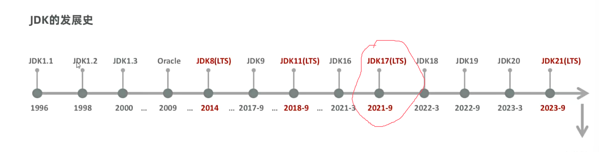

那么下面，将进行Jdk的安装

1. 首先进入[官网](https://www.oracle.com/cn/java/technologies/downloads/)

2. 然后往下滑找到这个页面注意我勾选的红框要对的上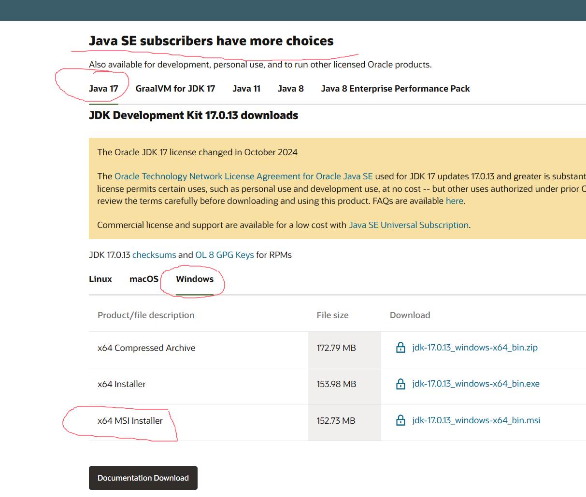

3. 这里我们**安装java17**，因为后面的框架部分内容，**新版本都是起步java17**，因此这里我们选择安装java17，安装要选择红圈圈住的**Msi下载或者是上面的exe下载**，因为这个是按照程序，下载回来一直点下一步就可以装好

4. 下载好后，双击打开，**根据安装程序一直点一下步**，安装即可

5. 安装好后，按下**win键**搜索环境变量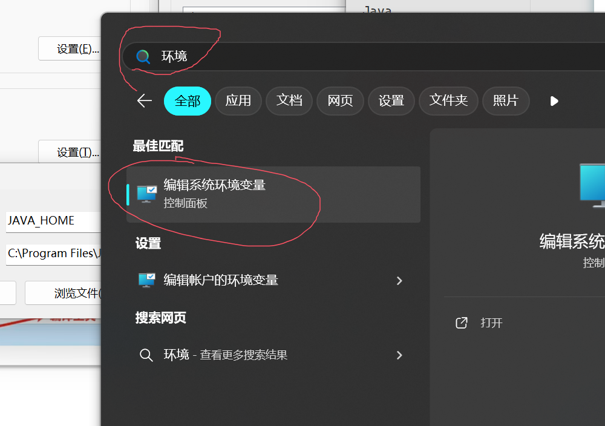

6. 打开后，**根据图片点出环境变量设置**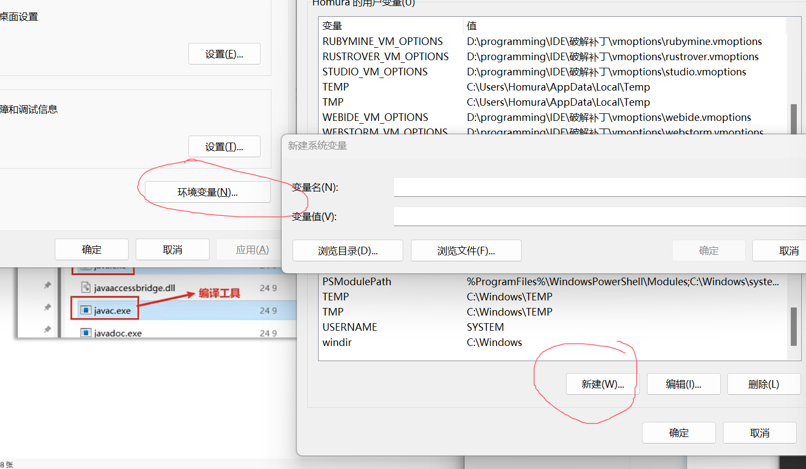

7. 在变量名和变量值分别输入这段内容

   ```
   变量名：JAVA_HOME
   变量值：C:\Program Files\Java\jdk-17
   ```

   当然变量值生效的前提是，**你在前面安装的时候没有动过人家的默认设置**，如果修改了安装目录，则根据你修改的安装的地方做修改

8. 然后win+r键输入cmd打开命令窗口，输入这段内容

   ```cmd
   java -version
   ```

9. 如果**显示的内容和你下载的版本号对上了**，那么说明你**安装成功**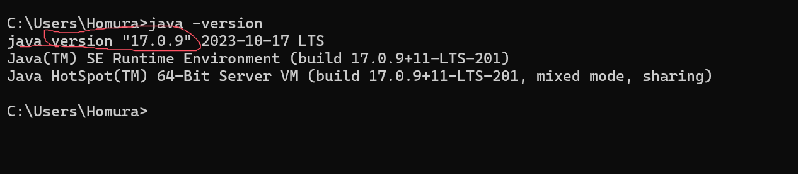

到这，Jdk就安装完成。

## Idea

**idea**是**Java开发最常用的工具**，用这个软件官网的说法，**idea拥有领先式的Java编程体验**

1. 前往[官网](https://www.jetbrains.com.cn/idea/download/other.html)下载
2. 要下载这个版本的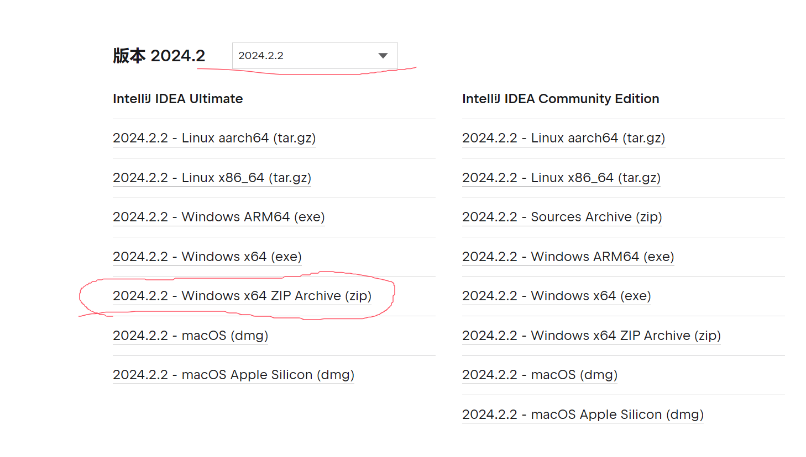
3. 下载压缩包后，解压后进入目录=>bin找到**idea64.exe**双击点开就能使用
4. 进去选择好这些设置，然后点击下一个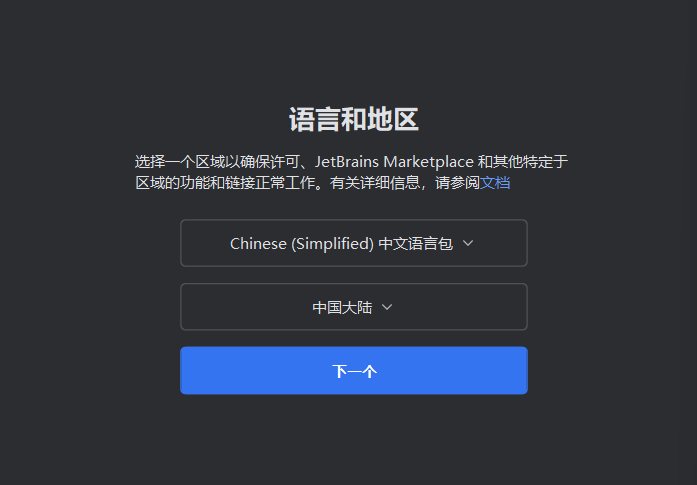
5. 进入这个界面后，点击免费试用
6. 在这里点击新建项目
7. 如图点击
8. 进来之后，需要稍微配置一下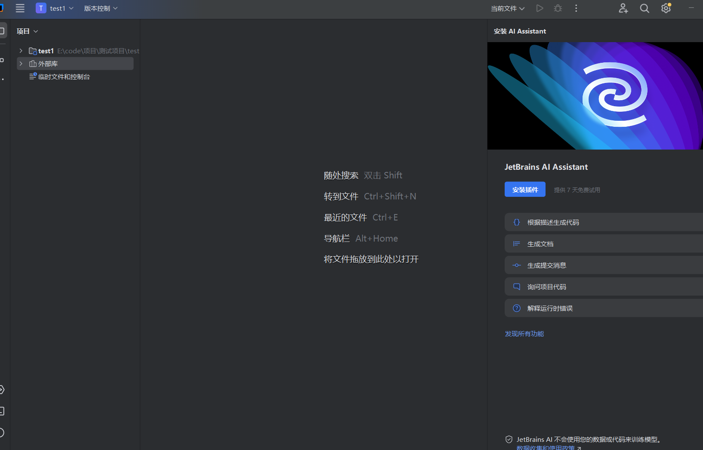
9. 打开设置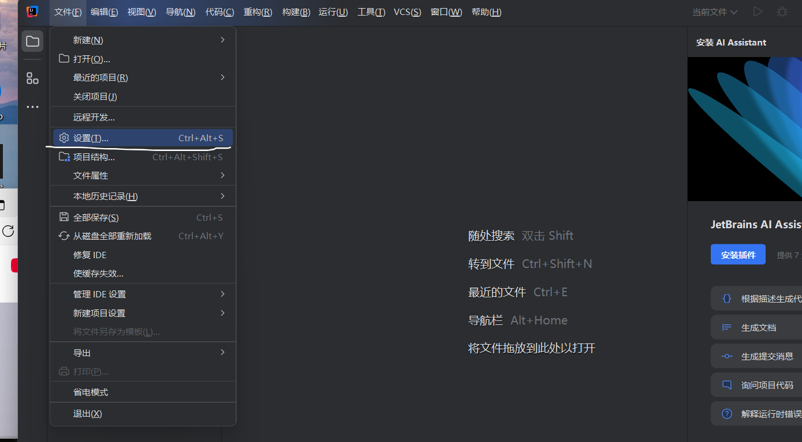
10. 首先下载的第一个插件就是ui插件，能让idea更漂亮美观(Material Theme UI Lite)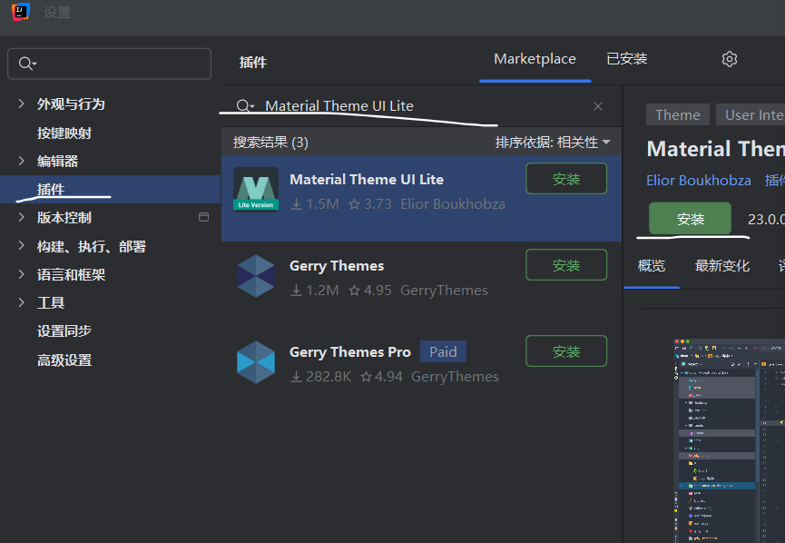
11. 然后就是这个插件，可以让括号变成彩色，在以后编程更加方便(Rainbow Brackets Lite)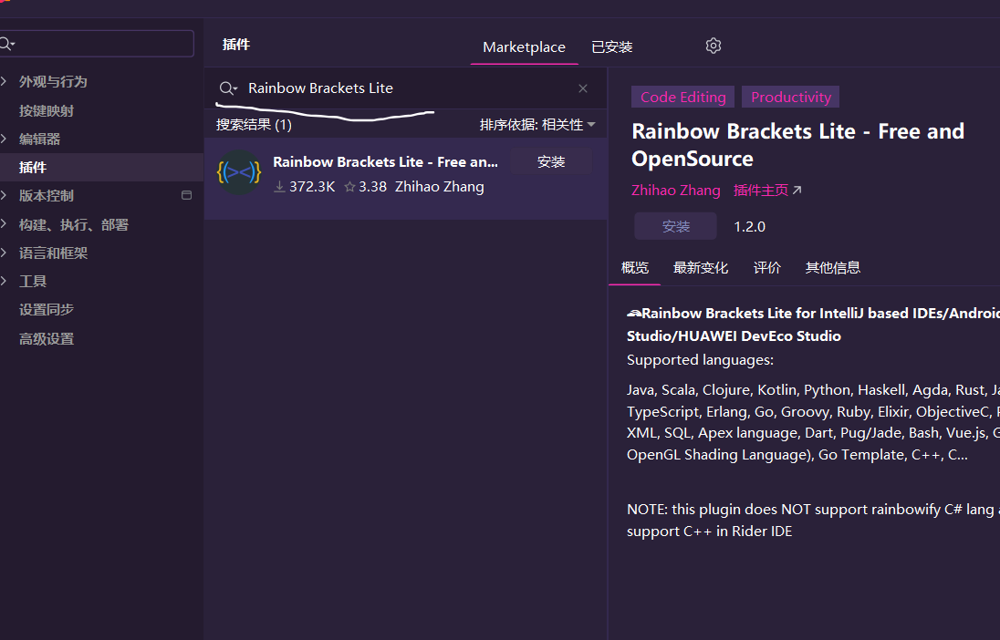
12. 插件装好后，就开始破解，破解插件可以参考这个[网站](read://https_blog.csdn.net/?url=https%3A%2F%2Fblog.csdn.net%2Fweixin_48050899%2Farticle%2Fdetails%2F141721188)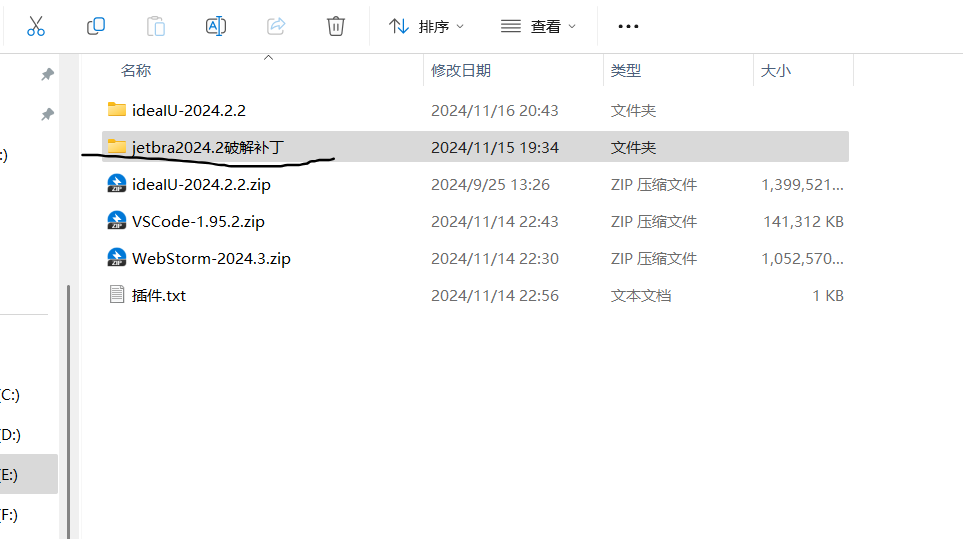
13. 下载好后，关闭idea，然后点击文件夹中的idea破解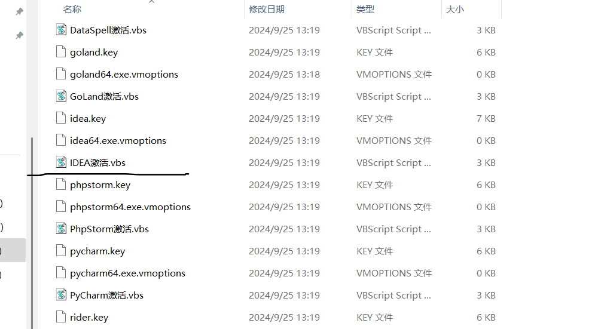
14. 看到这个后，就说明稳了
15. 进到这个页面，点击后就能看到有效期
16. 看破解成功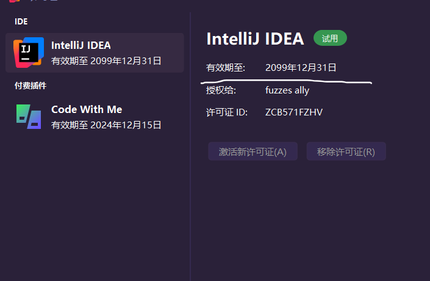

### 破解失败

如果出现破解失败场景

- 比如说

那么这个问题，是因为你之前选择地区选择了中国大陆的原因

因为中国大陆，intellij公司会做网络数据校验

1. 点击开始使用
2. 关闭项目
3. 这里选择未指定区域，这样就可以避开公司的检验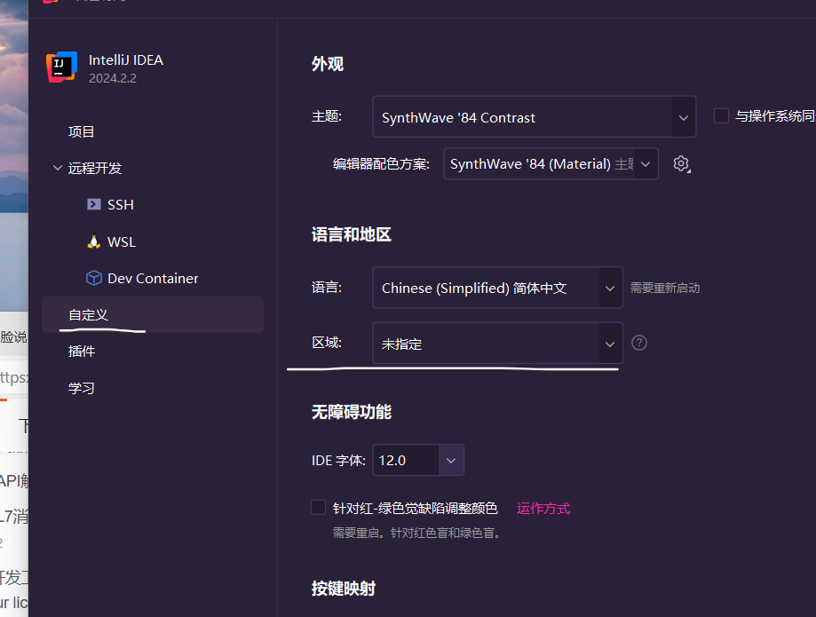
4. 然后使用破解插件重新来一遍，基本就能解决问题


