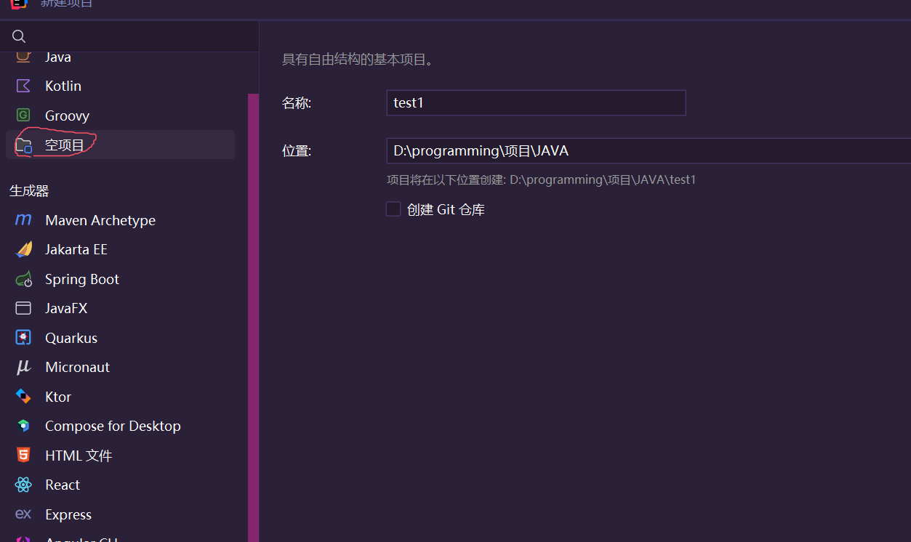
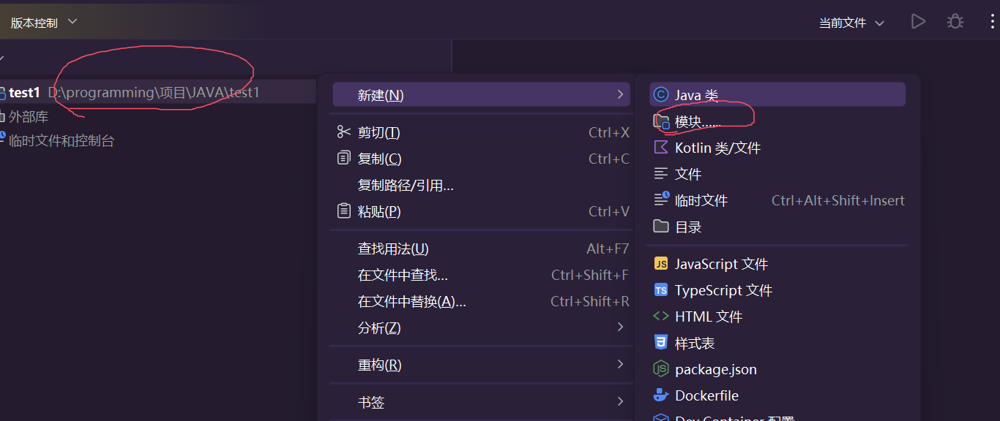
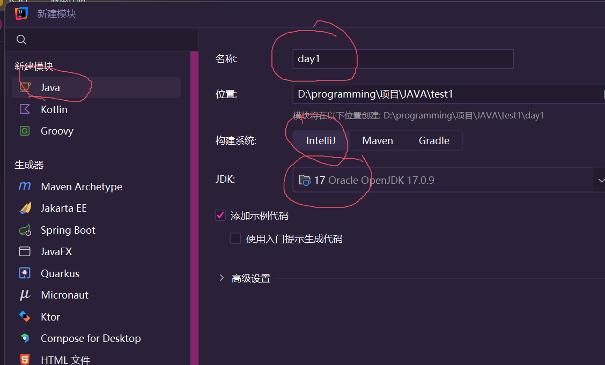
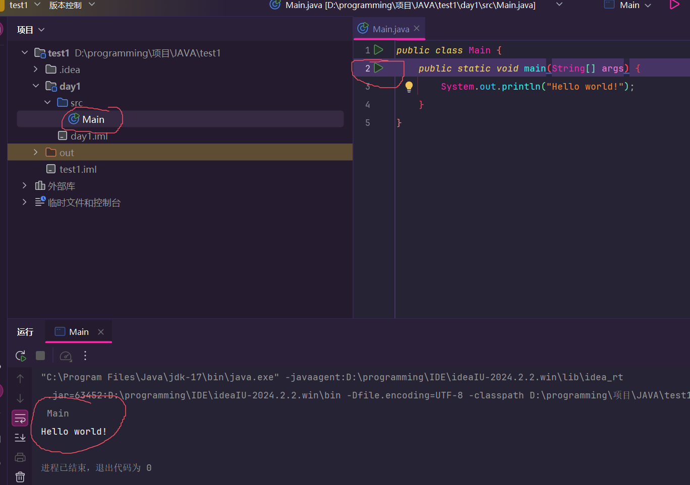
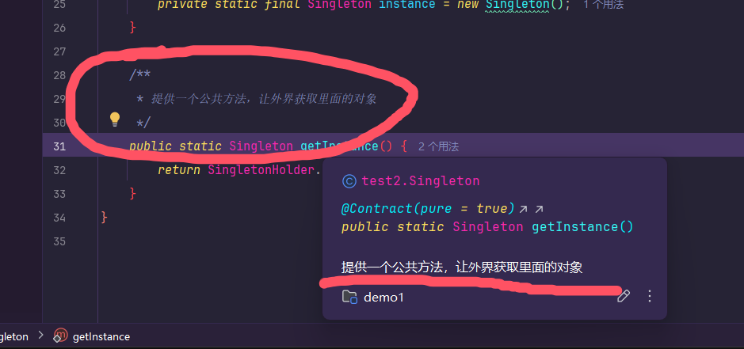
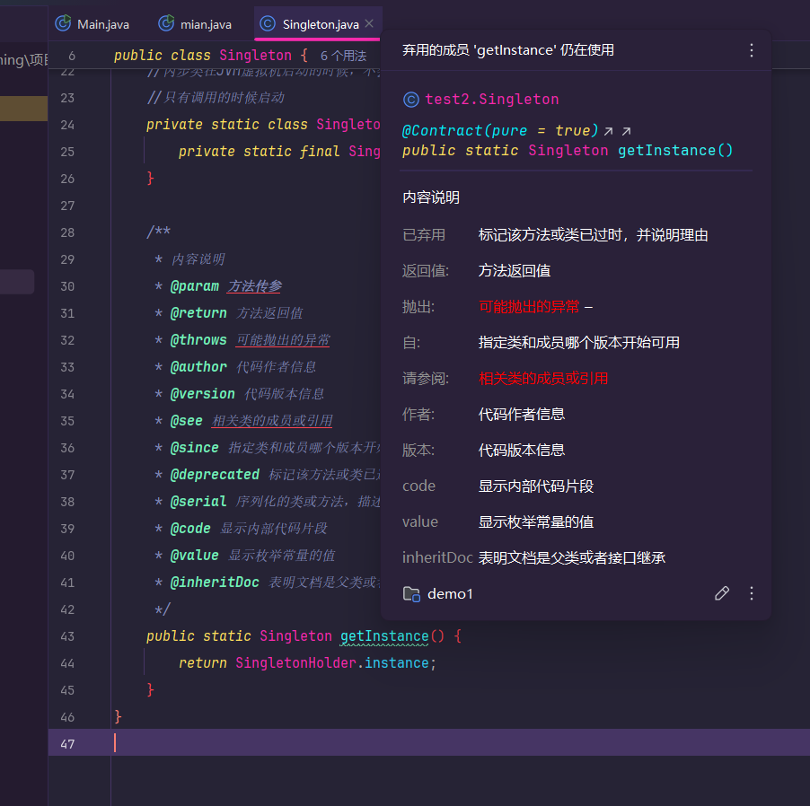
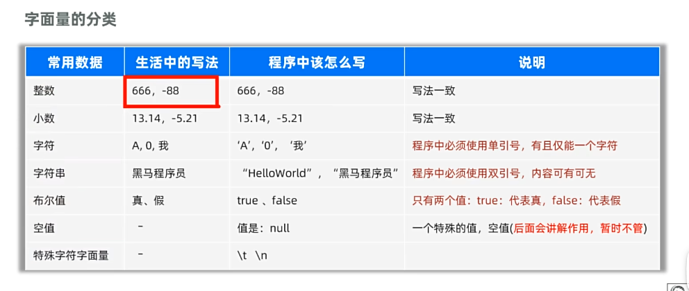

# Java

## Java是什么？

java是**美国sun公司**在**1995年**推出的**计算机高级编程语言**

sun公司在2009年被Oracle（甲骨文）公司收购

普遍认可的**java之父**是：**詹姆斯·高斯林**

1. java是目前世界流行的编程语言之一，**主要作为服务器开发**
2. java社区热度高，**开源的框架多**
3. 具有良好的可移植性，**一份代码全平台使用**。并且内存安全好

## java三大技术平台

1. JavaSe:java的基础和核心（标准版）
2. JavaEe:企业级开发的解决方案（企业版）
3. JavaMe：针对移动端的解决方案（小型版）

## Jdk组成

jdk的组成包括

1. **Jvm**：**java虚拟机**，用来运行java程序
2. 核心类库：java官方自己写好的程序，给程序员调用的库
3. Jre：java的运行环境

## Idea使用

idea是我们使用java开发最多的一款软件

**这里idea下载到安装参考《学习准备》笔记，这里只说idea一些知识概念**

idea创建的项目代码为：Project=>Module=>Package=>Class

分别为工程=>模块=>包=>类

1. 首先建立一个空工程名称就是**项目名称**，位置就是你这个项目在**本地磁盘的位置**
2. 然后点击右键这个项目，**新建一个模块**
3. 然后建立一个Java模块，**其中构建系统要选择好图片选择的**，jdk采用我们前面安装好的程序
4. 创建好后，**src目录下会有一个Main的程序，这个就叫类**，**而src就是包**（其实并不是，还有在src下建立一个目录，那个目录文件夹其实才是包）。点击右边的绿色运行，下面控制台就会打印出Hello world
5. 到这一步，你的Idea第一个程序就写完了，并且成功运行（虽然这个程序是自带的）

## 方法

java中一个后缀名**.java**的文件叫类，它在内部可以写java程序

- 如下面代码所说

  ```java
  //这个是类，名为Main类
  public class Main {
      //这个是主方法，名为main方法
      public static void main(String[] args) {
          System.out.println("Hello world!");
      }
      //这个是方法,名为a方法
      public void a(){
          System.out.println("Hello china!");
      }
  
      //这个也是方法，名为b方法
      public void b(){
          System.out.println("Hello!");
      }
  }
  ```

**方法就是对应一个功能模块，而只有main方法也就是主方法，是整个java程序的入口，没有它，java程序无法运行**

- 如果想使用方法，直接在Main中写方法名即可

  ```java
  //这个是类，名为Main类
  public class Main {
      //这个是主方法，名为main方法
      public static void main(String[] args) {
          System.out.println("Hello world!");
          //调用a方法，程序走到这里，将进入a方法之中
          a();
      }
      //这个是方法,名为a方法
      public void a(){
          System.out.println("Hello china!");
      }
  
      //这个也是方法，名为b方法
      public void b(){
          System.out.println("Hello!");
      }
  }
  ```

## 注释

当你写了一大段复杂的代码的时候，你当时是能理清思路逻辑，但是过了几个星期后，你就难以看懂自己当时写的什么代码

这其实是一种很正常的情况，因此为了尽可能减少这种情况发生，我们就需要在**代码加上注释**

**注意！注释内容不会参与编译和运行，仅仅只是代码说明**

1. 比如这个简单的代码（这里仅仅只是简单举例子说明，不要过于较真）

   ```java
   public class Main {
       public static void main(String[] args) {
           int a=1;
           int b=2;
           int c=a+b;
           System.out.println(c);
       }
   }
   ```

   这段代码的作用，身为程序员的我们肯定能看懂，但是拿你身边不懂编程的人，它一定是**看不懂**的。

2. 但是你加上注释后

   ```java
   public class Main {
       public static void main(String[] args) {
           //声明两个变量
           int a=1;
           int b=2;
           //c的值是a+b的值
           int c=a+b;
           //打印一下c的数值
           System.out.println(c);
       }
   }
   ```

   只要稍微开动脑筋就能明白这段代码的作用，这就是**注释的好处**

当然**注释也分几种**

1. 单行注释

   ```java
   //仅注释这一行信息 int a=10
   int a=20；
   ```

2. 多行注释

   ```java
   /*
   	在这个范围，注释多少行都行
   	int a=10
   	我也被注释了
   */
   int a=10；
   ```

3. 文档注释

   ```java
   /**
    * 这个注释在方法和变量（getInstance()这个单词上）上的话
    * 就会显示这个注释里的内容
   */
   public static Singleton getInstance() {
           return null;
       }
   ```

   图片

### * 注释文档标签

在**注释文档**中可以通过**@+关键字**来指定一下内容。

- 下面是大部分注释标签的代码

  ```java
      /**
       * 内容说明
       * @param 方法传参
       * @return 方法返回值
       * @throws 可能抛出的异常
       * @author 代码作者信息
       * @version 代码版本信息
       * @see 相关类的成员或引用
       * @since 指定类和成员哪个版本开始可用
       * @deprecated 标记该方法或类已过时，并说明理由
       * @serial 序列化的类或方法，描述序列化字段
       * @code 显示内部代码片段
       * @value 显示枚举常量的值
       * @inheritDoc 表明文档是父类或者接口继承
       */
      public static Singleton getInstance() {
          return SingletonHolder.instance;
      }
  ```

  它的图片是这样的**注意！**这里的标签不是所有都会生效，idea中显示红色下划线的就表示，当前注释标签在该环境下不生效
  

## 字面量

字面量，就是数据写进代码中的数据

1. 比如说下面打印的这个abc就是字面量（字符串字面量）

   ```java
   public static void main(String[] args) {
           System.out.println("abc");
       }
   ```

2. 再比如说这个打印的123也是字面量（整数型字面量）

   ```java
   public static void main(String[] args) {
           System.out.println(123);
       }
   ```

而java中的字面量还有很多

- 如图所示

## 变量

变量就是**内存中**的一块区域，用来**装数据**的区域，并且这个数据是**随时可修改**的，叫做变量

- 以下是常见的基础类型变量，并且它们定义好数据类型后，就只能接受这种数据类型

  ```java
  public static void main(String[] args) {
          //整数型变量，不能带小数
          int a=10;
          //浮点型变量，可以带小数
          double b=20.5;
          //字符变量，只能是一个字符
          char c='c';
          //字符串变量，只能是字符串
          String d="abc";
          //布尔类变量，只能为true（真）或false（假）
          boolean e=true;
      }
  ```

  注意！编程中，一个**=**号的意思**是赋值**的意思，两个**==**号才是**相同**的意思

为什么要使用变量？假如你要打印十行的整数10。

那么你就得写十行的这段代码

```java
System.out.println(10);
```

而采用变量就是这样写

```java
int a=10;
System.out.println(10);
```

**这看起来好像还多写了一行代码，感觉没有必要啊。**

那好，现在我跟你说，我要**修改一下**，我想**打印十行整数20**，那你用**第一种写法得修改十次**，而采用**第二种写法只需要改一个变量的值就可以了**

这就是变量的好处之一

## ASCII字符集

计算机的底层原理，就是1和0组成的一段数字

比如说你定义一个变量=**10**，那么这个在计算机眼中就是这么一段数据：**1010**
