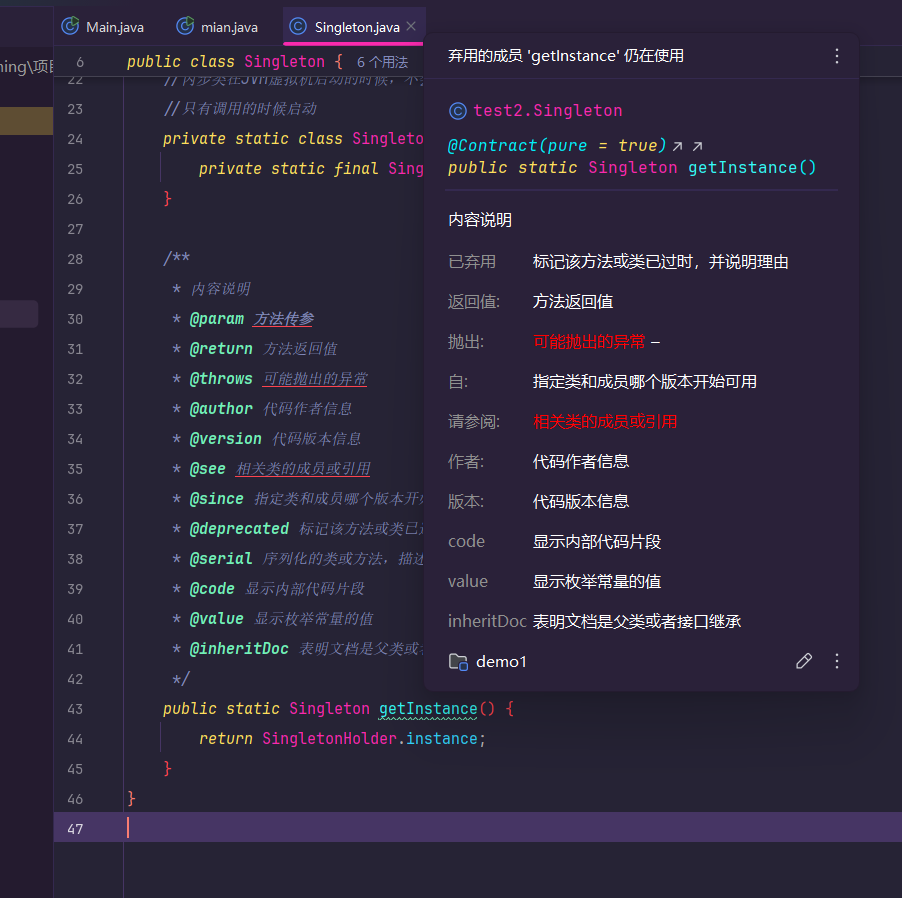

# java语法

## 注释

当你写了一大段复杂的代码的时候，你当时是能理清思路逻辑，但是过了几个星期后，你就难以看懂自己当时写的什么代码

这其实是一种很正常的情况，因此为了尽可能减少这种情况发生，我们就需要在**代码加上注释**

**注意！注释内容不会参与编译和运行，仅仅只是代码说明**

1. 比如这个简单的代码（这里仅仅只是简单举例子说明，不要过于较真）

   ```java
   public class Main {
       public static void main(String[] args) {
           int a=1;
           int b=2;
           int c=a+b;
           System.out.println(c);
       }
   }
   ```

   这段代码的作用，身为程序员的我们肯定能看懂，但是拿你身边不懂编程的人，它一定是**看不懂**的。

2. 但是你加上注释后

   ```java
   public class Main {
       public static void main(String[] args) {
           //声明两个变量
           int a=1;
           int b=2;
           //c的值是a+b的值
           int c=a+b;
           //打印一下c的数值
           System.out.println(c);
       }
   }
   ```

   只要稍微开动脑筋就能明白这段代码的作用，这就是**注释的好处**

当然**注释也分几种**

1. 单行注释

   ```java
   //仅注释这一行信息 int a=10
   int a=20；
   ```

2. 多行注释

   ```java
   /*
   	在这个范围，注释多少行都行
   	int a=10
   	我也被注释了
   */
   int a=10；
   ```

3. 文档注释

   ```java
   /**
    * 这个注释在方法和变量（getInstance()这个单词上）上的话
    * 就会显示这个注释里的内容
   */
   public static Singleton getInstance() {
           return null;
       }
   ```

   图片

### * 注释文档标签

在**注释文档**中可以通过**@+关键字**来指定一下内容。

- 下面是大部分注释标签的代码

  ```java
      /**
       * 内容说明
       * @param 方法传参
       * @return 方法返回值
       * @throws 可能抛出的异常
       * @author 代码作者信息
       * @version 代码版本信息
       * @see 相关类的成员或引用
       * @since 指定类和成员哪个版本开始可用
       * @deprecated 标记该方法或类已过时，并说明理由
       * @serial 序列化的类或方法，描述序列化字段
       * @code 显示内部代码片段
       * @value 显示枚举常量的值
       * @inheritDoc 表明文档是父类或者接口继承
       */
      public static Singleton getInstance() {
          return SingletonHolder.instance;
      }
  ```

  它的图片是这样的**注意！**这里的标签不是所有都会生效，idea中显示红色下划线的就表示，当前注释标签在该环境下不生效