# maven高级

## * maven模块设计

目前我们写的项目，都是一个人写完，可是实际开发中，往往是**多人团队开发**，那么大家都用一个项目怎么开发？

因此我们需要**按模块去开发**，不同业务或者不同功能，来去进行模块拆分

但是模块开发，就会出现**jar包的版本问题**。因此我们所有的模块，都得在一个**总的maven项目进行开发**

1. 首先新建立一个maven项目，因为这个maven项目是做为总项目而存在，因此需要**删除部分内容**，并且**添加一段代码**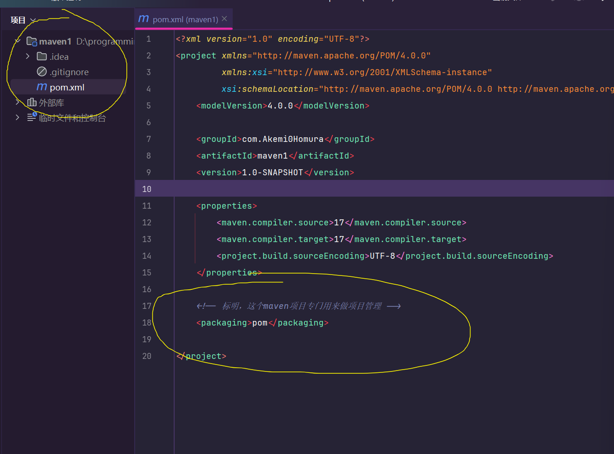

2. 现在maven总项目建好了，那么我就需要建立一个模块如图所示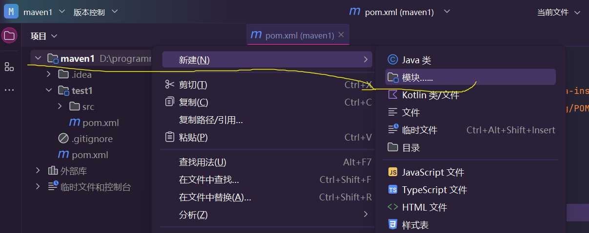当然创建的依然是maven项目

3. 创建好后，回到总项目中，你会发现pom文件自动增加了几行代码

   这段代码的意思，就是这个总项目管理这test1和test2两个模块

4. 现在就要进行jar包的管理，如图所示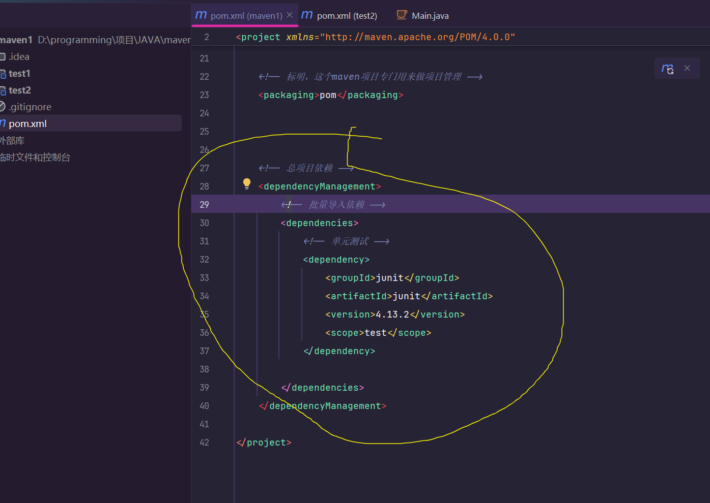

   具体代码如下

   ```xml
       <!-- 总项目依赖 -->
       <dependencyManagement>
           <!-- 批量导入依赖 -->
           <dependencies>
               <!-- 单元测试 -->
               <dependency>
                   <groupId>junit</groupId>
                   <artifactId>junit</artifactId>
                   <version>4.13.2</version>
                   <scope>test</scope>
               </dependency>
           </dependencies>
       </dependencyManagement>
   ```

5. 导入查看子工程的pom文件是否写父工程（一般都有）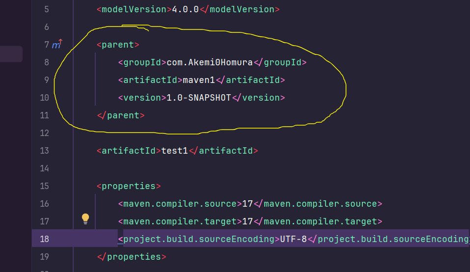

6. 然后去子项目导入单元测试，但是不需要导入版本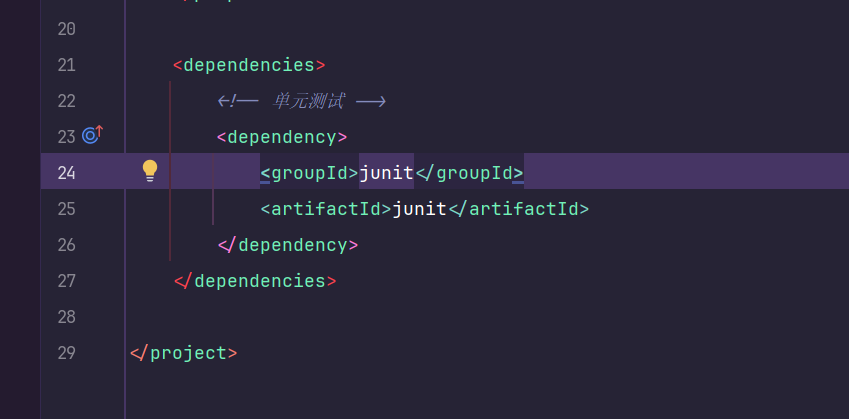具体代码

   ```xml
       <dependencies>
           <!-- 单元测试 -->
           <dependency>
               <groupId>junit</groupId>
               <artifactId>junit</artifactId>
           </dependency>
       </dependencies>
   ```

7. 这样子项目所导入的junit就是父工程的的版本

8. 我们可以去测试类测试一下，看一下是否导入成功

9. 有联想，并且导入正确地址。说明父项目管理子项目已经成功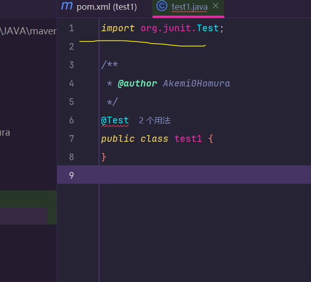

这样**maven分模块设计已经完成**，并且不再会有版本冲突问题

### 无法识别模块

有时候，可能会出现这么一种情况，就是Idea无法识别出你刚才新建好的模块

1. 如图所示，idea无法识别出这个shoot的SpringBoot项目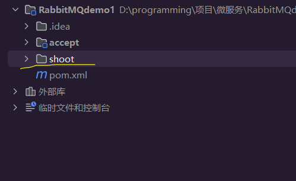
2. 这主要是因为父工程的maven没有识别出来，如图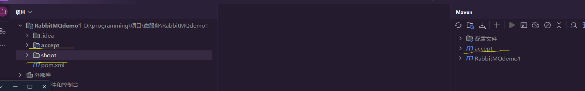

那么如何解决这个问题呢？其实并不难

问题在于父工程maven识别不出子模块，那我们就让它识别出来即可

1. 点击+号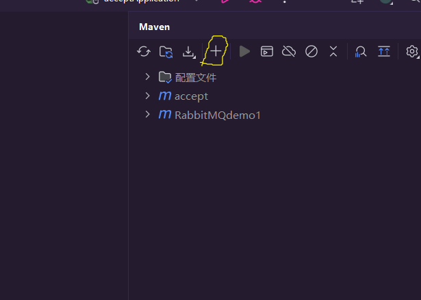
2. 然后选中你需要添加的模块目录
3. 然后就ok，成功识别出来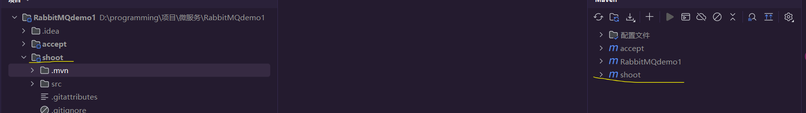

## 属性

maven的pom文件中，也可以定义一个变量（属性），这里简单演示一下定义一个版本属性

- 如图所示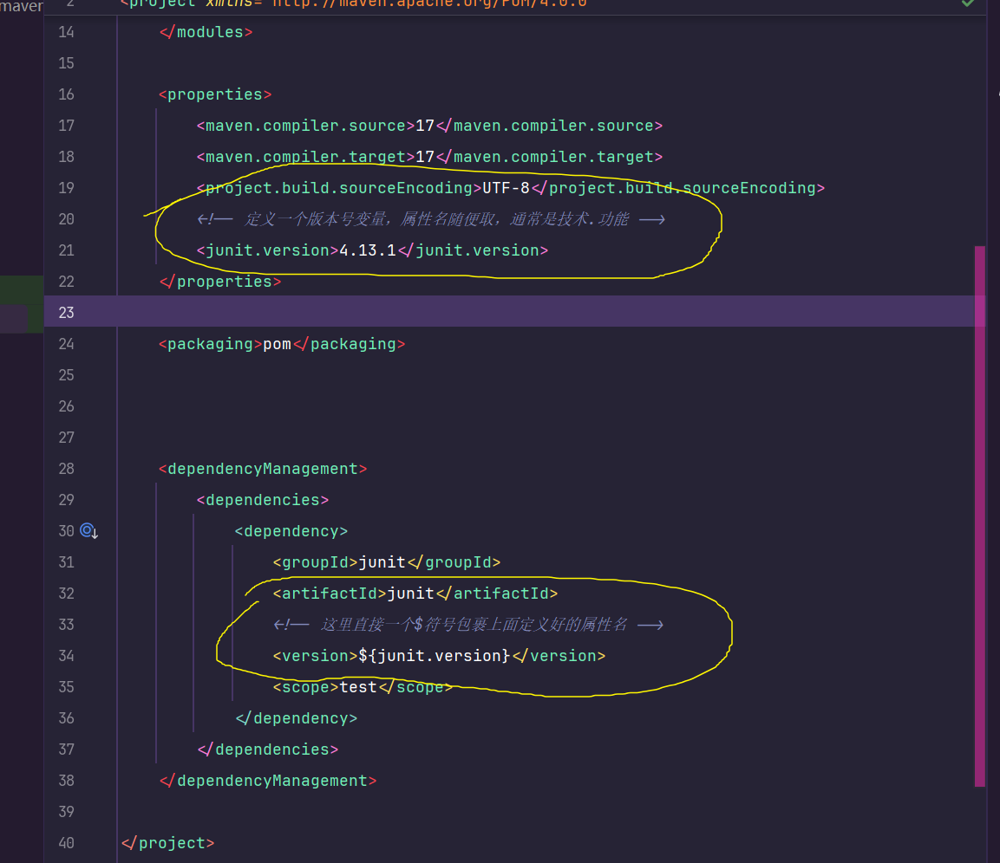

## 版本管理

你可能已经发现了，我们maven的项目版本

- 这是创建项目时候自动生成的，如图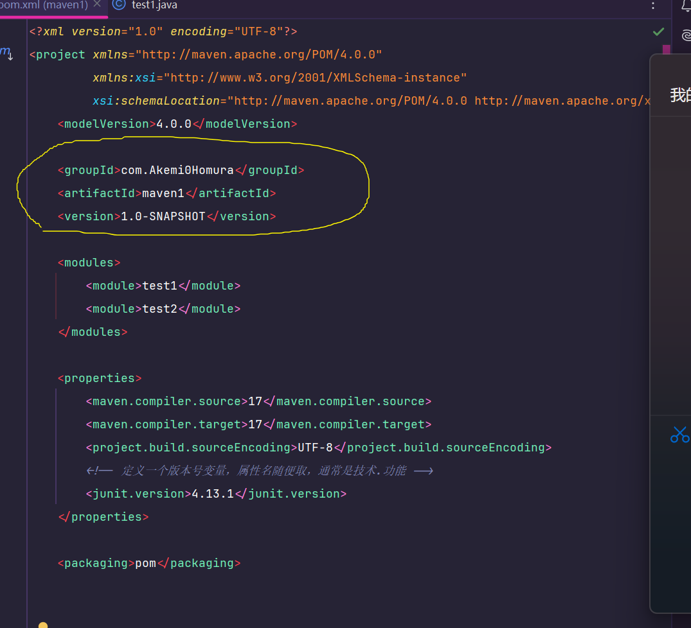

其中版本的迭代等，你自己定义。通常小版本改小数点以后的数字，大功能改版本前的数字。这点现实生活很常见，不过多阐述。

我们重点关注的是后面的单词：

1. SNAPSHOT:快照版本，可以简单理解为测试版本（未完成）
2. RELEASE:发布版本，可以简单理解成正式版本（已完成）

当然不同的公司采用的命名也不同，这两个是比较常见的命名规范

## -多环境配置

**在生成环境、测试环境、开发环境，可能需要更改不同的配置**。但是为了避免改动出错，最好是不修改源代码

而maven恰好支持根据环境动态调整项目配置的功能

由于环境问题，相信后人[智慧](https://www.bilibili.com/video/BV1Ah411S7ZE?spm_id_from=333.788.videopod.episodes&vd_source=95c95b2b45956217a529f886ca23dd35&p=24)

## -跳过测试

maven在打包的时候，**必须通过测试**

但如果有特殊情况，需要跳过测试的话，可以观看这个[视频](https://www.bilibili.com/video/BV1Ah411S7ZE?spm_id_from=333.788.videopod.episodes&vd_source=95c95b2b45956217a529f886ca23dd35&p=25)

## -私服

如果团队开发，**为了保证统一管理**，往往会搭建私服

由于环境问题，相信后人[智慧](https://www.bilibili.com/video/BV1Ah411S7ZE?spm_id_from=333.788.videopod.episodes&vd_source=95c95b2b45956217a529f886ca23dd35&p=26)

## *打包

用过那么多人写的第三方框架和库，你有没有想过自己写一个库，打成jar包分享给别人使用？

jar包分三种：

1. 运行jar包：双击jar包文件就可以运行的java程序
2. 普通jar包：别人封装好了一些功能的jar包
3. 源码jar包：带注释的jar包，但是里面的方法变量等无法使用

### *工具库打包

由于每个人开发习惯和写法不同，往往有一些代码部分是冗余的，可以抽出公共方法

为了能在不同项目中使用，我们就需要写一个工具库去打成jar包

1. 假设你的工具库代码已经写好了，现在需要打包。

2. 首先你得先打开maven插件，**清理掉编译好的文件**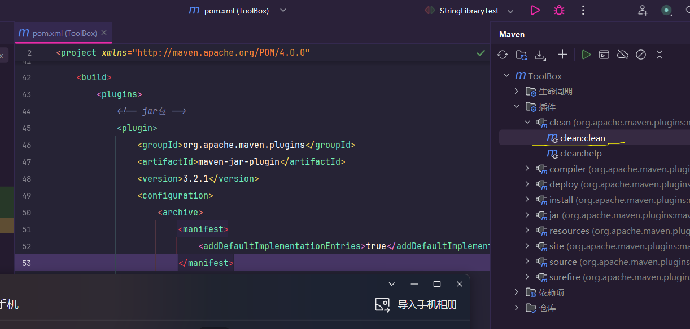

3. 清理好后，在pom文件中，**在坐标导入(dependencies)的标签块下面**导入这段代码

   ```xml
       <!-- 插件 -->
       <build>
           <plugins>
               <!-- 普通jar包 -->
               <plugin>
                   <groupId>org.apache.maven.plugins</groupId>
                   <artifactId>maven-jar-plugin</artifactId>
                   <version>3.2.1</version>
                   <configuration>
                       <archive>
                           <manifest>
                               <addDefaultImplementationEntries>true</addDefaultImplementationEntries>
                           </manifest>
                       </archive>
                   </configuration>
               </plugin>
               <!-- 源代码jar包 -->
               <plugin>
                   <groupId>org.apache.maven.plugins</groupId>
                   <artifactId>maven-source-plugin</artifactId>
                   <version>3.2.1</version>
                   <executions>
                       <execution>
                           <id>attach-sources</id>
                           <goals>
                               <goal>jar-no-fork</goal>
                           </goals>
                       </execution>
                   </executions>
               </plugin>
           </plugins>
       </build>
   ```

   导好插件后就刷新下载插件

4. 下载后，**运行你的工具库(测试类)。让idea编译好你的第三方库代码**

5. 然后先点击图中的jar包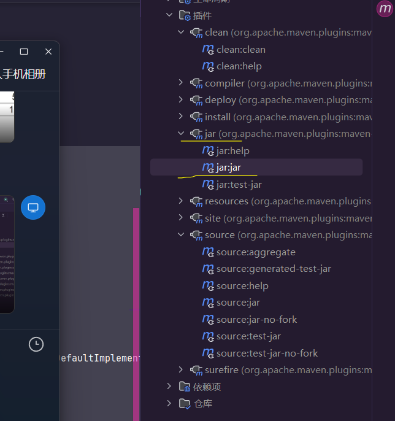

6. 运行完成后，普通jar包就打包完成

7. 普通jar包做好后，还没完。因为**没有注释**的缘故，别人可能看不懂你的代码，或者以后自己会忘记，因此我们需要在打包一个源代码jar包出来

8. 如图所示，点击运行完成后，源代码jar包也打包完成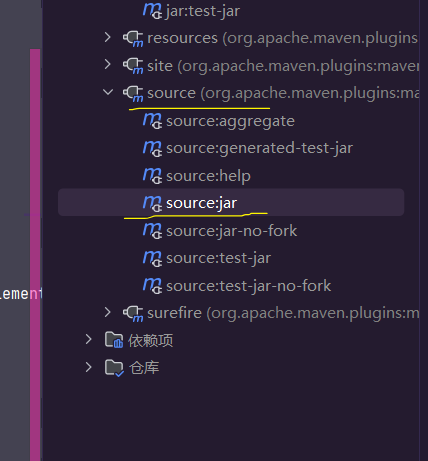

9. 然后去到目录中，找到你编译好的文件里，就能发现两个jar包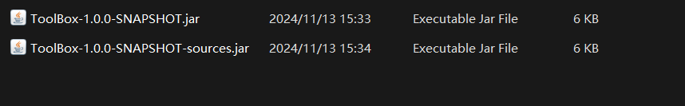

   其中第一个就是普通jar包，第二个就是源代码。

10. 有了这两个jar包就可以向它人分享你的jar包

### *部署本地仓库

有了jar包还不够，**因为我们开发都是pom导入依赖**

不过不要紧，因为这里就告诉你如何放到本地仓库

1. 其实很简单，首先先完成可以打包出jar包和源码包的功能

2. 然后点一下maven里的**install命令**，运行完成后就已经部署完毕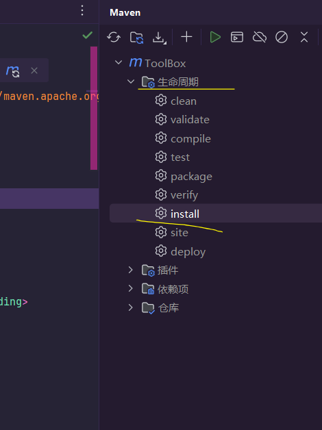

3. 运行完后去到本地的仓库目录下。由于我这个**项目坐标**是如图

   ```xml
       <groupId>com.Akemi0Homura</groupId>
       <artifactId>ToolBox</artifactId>
       <version>1.0.0-SNAPSHOT</version>
   ```

4. 那么在文件目录大概会是这样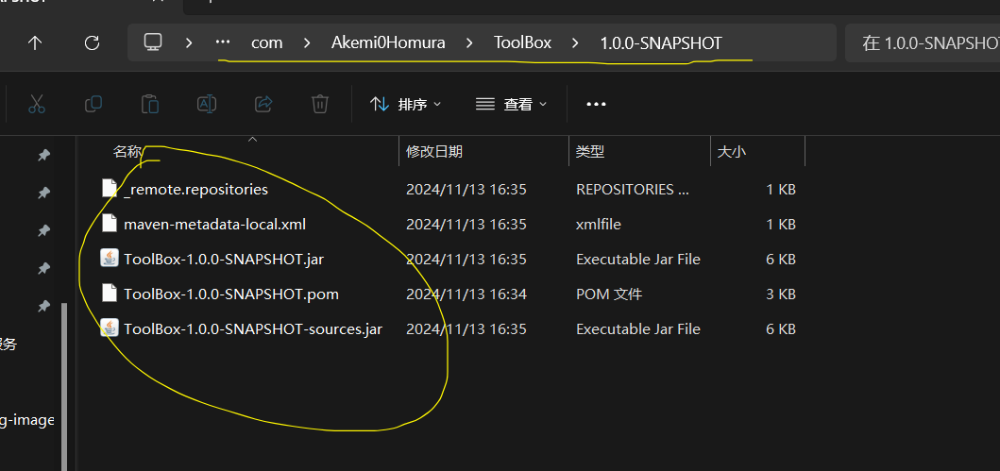

5. 在其他项目的pom文件导入依赖的时候，就把上面的**仓库目录导入**刷新一下即可（注意哦，要设置好你的idea中的maven设置）

   ```xml
       <dependencies>
           <dependency>
               <groupId>com.Akemi0Homura</groupId>
               <artifactId>ToolBox</artifactId>
               <version>1.0.0-SNAPSHOT</version>
           </dependency>
       </dependencies>
   ```

### -部署Maven中央仓库

不是哥们，你还真好意思来看啊？

你写的代码什么水平心里没数？ Github的星星超过100没？

老老实实部署本地仓库就完事了