# Maven聚合

## 环境准备

**正式的微服务环境非常复杂困难**，为了**过渡入门**，先从Maven模块聚合开始，因为它们底层逻辑是差不多的

1. 首先现在磁盘中建立一个文件夹，取好名字后如Maven打开

2. 然后如图所示创建一个**SpringBoot**（3.3.4）项目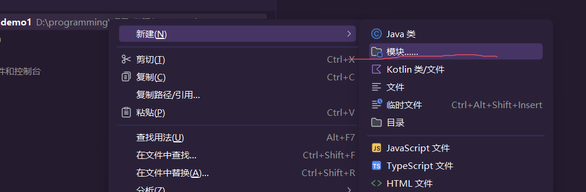

   在SpringBoot中勾选上SpringWeb的依赖

3. 要建立**两个项目**，建好后如图所示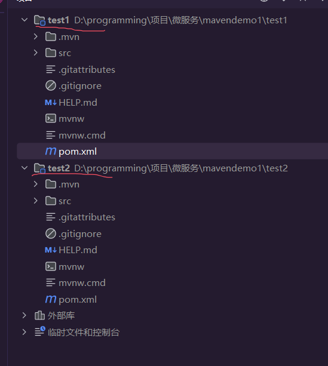

4. 然后在第一个**test1项目**中**建立一个网络接口类**

   ```java
   import org.springframework.web.bind.annotation.GetMapping;
   import org.springframework.web.bind.annotation.RequestMapping;
   import org.springframework.web.bind.annotation.RestController;
   
   @RestController
   @RequestMapping("test1")
   public class test1 {
       @GetMapping("1")
       public String test1(){
           return "我是test1项目";
       }
   }
   ```

5. 然后在**第二个项目也建立一个这样的类**。然后**启动两个项目**，当然**第二个项目**的**端口号要记得修改**

6. 然后进入[项目1](http://localhost:8080/test1/1)和[项目2](http://localhost:8081/test1/1)测试一下，如果**都能打开**，那么**环境**就**配置成功**

## * 服务治理

现在我们这个项目有**两个**这样的**模块（微服务）**，但是**模块业务之间**，如果有**数据交流该如何实现？**

目前它们的**物理位置上是隔离**的，我们该怎么交流数据呢？

其实我们之前就已经做个这样的功能，那就是项目开发的时候，前后端分离，**前端通过Ajax后端通过Servlet达到信息传输**。那么现在后端变前端，用前端的方式传给后端获取数据，这样就可以做到信息交流。

好现在信息传输问题是解决了。但在现实中，可能某个服务很热门，为了缓解压力，**会多开几个端口**，那么问题来了，多开几个端口，**那怎么选接口呢？**如果某个服务端口挂了，那你**万一选中**的正好就是**挂掉的端口**又该怎么办？如果公司新买了几台服务器，难不成还得改动源代码去重新打包编译部署吗？

总结一下现在的问题：

1. **动态获取接口地址**
2. **筛选出接口好坏**
3. **接口负载均衡**
4. **发送网络请求**

这四种问题综合一起，在微服务中，就被称为**服务治理**

### 注册中心

我们可以通过一个专门管理接口地址的**注册中心**获取**可用端口**，这样就能筛选出不可用的接口，因为注册中心会通过心跳（定期发送请求给注册中心）来判断接口是否可用。

#### Nacos注册中心

阿里巴巴开源的的注册中心组件，SpringCloud下有非常多的注册中心组件，那为什么要选Nacos呢？

因为是国产，**文档教程**和技术讨论以及社区热度都很高。重要的是这些组件都是**遵从SpringCloud的接口标准**，虽然底层可能不一样，但是封装好后的使用方法基本都差不多

##### 环境配置

[官方文档](https://nacos.io/docs/latest/quickstart/quick-start/)

注意！这个是在**Linux环境配置**的，但为了方便，就在**Windows环境安装**

1. 首先第一步，当然是去[官网](https://nacos.io/download/nacos-server/)下载Nacos压缩包，这个笔记中，采用的是**2.4.3**版本

2. 然后将它解压，进入文件目录=>conf找到mysql-schema.sql这个文件

3. 找到后**打开Navicat数据库软件**（使用idea也行，但是你得在每个表名上加上一个数据库名称，不然无法执行代码），然后**新建一个库叫Nacos**，然后在库中新建一个查询，然后把刚才的**.sql文件打开**，把里面**所有东西复制粘贴到查询窗口上**，然后**运行代码**，运行结束后吗的库表应该和我一致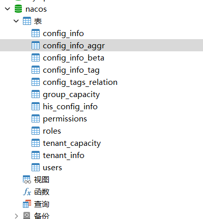

4. 然后在**文件目录下的bin文件下**，**新键一个cmd程序**，代码如下

   ```cmd
   startup.cmd -m standalone
   ```

5. 然后运行这个写好的cmd，那么Nacos就会启动，当你cmd窗口停在

   ```
   Nacos started successfully in stand alone mode. use embedded storage
   ```

   这段话后不动，就说你**Nacos启动成功**

6. 然后在输入这段地址，就能进入控制台（如果有密码，那账号和密码默认是nacos）

   ```
   http://127.0.0.1:8848/nacos
   ```

   当然这是**默认地址**，你没动过配置文件的情况下

7. 然后在bin的界面下，找到**shutdown.cmd**这个文件，**点击运行后就能关闭Nacos服务**

##### 服务注册

现在**注册中心搭建好**了，那现在就该让自己**项目的端口注册到注册中心**被引用

1. 先启动好Nacos服务，然后打开控制台停在**服务管理=>服务列表**这一页面

2. 然后向两个创建的项目的**pom文件**添加maven坐标

   ```xml
           <!-- Nacos服务 -->
           <dependency>
               <groupId>com.alibaba.cloud</groupId>
               <artifactId>spring-cloud-starter-alibaba-nacos-discovery</artifactId>
               <version>2023.0.1.3</version>
           </dependency>
   
           <!-- SpringCloud核心 -->
           <dependency>
               <groupId>org.springframework.cloud</groupId>
               <artifactId>spring-cloud-dependencies</artifactId>
               <version>2023.0.3</version>
               <type>pom</type>
               <scope>import</scope>
           </dependency>
   ```

3. 添加后启动两个项目回到页面刷新，你就会发现列表已经出现**两个服务**，**说明服务注册成功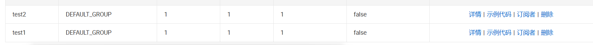**

4. **还没完**，因为实际项目中，**一个模块服务会有多个实例**，因此我们也需要进行相对于的配置

5. 首先打开这个设置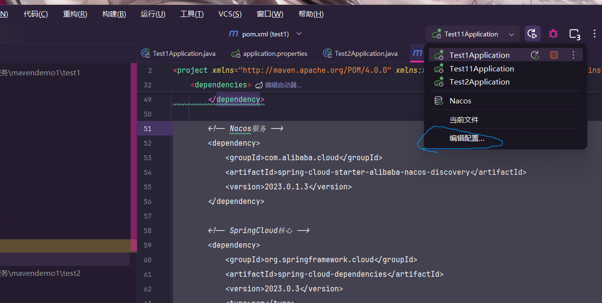

6. 然后框选要复制的项目，然后点击一下

7. 然后**修改**一下**名称**，然后再点击一下这个界面的**修改选项**（有高亮显示），点击添加**虚拟机选项**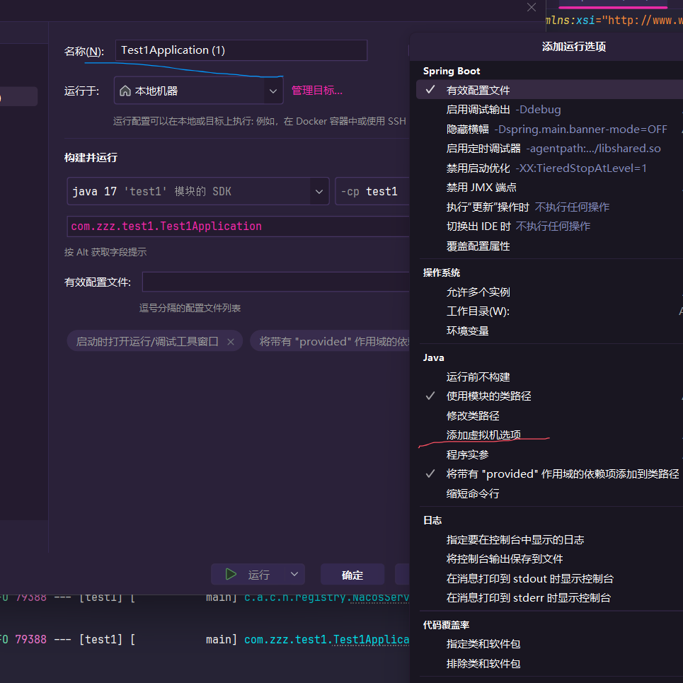

8. 然后在里面添加上这段代码，**等于号后面就是端口号**

   ```
   -Dserver.port=8083
   ```

9. 然后在外面启动这个项目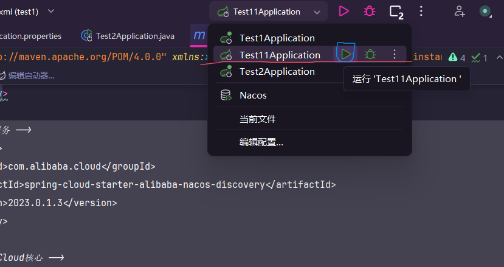

10. 然后去到**Nacos页面**，刷新一下，就会发现实例从1变成2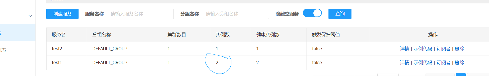

    说明**多例项目设置完成**

### 负载均衡

现在解决了筛选端口的问题，那么如何解决选择可用端口的问题呢？为了避免请求过于集中，因此我们需要做**负载均衡算法**，让各个接口的请求数量来看是基本一致，最大化利用性能。

1. 随机：就是字面意思，**随机选择一个接口**，在短时间内可能会造成单个接口负载过大，但是长期来看，基本是能做到负载均衡这点。
2. 加权随机：也是字面意思，**会根据  接口数量和接口性能等方面，来做不同概率随机**，比如高性能服务器的接口就能大概率被选中，低性能的接口就小概率被选中。也能做到负载均衡效果
3. 轮询：也是字面意思，abc三个接口，轮流发送请求

### OpenFeign

在上面的例子中，我们已经解决了**动态获取接口**和**负载均衡**的问题，现在只剩最后一个问题了，就是如何**发送请求**

一个声明式Http客户端，**专门来做http请求**

#### 快速入门

这里写一个简单的例子，快速上手使用**OpenFeign**

1. 在一个需要发送请求的项目的pom文件中导入Maven依赖

   ```xml
           <!-- OpenFeign 用来做http协议服务 -->
           <dependency>
               <groupId>org.springframework.cloud</groupId>
               <artifactId>spring-cloud-starter-openfeign</artifactId>
               <version>4.1.3</version>
           </dependency>
   
           <!-- 负载均衡算法库 -->
           <dependency>
               <groupId>org.springframework.cloud</groupId>
               <artifactId>spring-cloud-starter-loadbalancer</artifactId>
               <version>4.1.3</version>
           </dependency>
   ```

2. 导入完成后，去新建一个**请求发送接口**

   ```java
   import org.springframework.cloud.openfeign.FeignClient;
   import org.springframework.web.bind.annotation.GetMapping;
   
   //这个注解的作用是标记服务名称
   //服务名称是Nacos里面的登记的名称
   @FeignClient(value = "test2")
   public interface reqTest1 {
       //注解和SpringMvc使用逻辑差不多
       //你要以什么请求方式发送就写对应的注解
       //注解的括号填写则是完整的请求接口地址
       //不包括前面的IP地址，因为OpenFeign会和Nacos联动动态获取
       @GetMapping("test1/1")
       String test();
   
   }
   ```

3. 然后稍微**修改**一下**网络请求类**

   ```java
   @RestController
   @RequestMapping("test1")
   public class test1 {
       //通过Spring注入服务
       @Autowired
       private reqTest1 reqTest1;
   
       @GetMapping("1")
       public String test1(){
           //通过动态带来方式，直接就能点出方法使用
           return "我成功获取到"+reqTest1.test();
       }
   }
   ```

4. 然后去修改一下**被请求**的**项目接口内容**

   ```java
   import org.springframework.web.bind.annotation.GetMapping;
   import org.springframework.web.bind.annotation.RequestMapping;
   import org.springframework.web.bind.annotation.RestController;
   
   @RestController
   @RequestMapping("test1")
   public class test1 {
       @GetMapping("1")
       public String test1(){
           System.out.println("有人进来了");
           return "test2项目";
       }
   }
   ```

   注意，被请求的项目，是可以不用导入上面的两个依赖的

5. 然后启动要**被请求项目两个实例**

6. 然后去到**请求项目**中，在**SpringBoot启动类**中**带上**一个这样的**注解**，然后启动项目

   ```java
   import org.springframework.boot.SpringApplication;
   import org.springframework.boot.autoconfigure.SpringBootApplication;
   import org.springframework.cloud.openfeign.EnableFeignClients;
   
   //意思就是启动OpenFeign
   @EnableFeignClients
   @SpringBootApplication
   public class Test1Application {
   
       public static void main(String[] args) {
           SpringApplication.run(Test1Application.class, args);
       }
   
   }
   ```

7. 然后浏览器进入[请求项目地址](http://localhost:8080/test1/1)

8. 如果能够正常打印，就多刷新几次，然后回到idea控制台，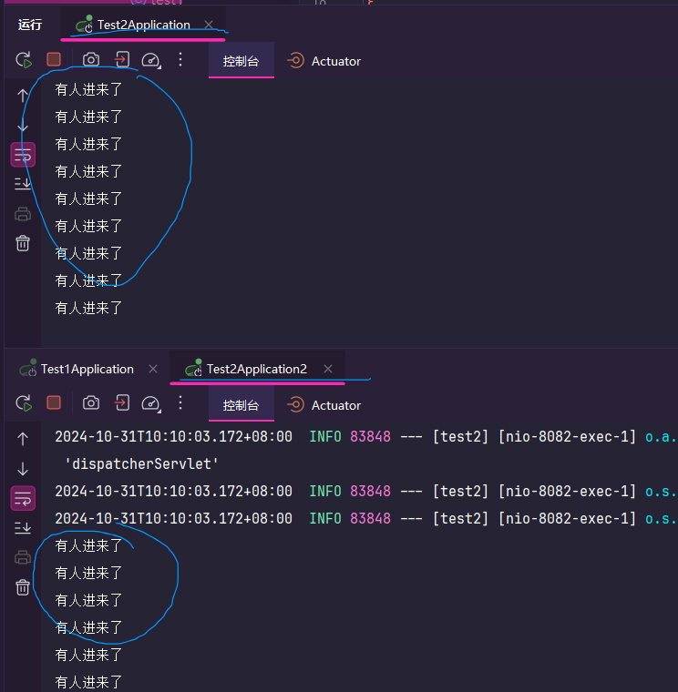如果两个**被请求项目实例**都能打印出文字，说明负载均衡也成功。

那么到这，**服务治理问题，算是初步解决完毕**

##### 有参请求

上面的入门案例是无参请求，这里简单演示一下有参请求的写法

1. 假设**被请求的方法**上面需要**一个参数**传递，例如

   ```java
   import org.springframework.web.bind.annotation.GetMapping;
   import org.springframework.web.bind.annotation.RequestMapping;
   import org.springframework.web.bind.annotation.RestController;
   
   @RestController
   @RequestMapping("test1")
   public class test1 {
       @GetMapping("1")
       //需要一个name的String类型
       public String test1(String name) {
           System.out.println(name);
           return "test2项目";
       }
   }
   ```

2. 那么我们的**请求方法**就得这样写

   ```java
   import org.springframework.cloud.openfeign.FeignClient;
   import org.springframework.web.bind.annotation.GetMapping;
   import org.springframework.web.bind.annotation.RequestParam;
   
   
   @FeignClient(value = "test2")
   public interface reqTest1 {
       @GetMapping("test1/1")
       //@Re......param这个注解标记的是对应被请求方法的形参名称
       //简单来说就说网址名后的?name=苹果
       //如果注解形参故意写错，那么被请求方法就无法接受到数据
       //注解后面的数据类型也必须相同，但是形参则可以自定义
       String test(@RequestParam("name") String name);
   
   }
   ```

3. 然后**重启两个项目**，**被请求方法就能接受到参数**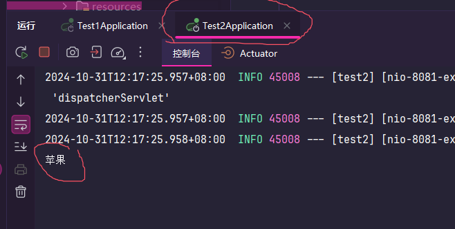

这就是有参请求的写法，那么下面就是传递多个参数的写法

- 其实没有什么变化，也是一样的方式，这里仅贴出代码来大概演示，不手把手带着写

  ```java
  import org.springframework.cloud.openfeign.FeignClient;
  import org.springframework.web.bind.annotation.GetMapping;
  import org.springframework.web.bind.annotation.RequestParam;
  
  
  @FeignClient(value = "test2")
  public interface reqTest1 {
      @GetMapping("test1/1")
      String test(@RequestParam("name") String name,@RequestParam("age") Integer age);
  
  }
  ```

##### Post请求

上面的都是**Get请求**，那**Post请求**该如何写呢？

答案也是很简单，把代码稍作修改即可

1. 这是**请求方法**

   ```java
   import org.springframework.cloud.openfeign.FeignClient;
   import org.springframework.web.bind.annotation.PostMapping;
   import org.springframework.web.bind.annotation.RequestBody;
   
   
   @FeignClient(value = "test2")
   public interface reqTest1 {
       //修改为post
       @PostMapping("test1/1")
       //将变量放入请求体中
       String test(@RequestBody String name);
   
   }
   ```

2. 这是**被请求方法**

   ```java
   import org.springframework.web.bind.annotation.*;
   
   @RestController
   @RequestMapping("test1")
   public class test1 {
       //接受post请求
       @PostMapping("1")
       //获取请求体参数
       public String test1(@RequestBody String name) {
           System.out.println(name);
           return "test2项目";
       }
   }
   ```

这样就实现了Post请求，但如果你想请求**多个Post参数**，则需要把它们**打包成对象**进行传递，这里就不做演示

#### 原理和优化

OpenFeign自动实现了从**Nacos获取接口列表**、**负载均衡**、**动态代理简化请求方法代码**

那么具体是如何做到呢？

可以观看这个视频[OpenFeign自动代理简单源码分析](https://www.bilibili.com/video/BV1S142197x7?spm_id_from=333.788.videopod.episodes&vd_source=95c95b2b45956217a529f886ca23dd35&p=51)

那么现在原理大概理清楚，**OpenFeign底层发送请求，每次发送都需要创建和销毁**，效率低下，因此**需要连接池技术，优化性能**

OpenFeign默认使用**HttpURLConnection**实现，这个技术是不支持连接池技术的

但是它提供了一个接口，可以让我们自定义从而支持连接池技术

以下两种都是常见的连接池技术

1. Apache HttpClient
2. OKHttp

##### 配置连接池

这里将以第二种，OKhttp来做连接池配置

1. 在**发送请求项目**的maven环境中导入依赖

   ```xml
           <!-- 实现OpenFeign的连接池技术 -->
           <dependency>
               <groupId>com.squareup.okhttp3</groupId>
               <artifactId>okhttp</artifactId>
               <version>5.0.0-alpha.14</version>
           </dependency>
   ```

2. 然后在**配置文件**（这里是**properties类型**）加上

   ```properties
   spring.cloud.openfeign.okhttp.enabled=true
   ```

3. 然后启动项目（是的你没看错，就是这么简单），然后访问请求没有任何问题，就说明已经成功配置完成

#### 使用标准

在行业中，使用**OpenFeign**是有使用规范，也可以是标准，再简单来说按着标准模板使用

我们先看看我们上面使用例子有什么问题？

比如说，如果**同一个接口**，需要**多个项目去访问**，那岂不是所有项目都得写一遍这个接口代码？

再比如，万一接口代码动了，那这些所有代码也得跟着修改

因此我们需要优化一下我们的代码

目前有两种解决方案，假设现在有一个场景，b项目要访问a项目内容

1. 分模块：请求方法就由a项目的人自己写，b项目通过maven坐标去获取直接调方法。简单来说就是**别人需要什么，你就写什么给别人**
2. 抽取公共方法：a和b项目都别写，专门开一个新项目c，所有请求方法全部交给c完成。简单来说就是**开一个专门负责写请求的项目**

在企业大项目中，往往会采用第一种方法，因为这种方法耦合最低，并且写代码的都是最了解的自己人所写。但是也不是没有缺点，会导致项目结构复杂，假如一个项目10个微服务，每个微服务又要开三个模块，那总计30个模块服务

而第二种，则相对来说会简单一点，但耦合相对也会提升，并且是项目以外的人编写代码

究竟是选择哪一种呢？

如果你是每个微服务是一个个**独立Project**，那么就把低耦合发挥到极致，就**采用第一种**

如果你是通过**maven聚合**工程开发，这种天然就带有一定的耦合性，那就没必要为了低耦合而低耦合，就**采用第二种**

##### 抽取公共方法

由于当前笔记使用的是Maven聚合，所以自然选择第二种方法

1. 首先新建一个模块（**注意！这个模块是专门负责API方法，因此它不需要去启动，但是由于这个项目不是建立在一个SpringBoot的父类maven项目下，因此会缺少很低依赖，所以在这里是以SpringBoot的项目创建，勾选SpringMvc**）

2. 然后把之前写请求方法的项目的pom文件依赖和请求方法的接口全都挪到**新建的模块下**

3. 别忘记配置文件中的**配置连接池**也要转移过去

4. 然后在**原本写请求方法**的**pom文件**上加上新建模块的依赖（引用）

   ```xml
           <!-- apiTest1的项目 -->
           <dependency>
               <groupId>com.zzz</groupId>
               <artifactId>apiTest1</artifactId>
               <version>0.0.1-SNAPSHOT</version>
               <scope>compile</scope>
           </dependency>
   ```

5. 然后在**请求方法项目**的SpringBoot启动类中上面的注解，**写明扫描范围**

   ```java
   import org.springframework.boot.SpringApplication;
   import org.springframework.boot.autoconfigure.SpringBootApplication;
   import org.springframework.cloud.openfeign.EnableFeignClients;
   
   //OpenFeign扫描范围声明，不写Spring就获取不到bean对象，就无法自动装配
   @EnableFeignClients(basePackages = "com.zzz.apitest1")
   @SpringBootApplication
   public class Test1Application {
   
       public static void main(String[] args) {
           SpringApplication.run(Test1Application.class, args);
       }
   
   }
   ```

6. 最后再修改一下请求方法类中的**接口位置**就行

   ```java
   import org.springframework.beans.factory.annotation.Autowired;
   import org.springframework.web.bind.annotation.GetMapping;
   import org.springframework.web.bind.annotation.RequestMapping;
   import org.springframework.web.bind.annotation.RestController;
   
   @RestController
   @RequestMapping("test1")
   public class test1 {
       //声明是来自于apiTest1项目中的接口
       @Autowired
       private com.zzz.apitest1.reqTest1 reqTest1;
   
       @GetMapping("1")
       public String test1(){
           //通过动态带来方式，直接就能点出方法使用
           return "我成功获取到"+reqTest1.test("苹果");
       }
   }
   ```

7. 最后启动项目，访问一下网址，能获取到信息说明**修改完成**

#### OpenFeign日志

日志在项目开发中，是相当重要的，因为它能快速定位问题所在，因此在生产环境下，需要在**合适的地方输出合适的日志内容**

OpenFeign只会在FeignClient所在包的日志级别为DeBug时候，才会打印日志

但是OpenFeign默认是为不做日志记录

总结一下就是想要输出OpenFeign的日志，我们要**做到两点**

1. 修改FeignClient的日志级别为DeBug级
2. 修改OpenFeign的日志默认值 

另外OpenFeign也是有**日志级别**的

1. NONE:不做任何记录，**默认值**
2. BASIC:记录请求方法、URL、响应状态码和执行时间
3. HEADERS:额外增加请求和响应头信息
4. FULL:记录一切

##### 修改日志等级

首先修改日志级别，要在请求方法模块中实现，而不是具体的微服务，因为可能大部分微服务都需要开启

[该功能在当时无法实现，相信后人的智慧，这个是参考视频](https://www.bilibili.com/video/BV1S142197x7?spm_id_from=333.788.player.switch&vd_source=95c95b2b45956217a529f886ca23dd35&p=53)

## * 网关配置

在**后端和后端请求**之间，我们有**Nacos**帮我们完成接口的**发布、筛选、动态获取**

那么问题来了，**前端怎么办？**

再比如说，如果登录的验证信息，所有微服务都需要了？难道每个微服务都做一份检验拦截器？

那么现在微服务组件中就有一个解决这个问题的方案：**网关**

简单来说，网关就是网络的入口，负责**路由、转发、身份校验等功能**

那么**网关**是**如何获取到后端这些动态接口呢？**

答案很简单，**直接去找Nacos要就行了**

配置了网关之后，前端只需要网关的网络ip地址即可，通过网关去做身份检验和路由到目标接口

目前比较主流的网关实现有两种

1. Spring Cloud Gateway：Spring开源，基于WebFlux响应式编程，性能优异
2. Netfilx Zuul：美国奈飞公司产品。基于Servlet阻塞式编程，需要优化

显然对比下来Spring家的产品更加优秀，因此下面学习也是基于Spring

### 快速入门

首先得完成两步，分别是**网关环境搭建**和**网关规则**

1. 首先新建一个网关项目（采用**SpringBoot3.3.4**）

2. 然后添加下面的**依赖**

   ```xml
           <!-- SpringCloud网关 -->
           <dependency>
               <groupId>org.springframework.cloud</groupId>
               <artifactId>spring-cloud-starter-gateway</artifactId>
               <version>4.1.5</version>
           </dependency>
   
           <!-- Nacos服务 -->
           <dependency>
               <groupId>com.alibaba.cloud</groupId>
               <artifactId>spring-cloud-starter-alibaba-nacos-discovery</artifactId>
               <version>2023.0.1.3</version>
           </dependency>
   
           <!-- SpringCloud核心 -->
           <dependency>
               <groupId>org.springframework.cloud</groupId>
               <artifactId>spring-cloud-dependencies</artifactId>
               <version>2023.0.3</version>
               <type>pom</type>
               <scope>import</scope>
           </dependency>
   
           <!-- 负载均衡算法库 -->
           <dependency>
               <groupId>org.springframework.cloud</groupId>
               <artifactId>spring-cloud-starter-loadbalancer</artifactId>
               <version>4.1.3</version>
           </dependency>
   ```

3. 添加后，**启动Nacos服务**

4. 然后去到**网关**的**配置文件**加上这段内容

   ```yaml
   spring:
     application:
       name: gatewayTest1                      #启动后的项目名称
     cloud:
       nacos:
         server-addr: 127.0.0.1:8848           #Nacos的网络地址
       gateway:
         routes:                               #网关的路由配置
           - id: test2                         #要路由到的ID，这里填写的是以项目的配置文件名称为准
             uri: lb://test2                   #路由到的路径
             predicates:                       #断言，就是匹配规则，lb就是采取复杂均衡策略
               - Path=/test1/**                #意思就是只要请求进来的接口，是test1下的，就能进来
             # - Path=/test1/**,/test2/**      #如果想要配多个的话，可以像这样写
     main:
       web-application-type: reactive          #设置web框架，如果你网关项目有SpringMvc依赖，就必须加上这个，如果不是就删掉
   server:
     port: 8083                                #项目端口号
   ```

5. 根据**配置文件**的**注释**，**自己调整一下**

6. 然后写完后就直接**启动网关项目**，然后**启动网关会路由到的项目**

7. 然后[输入这个地址](http://localhost:8083/test1/2)如果有能够正确访问，那么路由**网关搭建完成**

可以试着**停掉一个请求方法项目**，然后需要**去Nacos刷新点查询刷新一下**，不然网关会访问停机的服务器中

点了Nacos刷新后再来这个页面，你会发现**网关依然能正常访问**

**并且网关还实现了负载均衡的效果**

### 路由配置

刚才的入门案例属于**最基本的网关配置**，但这些基础配置**还远远不够**

1. **id**：路由唯一标识
2. **uri**：路由目标地址
3. **predicates**：路由断言，判断请求是否符合当前路由
   - 断言的基本属性有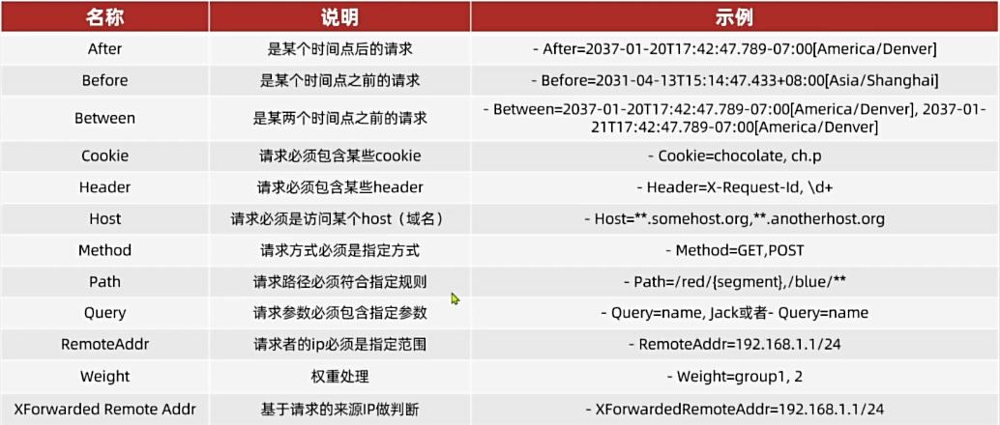
4. **filters**：路由过滤器，对请求和响应做特殊处理
   - 基本的过滤属性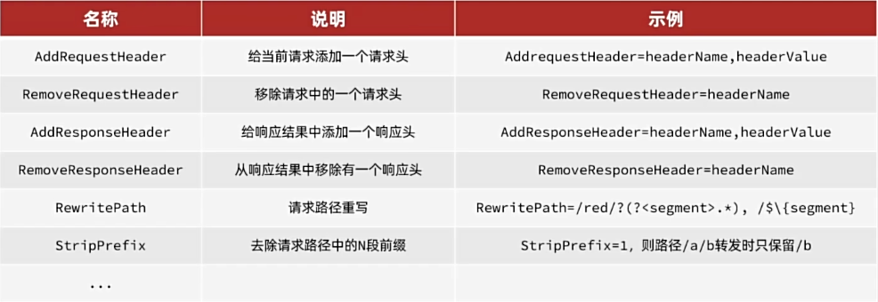

#### 过滤器

**很多业务是需要登录后，带着token来才可以访问**，因此需要**在网关处进行检验检查**，那么具体该怎么检查呢？

- 如图，这是网关处理的大致逻辑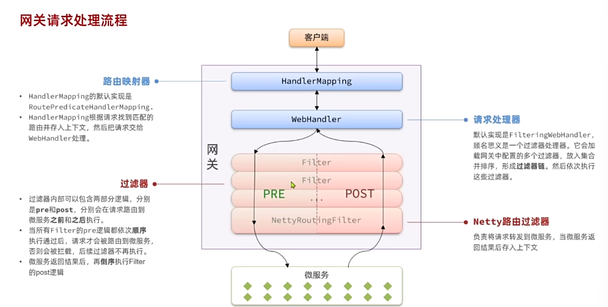

##### 自定义过滤器

网关过滤器有两种

1. GatewayFilter：**路由过滤器**，能指定任意路由，**默认不生效**，要配置到路由后生效
2. Globalfilter：**全局过滤器**，能作用在所有路由中，**声明后自动生效**

这里分别演示下两种的过滤器，首先先从Globalfilter开始

- 这是路由过滤器，在网关项目新建一个**过滤器类**

  ```java
  import org.springframework.cloud.gateway.filter.GatewayFilterChain;
  import org.springframework.core.Ordered;
  import org.springframework.http.server.reactive.ServerHttpRequest;
  import org.springframework.stereotype.Component;
  import org.springframework.web.server.ServerWebExchange;
  import reactor.core.publisher.Mono;
  
  @Component
  public class GlobalFilter implements org.springframework.cloud.gateway.filter.GlobalFilter, Ordered {
      @Override
      public Mono<Void> filter(ServerWebExchange exchange, GatewayFilterChain chain) {
          //获取请求的参数
          ServerHttpRequest request = exchange.getRequest();
          //打印请求头信息
          System.out.println("请求头是"+request.getHeaders());
          //放行
          return chain.filter(exchange);
      }
  
      /**
       * 设置执行优先级
       */
      @Override
      public int getOrder() {
          return 0;
      }
  }
  ```

写完后，重启下项目，通过网关走进的请求，就能看见请求头了

**通常使用路由过滤器，就能应付大部分业务场景**，而全局过滤器实现比较麻烦

[如果你有需要，就点我](https://www.bilibili.com/video/BV1S142197x7?spm_id_from=333.788.videopod.episodes&vd_source=95c95b2b45956217a529f886ca23dd35&p=63)

#### 网关传递用户

光是网关拿到信息还不够，因为**真正做业务处理**的是各种各样的**微服务**，因此还需要把**信息传给微服务**

那么如何传递到呢？在网关的时候，我们可以将它写在请求头上

1. 首先在网关获取到请求的时候，就添加上请求头信息

   ```java
   import org.springframework.cloud.gateway.filter.GatewayFilterChain;
   import org.springframework.core.Ordered;
   import org.springframework.http.server.reactive.ServerHttpRequest;
   import org.springframework.stereotype.Component;
   import org.springframework.web.server.ServerWebExchange;
   import reactor.core.publisher.Mono;
   
   @Component
   public class GlobalFilter implements org.springframework.cloud.gateway.filter.GlobalFilter, Ordered {
       @Override
       public Mono<Void> filter(ServerWebExchange exchange, GatewayFilterChain chain) {
           //修改请求头参数，这个sb是要和微服务部分统一，一般会使用常量
           exchange.mutate().request(builder -> builder.header("sb","BigApple")).build();
           //放行
           return chain.filter(exchange);
       }
   
       /**
        * 设置执行优先级
        */
       @Override
       public int getOrder() {
           return 0;
       }
   }
   ```

2. 然后在微服务里面接受请求头参数

   ```java
   @GetMapping("2")
       //第一个value就是请求头名
       //第二个是不一定能接受到
       public String test2(@RequestHeader(value = "sb",required = false) String sb) {
           System.out.println(sb);
           return "路由配置成功";
       }
   ```

3. 然后**还没完**，因为这种方式相当于**所有方法都得验证一遍**，所以需要抽出公共方法，在**公共项目中写拦截器代码**，获取到后**存入ThreadLocal线程变量中**

4. 由于环境问题，暂时无法实现，在这[标记](https://www.bilibili.com/video/BV1S142197x7?spm_id_from=333.788.player.switch&vd_source=95c95b2b45956217a529f886ca23dd35&p=65)一下相信后人智慧

#### 微服务信息传输

环境问题，相信后人[智慧](https://www.bilibili.com/video/BV1S142197x7?spm_id_from=333.788.videopod.episodes&vd_source=95c95b2b45956217a529f886ca23dd35&p=66)

### 配置管理

当你把这一章节学完，那么**微服务就可以进行开发**，当然，**依然会存在问题**，只不过都是些小问题，可以不理会

微服务可能会有几十个甚至上百，那么你就需要配置相对于的数据配置，如果将来要修改也是相当困难

解决方法，就是使用**配置管理服务**将通用配置都记录在这里面，而**配置管理服务**通过推送服务，让微服务获取数据，这样修改配置信息就不需要重新打包编译部署

那么**配置管理服务**具体是什么呢？

没错就是**Nacos**，Nacos除了具有注册中心功能，还有**配置管理服务功能**

#### 配置共享

但是现在又有个问题，那就是**我SpringBoot项目得先启动，启动后才能去拉取配置信息，可问题是我都启动完了，还读取个屁的配置**，这不是陷入了鸡蛋悖论（先有鸡还是先有蛋）问题？

为了解决这个问题，SpringBoot提供了一种配置文件，叫做**引导配置**

- 如图所示**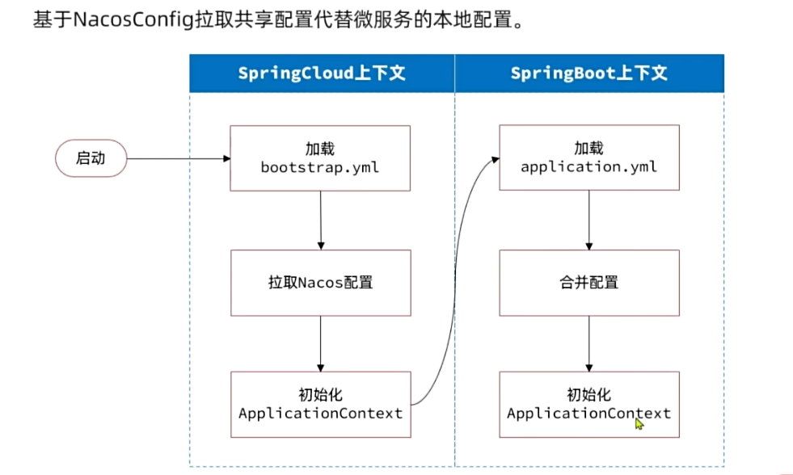配置文件由SpringCloud读取**，然后通过SpringCloud去启动SpringBoot项目

由于环境问题，具体实现过程相信后人[智慧](https://www.bilibili.com/video/BV1S142197x7/?spm_id_from=333.788.player.switch&vd_source=95c95b2b45956217a529f886ca23dd35&p=68)

#### 热更新

既然现在配置获取到了，那么如果我想在**不重启项目的情况下更新配置怎么办**？

由于环境问题，具体实现过程相信后人[智慧](https://www.bilibili.com/video/BV1S142197x7?spm_id_from=333.788.player.switch&vd_source=95c95b2b45956217a529f886ca23dd35&p=69)

#### 动态路由

网关作为整个微服务入口，是不能关闭和重启的，但如果想进行配置更改该怎么办？

这就需要Nacos进行动态路由设置

1. 首先，先在网关项目下导入Maven的依赖

   ```xml
           <!-- 从Nacos获取配置文件依赖 -->
           <dependency>
               <groupId>com.alibaba.cloud</groupId>
               <artifactId>spring-cloud-starter-alibaba-nacos-config</artifactId>
               <version>2023.0.1.3</version>
           </dependency>
   
           <!-- 用SpringCloud启动SpringBoot -->
           <dependency>
               <groupId>org.springframework.cloud</groupId>
               <artifactId>spring-cloud-starter-bootstrap</artifactId>
               <version>4.1.4</version>
           </dependency>
   ```

2. 然后去创建一个名为：**bootstrap**的yaml配置文件

   ```yaml
   spring:
     profiles:
       active: dev                     #说明为开发环境
     cloud:
       nacos:
         server-addr: 127.0.0.1:8848   #Nacos网址
         config:
           file-extension: json        #获取配置的格式
   ```

3. 然后修改一下项目里**application**的配置文件

   ```yaml
   spring:
     profiles:
       active: dev                     #说明为开发环境
     cloud:
       nacos:
         server-addr: 127.0.0.1:8848   #Nacos网址
         config:
           file-extension: json        #获取配置的格式
   ```

4. 然后在去到Nacos控制台中，创建配置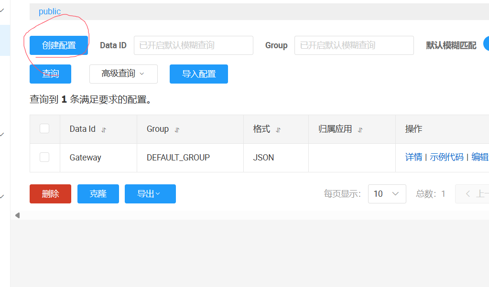

5. 点击后根据图片的信息填写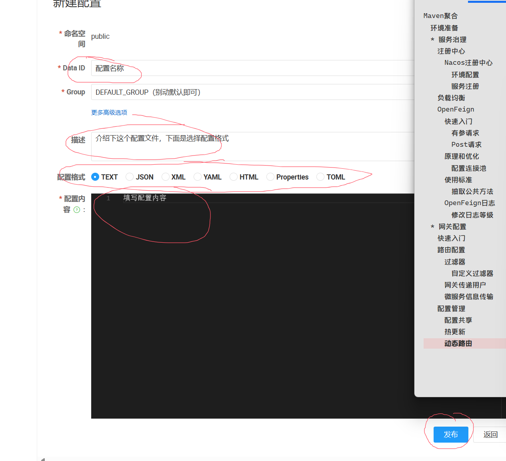

6. 这里我我填写的是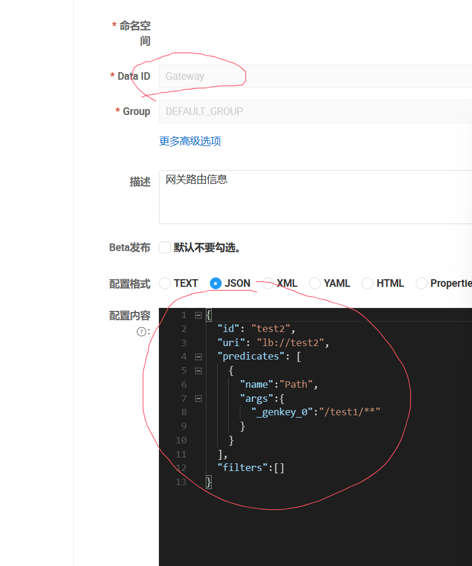

   1. 其中名字是：Gateway

   2. Json内容是

      ```json
      { 
        "id": "test2",
        "uri": "lb://test2",
        "predicates": [
          {
            "name":"Path",
            "args":{
              "_genkey_0":"/test1/**"
            }
          }
        ],
        "filters":[]
      }
      ```

7. 这里的信息和之前的网关配置文件差不多，可以回去查看琢磨，这里不过多阐述

8. 然后编写一个**配置文件类**

   ```java
   import com.alibaba.cloud.nacos.NacosConfigManager;
   import com.alibaba.nacos.api.config.listener.Listener;
   import jakarta.annotation.PostConstruct;
   import org.springframework.beans.factory.annotation.Autowired;
   import org.springframework.cloud.gateway.route.RouteDefinition;
   import org.springframework.cloud.gateway.route.RouteDefinitionWriter;
   import org.springframework.stereotype.Component;
   import reactor.core.publisher.Mono;
   
   import java.util.ArrayList;
   import java.util.List;
   import java.util.concurrent.Executor;
   
   @Component  //标明配置文件类
   public class DynamicRouteLoader {
       @Autowired
       private NacosConfigManager nacosConfigManager;
       @Autowired
       private RouteDefinitionWriter writer;
   
       //记录路由ID
       private String routeId=null;
   
       //Nacos的配置文件名称
       private final String dataId = "Gateway";
       ////Nacos的配置文件分组
       private final String group = "DEFAULT_GROUP";
   
       /**
        * 初始化路由
        */
       @PostConstruct  //初始化后执行
       public void initRoute(){
           try {
               //项目启动时，拉取一次配置，然后进行监听
               String config=nacosConfigManager.getConfigService()
                       //其中参数1是配置名称
                       //参数2是配置分组
                       //参数3是超时时间
                       //参数4是设置
                       .getConfigAndSignListener(dataId,group,1000*5,
                       new Listener() {
                           //定义线程池，返回null就是没有
                           @Override
                           public Executor getExecutor() {
                               return null;
                           }
   
                           //配置变更，你要做干嘛？
                           @Override
                           public void receiveConfigInfo(String s) {
                               //如果变更，就更改路由参数
                               updataConfig(s);
                           }
                       });
               //监听到配置变更，就修改路由参数
               updataConfig(config);
           }catch (Exception e){
               e.printStackTrace();
           }
       }
   
       public void updataConfig(String configJson){
           //检查一下，从配置文件拉取的参数
           System.out.println("检查一下："+configJson);
           //由于这里接受的是一个集合
           //但是这个封装好的工具只会返回一个对象
           //因此这样实现
           List<RouteDefinition> a=new ArrayList<>();
           a.add(redisJson.getJson(configJson,RouteDefinition.class));
   
           //在修改网关配置之前，先删除旧的配置
          if(routeId!=null){
              writer.delete(Mono.just(routeId)).subscribe();
          }
   
           //提供一个响应式编程的容器,然后进行订阅响应式
           writer.save(Mono.just(a.get(0))).subscribe();
           //存入ID
           routeId=a.get(0).getId();
       }
   }
   ```

9. 代码很多，要好好看一遍

10. 然后启动项目，可以测试一下，如果能进去就说明拉取配置成功

11. 然后可以尝试**去Nacos修改一下配置文件**，修改后回来看idea控制台，**你会发现它监听配置文件变化**，已经获取到新的配置文件信息了

## 服务保护和分布式事务

### 雪崩

**和Redis缓存雪崩类似**，因为一个小故障进而引发整个系统的故障

比如说如果一个系统有abcd四个业务，**假如abc三个业务都依赖于d的话**，那么**d业务一旦宕机**，那么abc三个业务都无法进行，相当于**整个系统都故障**

那么问题的关键在哪？问题的关键就是**调用者，没发现被调用者已经宕机故障，还在调用所导致的**

#### 解决方法

解决方法除了假大空的，提高代码质量、增加网络带宽这些以外，还有几种比较常见

1. **请求限流**：**限制微服务的请求并发量**，避免服务因流量暴增出现故障
2. **线程隔离**：也可以叫**舱壁模式**，通过限定业务能使用的线程数量，从而将故障业务隔离，避免故障扩散。简单来说，就是**进入这个服务，得先去线程池拿一条线程**，假如这时候服务故障，那你**业务没有完成，线程无法释放**，等线程池耗光后，其他地方进来，就因为**没有线程无法访问这个服务**
3. **服务熔断**：统计业务请求的异常比例和超时比例，超出阈值后熔断该业务，拦截该业务的请求接口，全部引导到另外一边进行业务补充

那么这些具体代码实现，都有一定难道，那么该怎么写了？

根本不用担心，因为Spring已经有对应的组件了，我们可以直接使用

#### 服务保护技术

目前常见的实现库有Sentinel和Hystrix，其中前者为阿里巴巴后者为奈飞（看剧的那个）

这里将于Sentinel来完成
