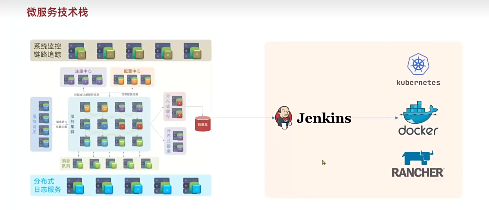
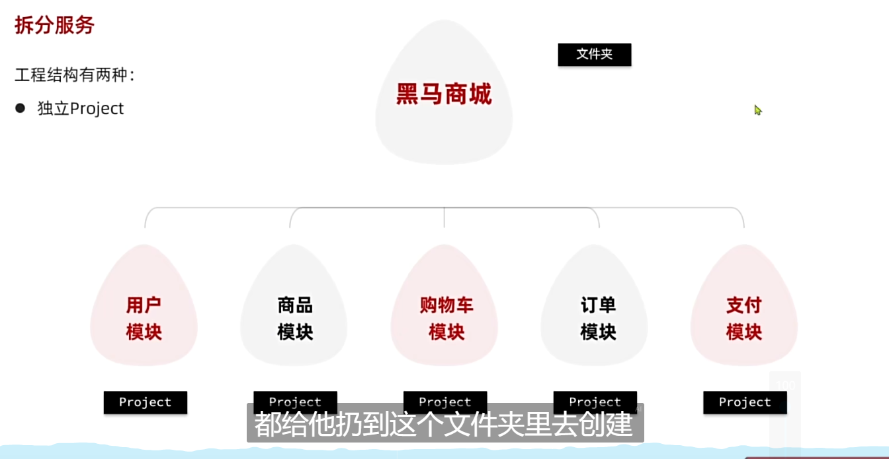
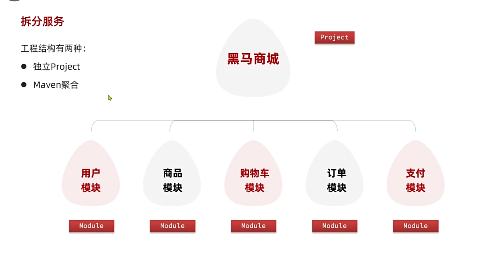

# 微服务入门

## 微服务是什么？

微服务是一种**软件架构**，以**单一职责**的很**多个小项目**组成的**复杂大项目**

传统的**单体项目**结构在开发超大型项目**难以管理和维护**

**注意！微服务不仅仅只是SpringCloud**

- 这才是完整的微服务

### 是否使用微服务？

使用微服务的条件，**就是看项目是否复杂且庞大。**

但是一开始**怎么确定**自己**是否使用微服务**呢？

1. 创业型项目：如果有很好的创意，那么先从单体架构开始，快速开发，然后规模扩大在逐渐拆分
2. 确定的大项目：如果资金和目标确定，可以一开始就用微服务架构开发，避免拆分带来的麻烦

### 怎么拆分

做到**高内聚**（服务单一，业务相互高关联）、**低耦合**（相对独立，减少依赖）

拆分可以从**横向**（服务模块）和**垂直**（业务模块）

### 拆分种类

拆分有两种种类，一种是**独立Project**，另外一种是**Maven聚合**

1. 独立Project，每个微服务就是一个Project，之间没有关联，耦合度降至最低
2. 如果项目不大，中小型项目可以采用Maven聚合也就是在项目主文件下新建一个模块，在不同模块实现不同的业务

Maven聚合看起来和单体架构没什么区别，但是**每个模块都是独立打包部署**，只是**单纯**的**把代码放到一起而已**

**注意！Maven聚合虽然有微服务的特点，但其实它并不算是微服务。并且在微服务这种架构或者类似架构下，开发效率等不再是第一，而是单一职责**
