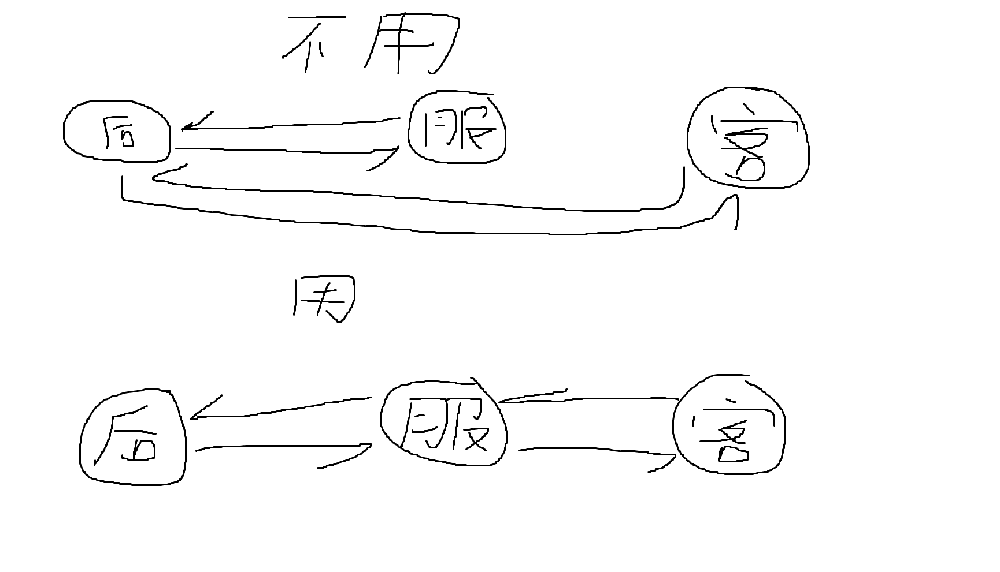

## Nuxt

开发**SPA**（单页面）项目的时候有**Router**,那么开发**SSR**（多页面）就用**Nuxt**解决

那么SPA和SSR除了在SEO（自然排名）和加载速度上区别以外

在技术上的区别就是：

1. SPA:客户端通过js动态构建页面
2. SSR:服务器生成html页面发送给客户端

那么它们**具体差异体**现在哪呢？

- 如同所示，同样一个页面。**左边采用传统的vue项目来写**，搜索引擎是抓取不到里面的内容，**而右边采用nuxt**，因为是渲染好html页面再做传送，因此搜索引擎就能抓取到里面内容，从而有更高的SEO（曝光度）

当然，nuxt可以渲染成html，自然它内置了一个渲染引擎**Nitro**

### 环境安装

Nuxt在webstorm中没有**现成的模板可以创建，因此我们需要手动去创建**

1. 首先在webstorm中创建Node项目

2. 然后根据代码手动调整下package.json文件

   ```json
   {
     "name": "test3",
     "version": "1.0.0",
     "main": "index.js",
     "scripts": {
       "test": "echo \"Error: no test specified\" && exit 1",
       "dev": "nuxi dev",
       "build": "nuxi build"
     },
     "devDependencies": {
       "nuxt": "^3.13.2"
     },
     "keywords": [],
     "author": "",
     "license": "ISC",
     "description": ""
   }
   ```

3. 然后设置npm作为启动程序

4. 然后打开终端输入这段代码，下载配置

   ```
   npm install
   ```

5. 然后启动npm，yes和no的选择可以自行去翻译选择。并不是重点

6. 创建好后，src目录下的内容可以直接创建使用（参考vue脚手架和vite的情况），但有一点不同，**就是app.vue要在项目的根目录，不能在src下**

### *开发差异

nuxt同样支持vue的语法，毕竟是一个团队的，基本上vite项目是可以无缝衔接上nuxt的。

但是，但是因为前面说过，nuxt是ssr架构下实现的，因此它会在服务器内部进行一次生成，然后传给浏览器。而原来则是动态传递js代码，这就导致部分代码会出现报错。

比如说弹框代码，比如**alert**方法，如果是进入页面就运行这个方法，那么就会导致报错，因为nuxt内置渲染引擎，会先用这个渲染引擎渲染一遍，**而这个渲染引擎是服务器端，因此不支持这种图形化相关的js代码**

解决方法也是有的，就是把它放在按钮里面，点一下再触发弹窗，因为点按钮是在浏览器操作，而浏览器来渲染当然就没问题了

因此采用nuxt开发，是有一点的禁忌的，**而且目前业界前端最强开发工具，webstorm和代码检查工具都没有针对nuxt去做适配**，因此这种问题只能是靠经验去累积

### 引用element-ui

首先，你得先生成好**nuxt.config.ts**文件，这个在每次启动项目时候，会询问是否生成

**注意，webstorm会对这个文件容易产生误报错**

原本的方式是下载文件，然后再mian.js配置，但是Nuxt没有mian.js这一玩意了，改用**nuxt.config.ts**文件了

1. 首先复制这段代码在终端中下载

   ```
   npx nuxi@latest module add element-plus
   ```

2. 然后在配置文件上加上这段代码（会自动生成，没有就记得加上）

   ```ts
   export default defineNuxtConfig({
     //导入这段就行了
     modules: [
       '@element-plus/nuxt'
     ],
     //分割线
     elementPlus: { /** Options */ }
   })
   ```

3. 然后就可以尝试一下

   ```html
   <el-button type="primary">123</el-button>
   ```

4. ok，导入成功

### 区分客户端和服务端

前面《开发差异》那一节说过，nuxt不支持图形化的js命令，如果你直接打**alert**这个函数，就会报错。

但问题来了，如果我就是想在页面进来的时候生成弹框，这种业务场景怎么办？

- 好办，可以if判断，判断当前代码处于哪个阶段，在服务器就不渲染，在客户端就渲染

  ```js
  //判断是否为服务器端，
  //因为这里取反，所以当在客户端（浏览器端）就弹出窗口
  if(!import.meta.server){
      alert('abc1231')
  }
  ```

### *目录解析

这里把之前和后面需要的目录结构盘点一下：

1. pages：路由到的网页
2. public：静态资源存放（图片、视频）
3. middleware：路由中间件
4. components：封装函数，存放.js文件，并且自动注册不需要导入（只会扫描一层，如果嵌套了个文件夹就不能用了）。并且可以存放组件
5. utils:和上面的components一样。

### *基本路由

进入正题，nuxt和vite使用的路由不同，**无需配置环境，即可使用**

1. 首先在项目根目录新建一个文件夹：pages

2. 然后把需要路由的页面添加进这个文件夹，就像图片中这样

3. 然后在app页面上添加一段代码作为入口

   ```html
   <NuxtPage></NuxtPage>
   ```

4. 然后在浏览器url输入你要的文件名

5. 如果想做**a标签超链接形式**，代码如下

   ```html
   <NuxtLink to="/login">登录</NuxtLink>
   ```

### 命名、可选、指定、全局、嵌套路由

#### 命名路由

命名路由呢，就是这个**名字无论是什么**（不能为空），都能访问到，**只要路径正确**

1. 如同，在pages文件夹下再建立给文件夹，然后里面的vue文件用中括号包起来

2. 然后新建的vue文件写入这段js代码

   ```js
   //用来获取用户url中的最后一个值
   //最后的.abc是根据你的文件名的中括号里面的值来的
   //如果文件名是[qwe]，那么这里就得.qwe
   console.log(useRoute().params.abc)
   ```

3. 然后在浏览器中路由

   发现没？只要路径正确，最后的那个无论你输入什么都能访问到这个页面

4. 而浏览器和webstorm控制台都能获取到用户输入的最后一个url地址

那么它的场景在哪呢？

比如说b站的用户界面，url最后一位就是你的账户的id。

#### 可选路由

可选路由就是命名路由的反过来版本。就是**路径可以随便写，甚至不写。但是最后的文件名必须正确**

1. 如图，文件夹用两个中括号括起来
2. 然后在路径上，可以随便写，哪怕是直接不写都行，但是文件名必须正确

#### *指定路由

字面意思，就是指定一个url作为该页面路由

1. 在pages根目录下创建一个文件，加上这段js代码

   ```js
   <script setup>
   definePageMeta({
   	//指定路由位置
   	//不要导入如何包和函数进来
       path:"/about"
   })
   </script>
   ```

2. 然后url输入路径，成功获取

**这是开发中最常用的路由方式**

#### 全局路由

这个就是当**所有路由都匹配不上的时候，就匹配这个路由**

1. 文件如同，文件名由一个中括号括起来，名称以...开始。后面名称任意
2. 然后url随便输入地址，只要路由不存在，都会匹配这个页面

#### 嵌套路由

假如你现在有一个场景，pages的文件夹下，如果有一个命名路由和一个首页，那么默认会进到哪个页面？

毫无疑问默认是首页，你随便访问一个地址，就是命名路由。

那问题来了，如果我想首页和命名路由同时显示该怎么办？

**答案是创建一个副路由，把首页和命名路由的内容都整合过来**

### 重定向

在nuxt中跳转网页，通过下面这段代码实现

- 重定向代码

  ```js
  //是在你的首页，也就是http://localhost:3000/往后修改url
  //也就是说，即使是原本是/user/index。运行这段代码也会回到首页app.vue上
  navigateTo("/")
  ```

### *内置API网络请求

由于nuxt会在服务器渲染然后客户端渲染的两次渲染特性所在。

因此**使用axios会导致连续两次请求后端接口的问题**，当然你通过一些手段封装好也是能解决的，但是既然nuxt提供了内置的api请求函数，那我们就使用这个就好

#### *跨域

像这种前后端分离项目，我们**必须考虑跨域的问题**

注意！**Spring cloud网关的跨域代码和Spring Boot的跨域代码是不一样的**，这里我都写出来

1. Spring cloud网关

   ```java
   import org.springframework.context.annotation.Bean;
   import org.springframework.context.annotation.Configuration;
   import org.springframework.web.cors.CorsConfiguration;
   import org.springframework.web.cors.reactive.CorsWebFilter;
   import org.springframework.web.cors.reactive.UrlBasedCorsConfigurationSource;
   
   /**
    * 允许来自其他端口的跨域请求
    * @author Akemi0Homura
    */
   @Configuration
   public class CorsConfig {
   
       @Bean
       public CorsWebFilter corsFilter() {
           CorsConfiguration config = new CorsConfiguration();
           // 允许发送凭证（如Cookies），设置为true时，allowedOrigins不能为*
           config.setAllowCredentials(true);
           //允许访问的网站
           config.addAllowedOrigin("http://localhost:3000");
           // 允许所有头部信息通过
           config.addAllowedHeader("*");
           // 允许所有的HTTP方法
           config.addAllowedMethod("*");
   
           UrlBasedCorsConfigurationSource source = new UrlBasedCorsConfigurationSource();
           // 注册CORS配置到指定路径模式"/**"（匹配所有路径）
           source.registerCorsConfiguration("/**", config); 
   
           return new CorsWebFilter(source);
       }
   }
   ```

2. Spring boot(或是基于Servlet做的网关)

   ```java
   import org.springframework.context.annotation.Bean;
   import org.springframework.context.annotation.Configuration;
   import org.springframework.web.servlet.config.annotation.CorsRegistry;
   import org.springframework.web.servlet.config.annotation.WebMvcConfigurer;
   
   /**
    * 允许来自其他端口的跨域请求
    * @author Akemi0Homura
    */
   @Configuration
   public class CorsConfig {
   
       @Bean
       public WebMvcConfigurer corsConfigurer() {
           return new WebMvcConfigurer() {
               @Override
               public void addCorsMappings(CorsRegistry registry) {
                   // 注册一个全局的CORS映射，匹配所有路径（/**）
                   registry.addMapping("/**")
                       	// 允许访问的网站
                           .allowedOrigins("http://localhost:3000")
                       	// 允许的HTTP方法
                           .allowedMethods("GET", "POST", "PUT", "DELETE", "OPTIONS")
                       	// 允许所有头部信息通过
                           .allowedHeaders("*")
                       	// 允许发送凭证（如Cookies）。注意：当设置为true时，allowedOrigins不能是"*"
                           .allowCredentials(true); 
               }
           };
       }
   }
   ```

#### $fetch

**fetch是浏览器中内置的一个API请求工具**，但因为是内置的原因，自然它的**功能要比axios少很多**。但是也因此fetch用起来很简单

并且**nuxt为fetch做了一些功能封装**

1. 代码很简单，一句话搞定

   ```java
   //向该网址发送请求，默认是GET
   const res=await $fetch('http://localhost:8080/Login/test')
   //打印对象信息
   console.log(res)
       
       
       
   //如果想用post请求，可以像下面这样写
   const res=await $fetch('http://localhost:8080/Login/test',{
       method: 'POST'
   })
   ```

2. 成功获取到后端信息

3. 但是你应该发现问题了，那就是他请求了两次，这肯定是不允许的啊

4. 有人说，这好办，你直接这样判断一下不就完事了吗？

   ```js
   if(!import.meta.server){
       //向该网址发送请求，默认是GET
       const res=await $fetch('http://localhost:8080/Login/test')
       //打印对象信息
       console.log(res)
   }
   ```

5. 确实啊，这样确实能解决，但是官方已经准备好一个函数来解决这个问题

#### useAsyncData

是的，这个useAsyncData就是用来解决，我前面所说的，$fetch请求两次的问题

1. 把代码稍作改装

   ```js
   //这个useAsyncData函数底层原理，在服务器上执行
   //是把数据装进缓存一个key叫a1的键值对种
   //当后面的代码执行到这个方法后，会先去缓存找下key值是否存在
   //如果存在，那么就会直接拿值，而不会在执行一次方法
   //这样就实现了只执行一次
   const res=await useAsyncData('a1',()=>{
       return $fetch('http://localhost:8080/Login/test');
   })
   //前面是res本身对象，后面才是后端返回结果
   //并且自动的将后端返回结果包装成响应式数据
   console.log(res)
   console.log(res.data.value)
   ```

2. 看成功获取到，并且只打印了一次

3. **有一点需要注意！**那就是注释中说，下次进来会去缓存查找key，但这**不意味着说你想主动去后端接口查新数据，就不允许了，拿的是缓存里的数据。**

   正如这个图所说的那样，当你不用useAsyncData的时候，直接使用$fetch会出现服务器和客户端都找后端要数据的情况

   但是当你使用useAsyncData后，服务器会找后端要数据，而客户端呢就会去服务器找数据，而找的数据依据呢，就是缓存中key值。因此key得保证唯一，如果是设计重复的，那么就相当于没有使用useAsyncData了。因为当页面放在客户端后，客户端的点击如果没有这个key值也会去找后端要，也就形成了图中不用useAsyncData的情况

看到这，你可能会说，那和前面if判断服务器才能使用api接口有什么区别啊？用if判断还简单点。

那当然是有区别的啊。想想我们用Nuxt是为了什么？是为了SEO，而采用useAsyncData的方法，从后端拿来的数据可以被搜索引擎抓取到。

所以使用API请求，**就不能使用if判断的方法**

#### useFetch

useFetch其实就是fetch和useAsyncData结合的语法糖

1. 代码如下

   ```js
   	//内部自动生成Key，默认为GET
       const res=await useFetch('http://localhost:8080/Login/test')
       console.log(res.data.value)
   ```

2. 成功获取

3. 但是呢这个**useFetch有些参数可以使用**

4. 比如说**refresh**这个对象

   ```js
   //解构出对象
   const {refresh}=await useFetch('http://localhost:8080/Login/test')
   //该对象方法作用是重新进行一次请求，通常作为刷新token
   refresh()
   ```

5. 再比如说**status**这个对象

   ```js
   //解构出对象,使用status对象，需要把await去掉，让他进行异步
   //不然放在一些htmk标签上，必须等请求完成，才会渲染页面
   const {status}=useFetch('http://localhost:8080/Login/test')
   //打印status的值
   //正在等待后端返回结果的时候，值//解构出对象,使用status对象，需要把await去掉，让他进行异步
   //不然放在一些htmk标签上，必须等请求完成，才会渲染页面是pending
   //当返回结果后就是success
   //因此可以使用这个对象做一个加载的友好提示之类的
   console.log(status)
   ```

   这个对象也有一点要注意。那就是服务器端，它一定是渲染好页面，也就是请求完成后，才把页面交给客户端。因此客户端看到的，永远是success。但是呢，如果客户端手动去请求一次，那么就能看在pending的时候。

6. 假如说，你想要useFetch必须同步，但也想使用status怎么办？答案是需要设置一下

   ```js
   const {status}=await useFetch('http://localhost:8080/Login/test',{
       //先去渲染html页面
       lazy: true
   })
   ```

7. 改成这样就可以解决了

#### 封装useFetch

好，现在我们了解了fetch的基础用法了。但是问题来了。像axios那样的响应、请求拦截器之类功能怎么实现呢？总不能每个fetch都写一大段代码去处理是吧。

那当然不能，因此我们需要去手写axios的这些拦截器功能

注意！**这个封装是根据你的项目需求来的**，因为它是手写，因此存在着高度自定义，所以你需要看懂整体代码逻辑后，再去动手写代码

1. 首先，前往nuxt.config.ts的配置文件添加一个全局变量

   ```ts
   //全局变量(严格来说是全项目的变量)
     runtimeConfig:{
       public:{
         //后端网关的地址
         ApiUrl: 'http://localhost:8080/'
       }
     }
   ```

   这个url，就作为请求的前缀地址

2. 然后新建一个js文件

   ```js
   /**
    * @param url 请求网址
    * @param options 请求参数
    */
   export function Api(url,options) {
       //取出nuxt的ts配置文件对象
       const a=useRuntimeConfig()
   
       return useFetch(url,{
           //指定请求的前缀
           baseURL:a.public.ApiUrl,
           //请求拦截器
           onRequest({options}){
               //携带token
               //注意这个localStorage是浏览器的数据库，从这里拿token，看起来没问题
               //但是呢，服务器它是没有数据库的，因此会导致无法获取请求
               //必须是客户端的操作才能获取到
               //也就是在服务器走到这里，是会抛出异常的其实，但是nuxt并没有抛给我们
               //因此这里需要添加一个环境的if判断
               if(import.meta.client){
                   let token=localStorage.getItem('token')
                   options.headers={
                       Authorization: `Bearer ${token}`,
                       ...options.headers
                   }
               }
           },
           //注意，axios会根据http的状态码，自动划分到响应拦截器和异常处理器
           //但是fetch不会。返回的对象中，会携带一个ok属性。
           //当这个属性为ok时候，只会走响应拦截器。
           //但是如果为false，那么会同时进入响应拦截器和异常处理器
   
           //响应拦截器
           onResponse({response}){
               if(!response.ok)return null;
   
               //集中处理后端的异常
               switch (response._data.code){
                   case 'E0': ElMessage.error(response._data.msg);break
                   case 'E1': ElMessage.error(response._data.msg);break
                   case 'E2': ElMessage.error(response._data.msg);break
               }
   
               //接下来就可以根据你的业务场景添加代码
               if(import.meta.client){
                   ElMessage.error(response._data.data)
               }
   
           },
           //异常处理器
           onResponseError({response}){
               //这里我们可以解决的是前端导致的异常
               //就比如说404，可以给一个友好提示，或者重定向到某个页面之类的
               switch (response._data.status){
                   case 404: ElMessage.error('请求的网络地址并不存在');break
               }
           },
           ...options
       })
   }
   ```

3. 在这个模块里，就封装好了请求、响应、异常三个处理。然后接下来就是将这个模块二次封装

   ```js
   /**
    * 异步的HTTP请求方法，会自动帮对象序列化成JSON字符串<br>
    * 返回的参数是后端传输的对象
    * @param url 请求地址
    * @param method 请求方式，默认为GET
    * @param data 请求体中的对象，当POST情况下，传输对象就放这里
    */
   export function getApi(url,method='GET',data) {
       return new Promise((resolve,reject)=>{
           Api(url,{
               //使用外界传来的请求，默认为GET
               method:method,
               headers: {'Content-Type': 'application/json'},
               body: method!=='GET'?JSON.stringify(data):null
           }).then(res=>{
               resolve(res.data.value)
           }).catch(err=>{
               reject(err)
           })
       })
   }
   ```

4. 这样就封装好了一个请求模块，有**请求、响应、异常处理器**，并且返回对象是**后端的传输对象，并且自动json化对象**。而且最后发送的时候，还会自动携带token

### *路由中间件

一个网页路由到另一个网页上，可以**从中拦截下获取数据信息，或者去做些重定向处理**

1. 首先在根目录创建一个文件夹名为：middleware

2. 然后下面创建一个js文件，作为路由中间件。代码如下

   ```js
   export default defineNuxtRouteMiddleware((to, from)=>{
   	//打印目录
       console.log(to.path)
   })
   ```

3. 然后在**需要的中间件的网页上加上这段代码**

   ```js
   definePageMeta({
       middleware:[
           //引用名为my的路由中间件
           "my"
       ]
   })
   ```

4. 然后访问浏览器，ok成功获取

5. 还没完，路由中间件还有一个作用。比如说需要某些登录凭证，才能到某些网站。如果没有就一律去到登录界面，该功能就得需要路由中间件实现

6. 那么代码就可以这样写

   ```js
   export default defineNuxtRouteMiddleware((to, from)=>{
       //当访问user时候，一律重定向到登录
       if(to.path === '/user') {
           return navigateTo('/login')
       }else{
           //否则就放行
           return true
       }
   })
   ```

#### 全局路由中间件

全局中间件，就是所有文件都会进到经过这个中间件，因此在网页文件就不需要写。只需要定义中间件内容即可

1. 创建一个文件，名字必须是*.global.js

2. 然后里面代码就随便写，做个演示

   ```js
   export default defineNuxtRouteMiddleware((to, from)=>{
       console.log('你已经被监测');
   })
   ```

3. 随便一个页面刷新，ok成功拿到

当然全局中间件是可以导入多个。执行顺序按照名称的ascii码表

#### -中间件携带token

相信后人[智慧](https://www.bilibili.com/video/BV11W421R7nC?spm_id_from=333.788.player.switch&vd_source=b7e51bcbc0f9685a366948ac7d7fa47f&p=11)

### -引入pinia和持久化插件

相信后人[智慧](https://www.bilibili.com/video/BV11W421R7nC?spm_id_from=333.788.videopod.episodes&vd_source=b7e51bcbc0f9685a366948ac7d7fa47f&p=18)

### 错误处理

到nuxt发生错误后，为了避免直接报500错误，因此提供一个页面专门处理500错误

1. 首先在项目根目录新建一个vue文件，必须是叫error

2. 然后里面代码如下

   ```vue
   <script setup>
       defineProps({
           error: Object
       })
   </script>
   
   <template>
     <div>
         {{error.statusCode}}<br>
         {{error.message}}
     </div>
   </template>
   
   <style module>
   
   </style>
   ```

3. 然后浏览器报错就不再是nuxt自带的页面

4. 还没完，如果你想清空错误，那么可以通过下面这段代码进行跳转

   ```vue
   <script setup>
       //获取错误对象
       defineProps({
           error: Object
       })
       
       //清楚错误，并且跳转到其他页面
       clearError({redirect:'/'})
   </script>
   
   <template>
     <div>
         {{error.statusCode}}<br>
         {{error.message}}
     </div>
   </template>
   
   <style module>
   
   </style>
   ```

5. 当然这个跳转是立刻生效，因此**建议延时一段时间**再跳转

### SEO优化

为了让搜索引擎更好抓取到，需要设置下页面的标题等内容

- 代码如下

  ```js
  useHead({
      //设置页面标题，在浏览器标签上
      title:'Steam',
      //meta标签主要就是负责对SEO方面配置
      meta:[
          {
              //通常搜索引擎以这个作为摘要文本
              name:"description",
              //确保这个描述是独特的，并且包含关键字提高SEO
              //作为内容正文
              content:'my custom description'
          }
      ]
  })
  ```

### Layout

为了保持APP页面的干净，可以在另一个页面去编写

1. 首先新建一个文件夹和vue文件，名称必须一模一样

2. 然后在App页面写上这个标签就可以调用

   ```html
   <nuxt-layout></nuxt-layout>
   ```

3. 如图

4. 当然，如果你希望这个default是一个独立页面，那你可以在app页面加上这段代码

   ```js
   definePageMeta({
       layout: false
   })
   ```

   该代码未知原因，无法生效

### 开发和生产

当然，开发和生成两种不同环境，对应两种配置。

相信后人[智慧](https://www.bilibili.com/video/BV11W421R7nC?spm_id_from=333.788.player.switch&vd_source=b7e51bcbc0f9685a366948ac7d7fa47f&p=24)
