# maven基础

## 什么是maven

随着我们开发的进行，所使用到的jar包越来越多，以后工作还要用公司内部写好的jar包，甚至可能一些业务代码直接打包成jar使用。

那么这样**大量jar包**导入以及产生的**后续版本冲突**等等是一个大问题。

那么maven就是用来解决这个问题的工具，将项目开发和管理抽象成一个**POM**（项目对象模式）

而POM的对象信息就来源于**pom.xml配置文件**

**maven通过依赖管理，来获取jar包信息。同时你的项目也能做为资源被其他maven项目进行依赖管理，获取信息**

那么这些jar包和资源从哪获取呢？

答案就是**从本地获取**，如果**没有则前往私服仓库**获取，如果还**没有**，就**前往maven官方仓库获取**。**当从maven官方仓库或者私服仓库获取到后，就保存到你自己的计算机中**

当你的项目做好后，就可以**通过maven的插件**进行**打包处理**，比如说把你的项目打包成一个jar包，打包成一份源代码文件等。

并且maven实现约定大于配置原则，**统一java开发的文件目录结构**（是大家向maven学习，因为maven实在太方便好用）

总结一下，用maven来做为项目进行开发，可以省去**jar包导入**、**打包处理**、**版本控制**等一系列问题。

## 环境配置

既然maven那么强大，那就赶紧下载来使用吧

其实并不需要下载，因为idea集成了maven。但是，idea集成的maven不方便使用，并且不好配置。因此我们这里**更推荐**去网上下载maven，自己配置自己使用，而不是使用idea集成的maven

1. 前往[官网](https://maven.apache.org/download.cgi)下载圈住的版本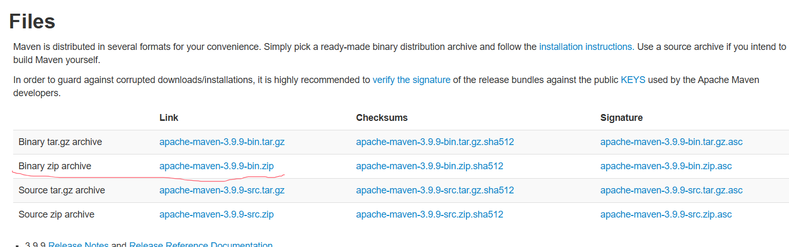

2. 下载好后解压，然后去任意一个位置（不能是maven目录里面）**新建一个文件夹**，取名为mavenGit（**注意！这个文件夹十分重要，因为这就是maven的本地仓库了，以后项目开发所需要的所有maven插件和jar包等都将放在这里**）

3. 新建好文件夹后，**回到解压好的maven目录下**，进入conf文件夹中，找到**settings.xml**文件

4. 打开文件后，找到这个形状的代码标签块

   ```xml
   <mirror>
   	***      
   </mirror>
   ```

5. 这个代码块里面的信息，就是maven官方仓库的信息，**因为网络问题**，加上政治等原因，**maven官方速度极慢**，有时候甚至无法连接上去，因此我们这里就需要把它**改成国内阿里公司的镜像maven仓库**，这样速度就很快。

   ```xml
       <mirror>
         <id>aliyunmaven</id>
         <mirrorOf>*</mirrorOf>
         <name>阿里云公共仓库</name>
         <url>https://maven.aliyun.com/repository/public</url>
         <blocked>false</blocked>
       </mirror>
   ```

6. 还没完，还需要**配置maven变量**，和配java时候一样

7. 找到你**maven的安装目录下的bin目录**

   ```
   安装地址\apache-maven-3.9.8\bin
   ```

8. 然后复制后去到**环境变量**设置中，在**系统变量中找到path**，点进去后**新建变量**，然后**输入你刚才复制的安装目录**中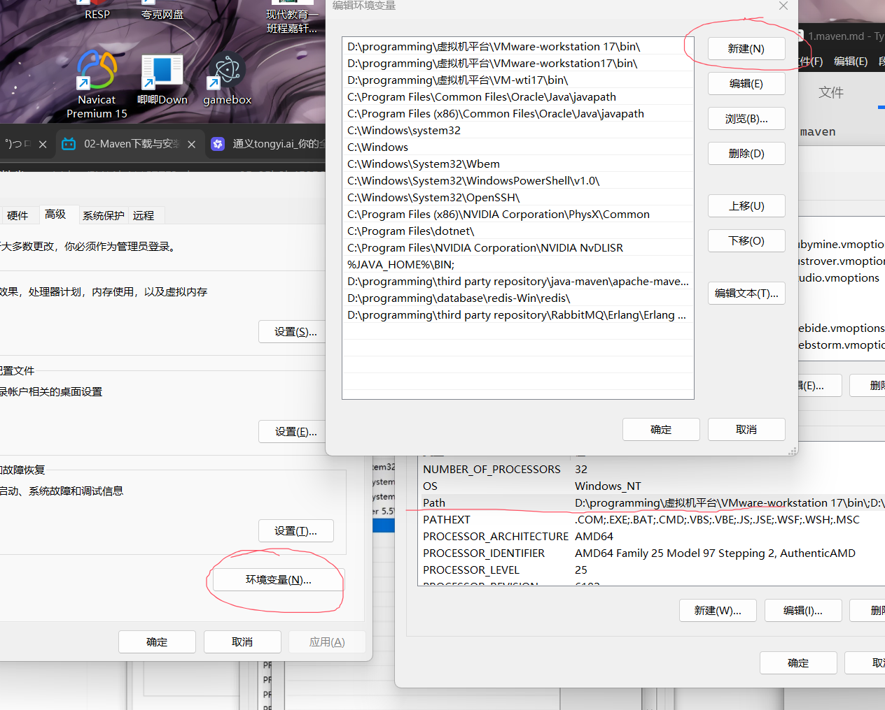

9. 然后打开cmd，输入代码后，如果显示版本信息则说明maven配置成功

   ```cmd
   mvn -v
   ```

## 仓库

仓库就是字面意思，**存放jar包和插件的仓库**（额......）

正如前面环境配置时候，我说的那样。仓库有三级，分别为**本地**=>**私服**=>**中央仓库**

1. 本地仓库：就是前面让你新建的文件夹，maven优先从这里获取
2. 私服仓库：**就是公司团队组织等内部配备的一个仓库**，里面除了开发需要用的开源jar包以外，还有你们**团队等写的jar包**等
3. 中央仓库：当然也可以叫官方仓库、远程仓库。**中央仓库就是maven开发团队自己所管理的仓库，全世界所有知名的java开源jar包插件等，全都存储在这个仓库中**。如果你有能力的话，也可以自己开发一个组件框架之类的，提交给maven官方，将其纳入中央仓库，这样全世界的人都可以通过maven使用你的代码

**当本地没有的时候，会逐级上找，当找到需要的资源后，就会下载在本地使用**

## 坐标

**坐标就是仓库中的地址**，对应着每个jar包和插件资源等，类似于网络中的url一样

maven坐标的组成：

1. **groupld**：定义maven项目隶属的**组织名称**（通常域名反写，比如org.mybatis）
2. **artifactld**：定义当前maven**项目名称**（模块名）
3. **version**：项目版本号
4. **packaging**：打包方式

那么maven坐标如何书写呢

答案是不用写，因为这个[网站](https://mvnrepository.com/)已经帮我们收录了maven坐标

1. 点击网址后，长这样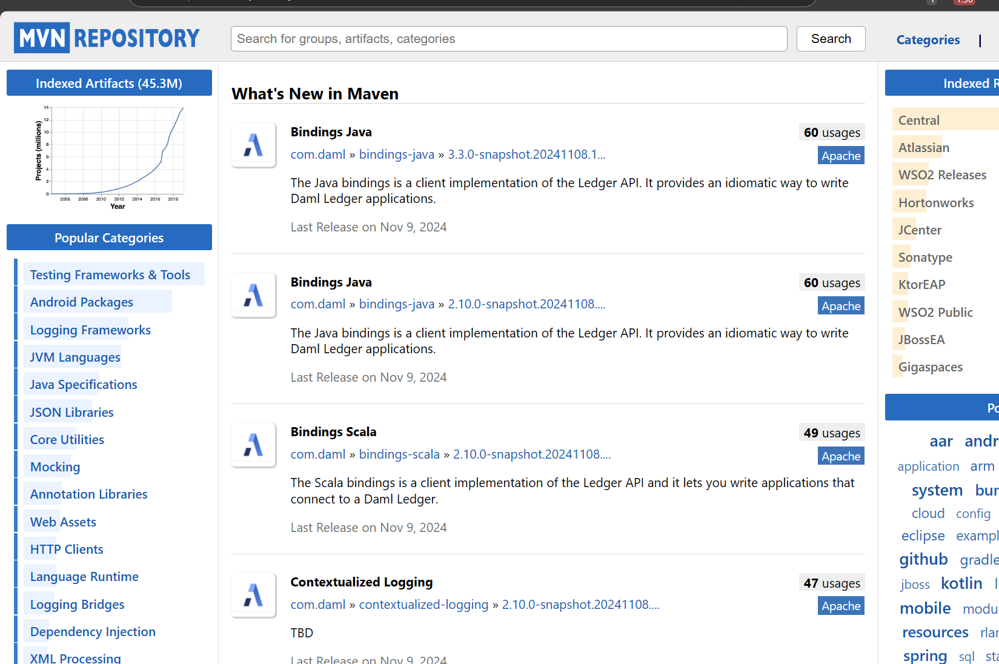
2. 需要什么，就在上面搜索什么，比如搜个**druid**数据库连接池技术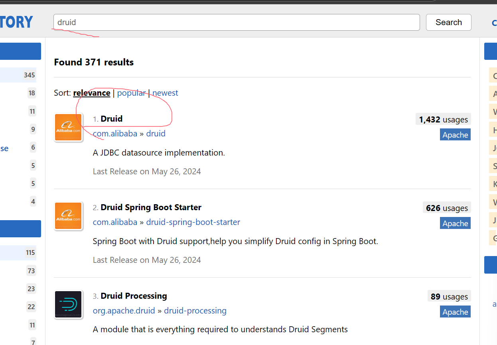
3. 然后点进项目后下面是版本号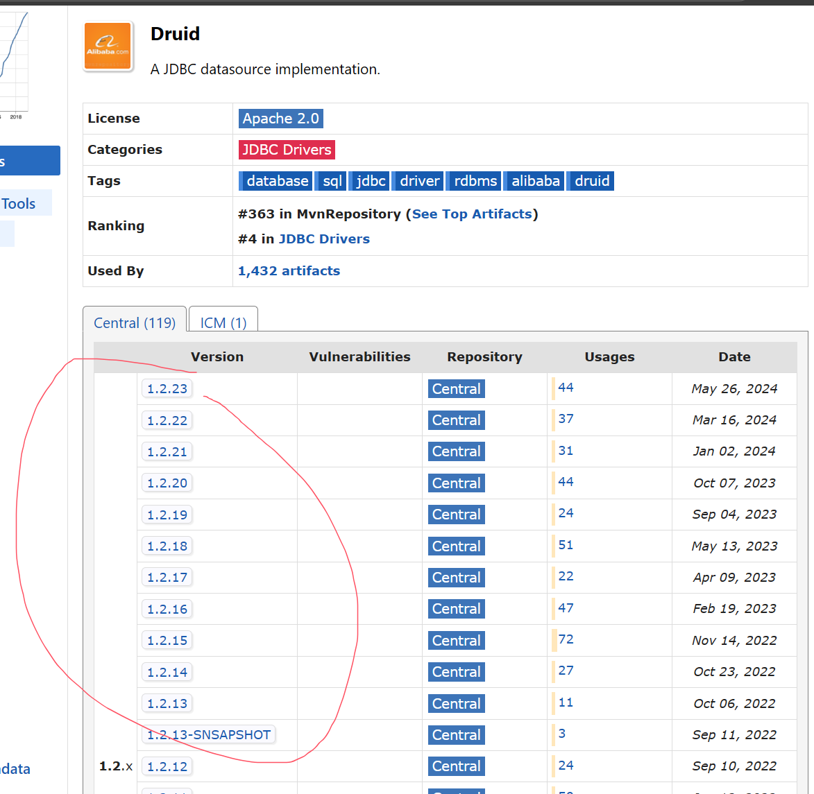
4. 找到你想要的版本，下面着段代码就是maven坐标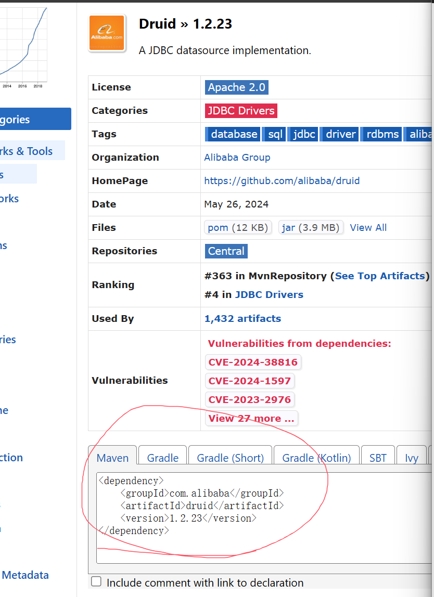
5. 有了这段坐标，就能导入对应的jar包

## * maven项目

本次创建maven项目，**将基于Idea去创建**

1. 首先打开idea，创建一个**maven项目**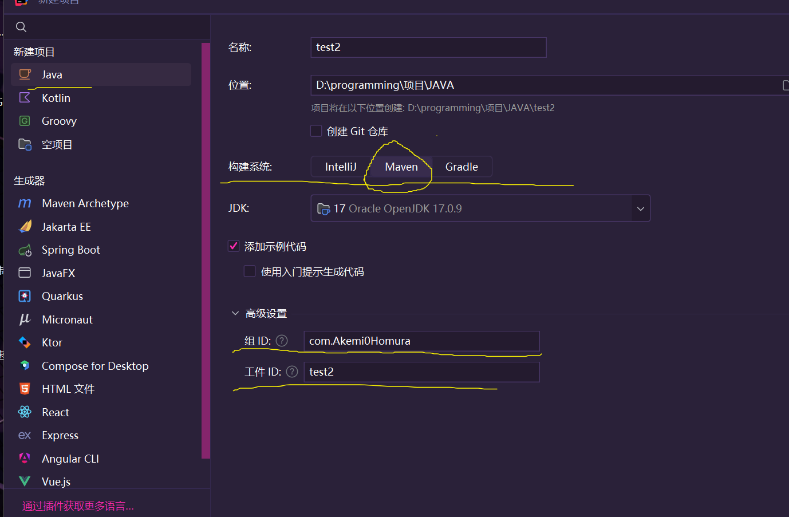

   图片中的**组ID为组织公司团队等名称**，而**工件ID则为项目名称**

2. 创建好后长这样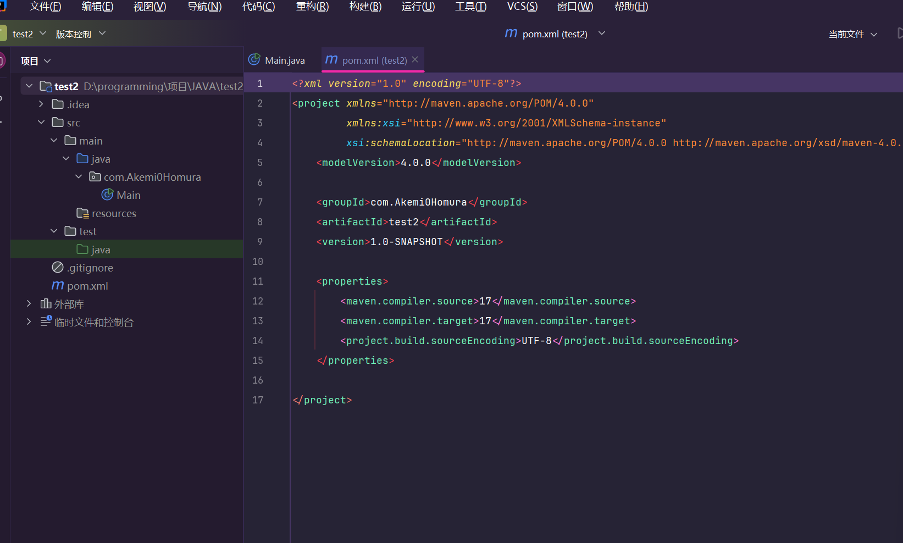

   其中图片的**pom文件**，就是前面所说的，**maven的项目对象**，关于这个项目的一些信息都在这里配置

3. 我们注意左边文件目录，**java包下就是我们的代码存放区域。resources则是我们的配置文件区域。而test目录下的java就是测试方法代码存放区域**，但是少了个配置文件目录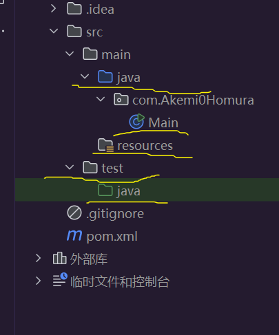

4. 因此这里我们需要**手动配置一下**（虽然绝大多数都用不上）

5. 如图所示点击目录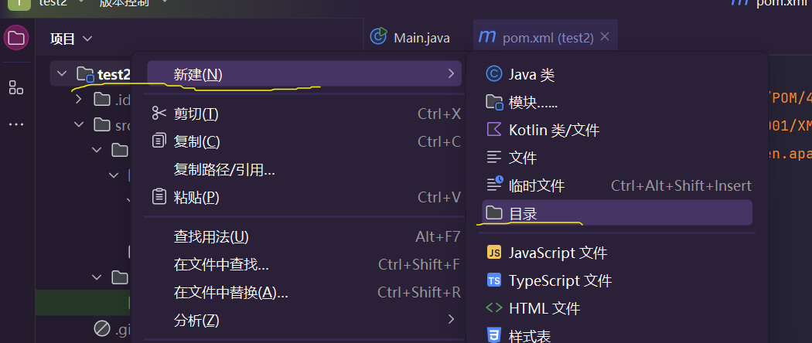

6. 然后点击下面这个，然后回车一下，测试中的配置文件目录就创建好了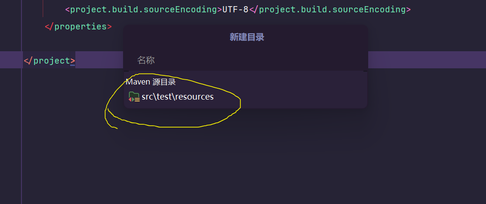

7. 然后现在我们去导入一个坐标看看，**maven的坐标就从刚才的网站中获取**，这里我们就导入一个junit单元测试类的jar包

   ```xml
           <dependency>
               <groupId>junit</groupId>
               <artifactId>junit</artifactId>
               <version>4.13.2</version>
               <scope>test</scope>
           </dependency>
   ```

8. 获取到坐标后，到pom文件下面先写一个标签块**，在标签块当中填充maven坐标**

   ```xml
       <!-- 导入批量坐标 -->
       <dependencies>
           <!-- 单元测试jar包 -->
           <dependency>
               <groupId>junit</groupId>
               <artifactId>junit</artifactId>
               <version>4.13.2</version>
               <scope>test</scope>
           </dependency>
       </dependencies>
   ```

9. 当然，这段代码位置不能随便乱动，如图所示，**放在最下方**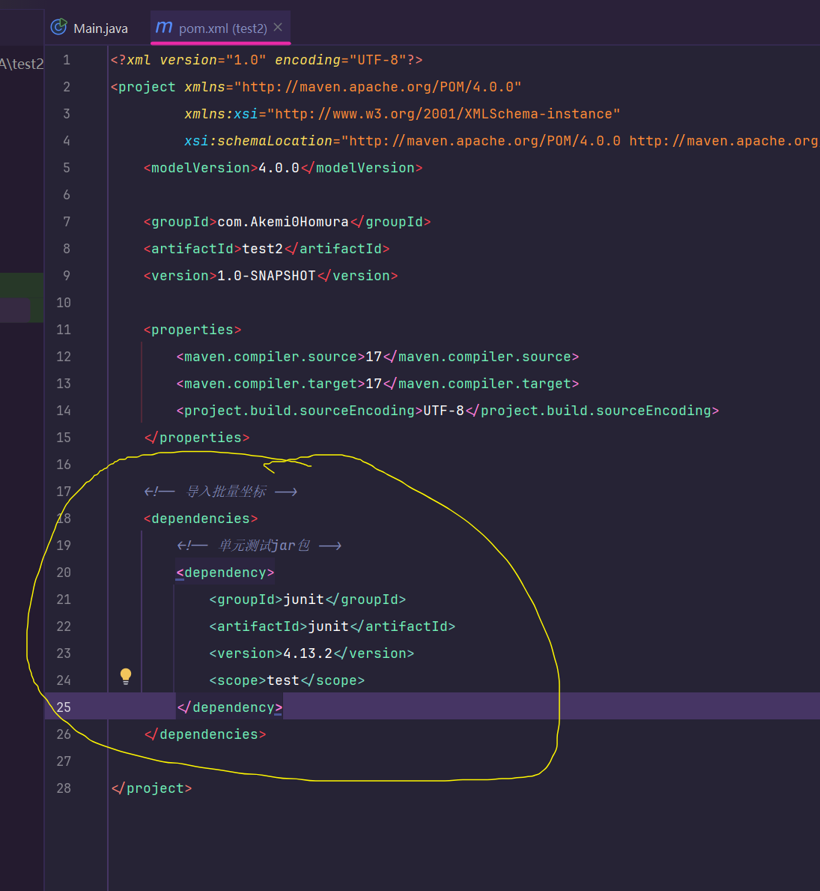

10. 还记得我们前面说过，idea集成了maven吗？因此在这里，我们**需要更换成自己的maven**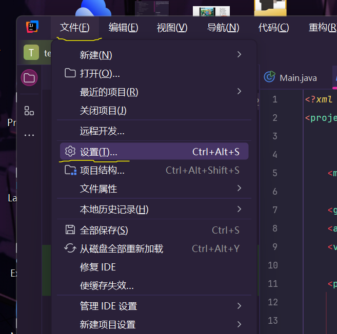

11. 点开设置后，搜索maven直到找到这个页面

12. 其中我们要设置的是：**maven主路径、用户设置文件、本地仓库**

13. **其中maven主路径，就是你安装maven的目录，用户设置文件就是maven目录下的conf文件夹中的settings.xml文件，本地仓库就是之前新建的文件夹**。如图所示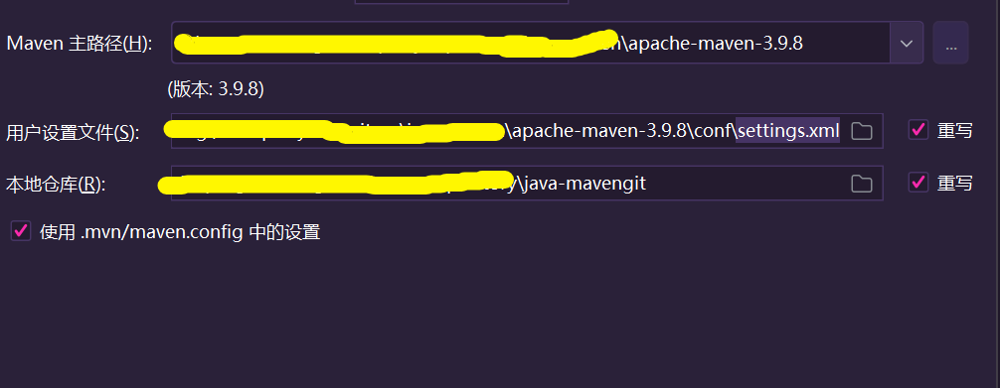

    设置好后点击确定保存好

14. 然后点Idea右边的maven图标，点击**刷新一下**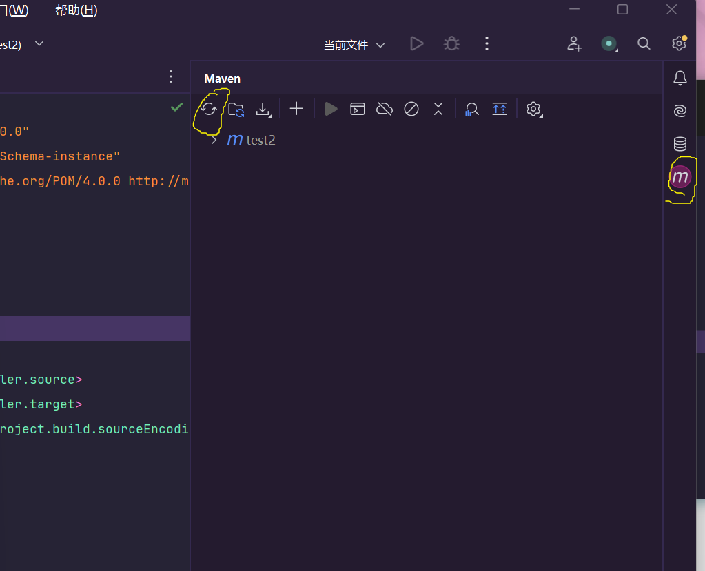

    等待一段时间后，当你看见**pom文件不再报错后**，说明maven坐标已经成功导入

15. 然后在test中下面的java包新建一个类

16. 在类上写一个注解

    ```java
    import org.junit.Test;
    
    /**
     * @author Akemi0Homura
     */
    @Test
    public class test1 {
    }
    ```

17. **不管它报错**，只有你打@Test有联想，并且是来自于org.junit.Test这个目录，就说明junit这个jar包通过maven导入成功

## Maven骨架

maven骨架，就是**对应不同的开发需求，所准备好的默认配置**。

但是该功能，目前**已被淘汰**

被后续课程的**SpringBoot所替代**，并且也**不太好用**，所以这里不做笔记。仅仅只是了解有这么个东西即可

## 依赖管理

**注意！该问题实际开发中很难遇到，仅作了解即可。**

假如现在有多个maven项目，有相同的jar包但是不同版本的项目，最后这些版本冲突的maven全部合成一个大项目，那么它们执行是如何呢？

- 如图所示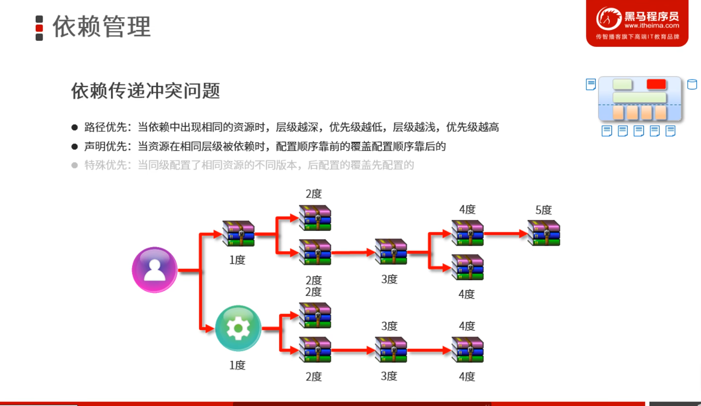

依赖可以隐藏，让外界无法知道你使用了什么jar包

也可以禁用jar包（不删除坐标）

如果想具体了解可以观看[视频](https://www.bilibili.com/video/BV1Ah411S7ZE?vd_source=95c95b2b45956217a529f886ca23dd35&spm_id_from=333.788.player.switch&p=12)

## 依赖范围

**简单来说，就是导入的jar包在哪可以使用**

- 如图所示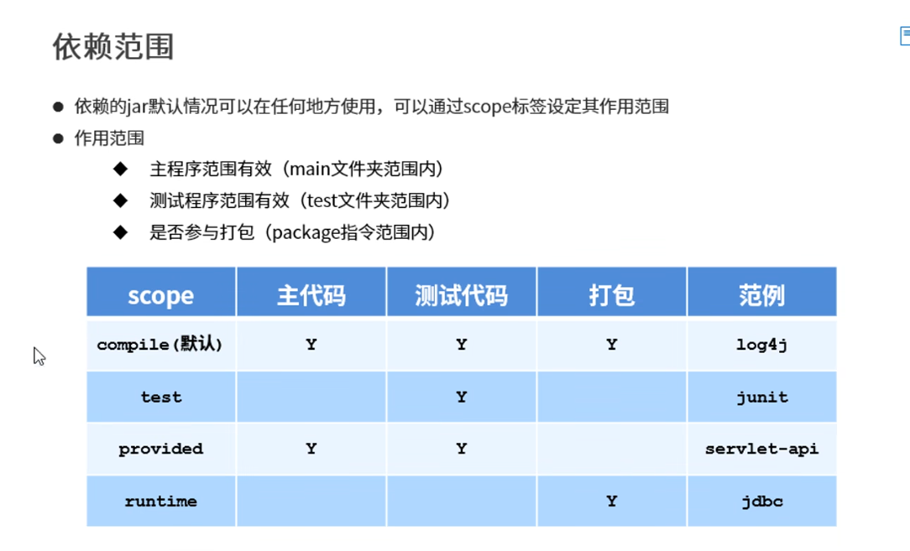

那么具体如何实现呢？

- 其实就是maven导入的坐标中的标签

  ```xml
          <dependency>
              <groupId>junit</groupId>
              <artifactId>junit</artifactId>
              <version>4.13.2</version>
              <!-- 这个标签决定作用范围 -->
              <scope>test</scope>
          </dependency>
  ```

## 插件和生命周期

**注意！该问题实际开发中很难遇到，仅作了解即可。**

一个普通的项目，在打包成一个可运行的项目需要经历以下过程：

编译=>测试=>打包=>安装

- 而maven提供了这样的插件，可以让我们精准控制一个项目的生命周期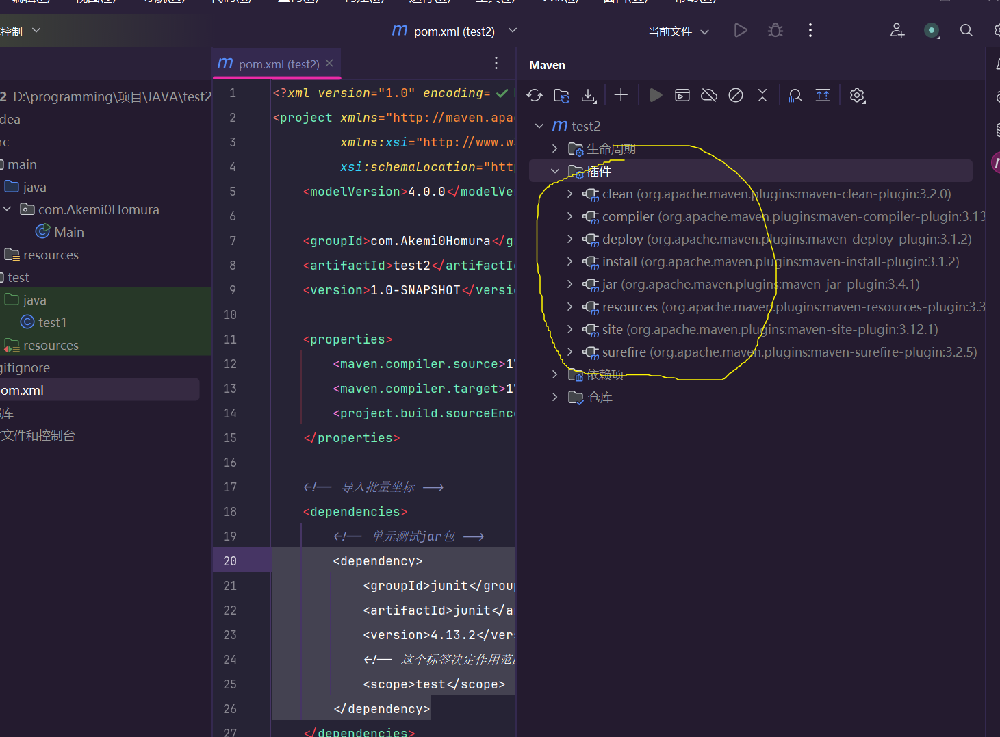

其中这些插件的作用：

1. clean：清除打包好的旧项目
2. compiler：编译项目
3. deploy：部署插件
4. install：安装插件
5. jar：打成jar包
6. resources：处理资源配置文件等
7. site：生成文档
8. surefire：生成单元测试报告

其中我们可以发现，**想运行第二步，就必须先运行第一步**

同理**想运行第五步，就得先运行前面的四步**

**而这段过程就是生命周期**

当然插件远远不至这些，但这些基本就是常用的插件
