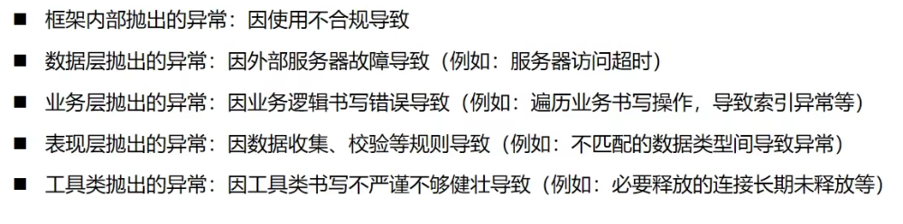
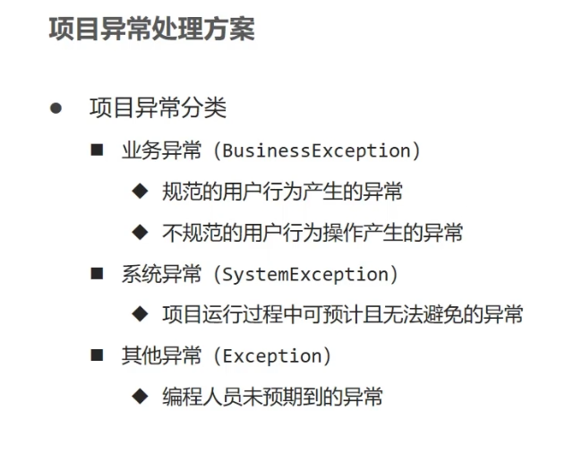
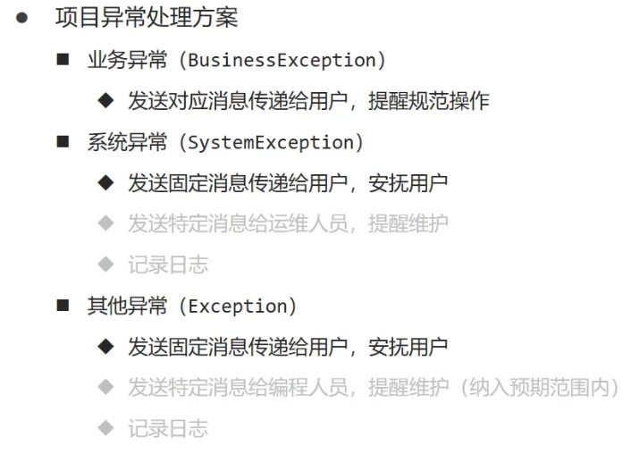

# ssm整合

## 异常处理器

前面我们说，统一了前后端交互对象，但是如果出现异常，就会返回500页面，**前端看到后无法处理**

那么这里我们就得集中处理下这些异常：

这样看下面，好像所有层都会出现异常，因此我们处理异常集中在一个地方处理，**那么距离页面最近的就是表现层(网络接口层)**，在这层进行处理。

那么具体该如何实现了，答案就是**SpringMvc的异常处理器**

- 代码如下

  ```java
  import com.Akemi0Homura.Code;
  import com.Akemi0Homura.Result;
  import org.springframework.web.bind.annotation.ExceptionHandler;
  import org.springframework.web.bind.annotation.RestControllerAdvice;
  
  /**
   * 异常处理器
   * @author Akemi0Homura
   */
  @RestControllerAdvice   //开启异常处理器
  public class Abnormal {
      //拦截的异常类型
      @ExceptionHandler(Exception.class)
      public Result<String> Ex(Exception ex){
          System.out.println("出现异常");
          //最终返回的不再是500页面，而是这个Result对象
          return new Result<>(Code.B2,"出现异常");
      }
  }
  ```

这样无论是正常情况还是异常情况都能**正确的返回统一对象**

### 项目中的用法

那么异常处理器学会后，那么在项目中具体该怎么去使用呢？

同样的，我们做一个项目中异常的归类

这三种异常，我们就得做不同的处理，那么这三种异常对应的解决方法如下