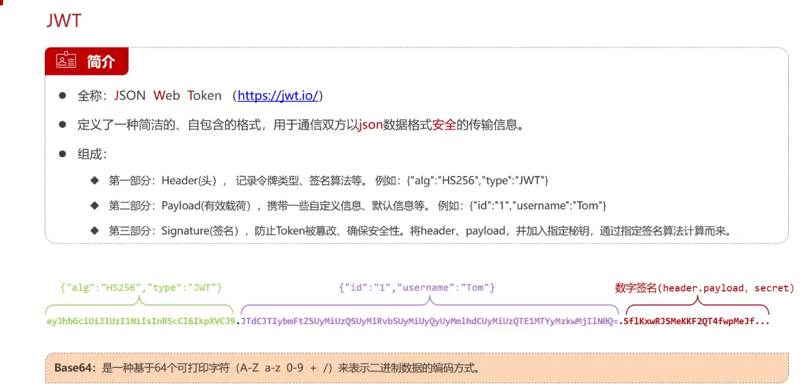

# SpringBoot

## JWT

这是一种通过Json数据格式进行安全传输的技术。

在实际开发中，我们经常用来做登录的开发。

之前我们登录，想要保持登录状态，都是通过session完成，但是实际场景中，一个网站是有多个服务器的，**每个服务器之间session是不共享的**。会出现用户在A服务器登录，第二天访问进了B服务中的情况。

为了解决这种问题，就需要采用**JWT**这种技术。

**通过生成一段随机字符串X，丢给前端**，前端通过**cookie**或者是**LocalStorage进行保存**，然后在**前端发送请求的时候，携带上这段X字符串过来**，然后通过专门的api去**确认你的登录是否过期**（登录有效期会被写在X字符串中）。

这样就能**完美替代上session的保持登录能力**，同时也解决了服务器问题。

### 认识Jwt

- Jwt的token如下

  

  这里三个部分，中间部分虽然加密了，但这种加密是公开的**，因此中间部分不能存放任何重要数据**。而第三部分，也就是数字签名部分，用来防止前面两段的数据被篡改。


### 快速入门

接下来快速入门了解下如何使用，方法也很简单

1. 首先导入jar包

   ```xml
   			<!-- JWT依赖 -->
               <dependency>
                   <groupId>com.auth0</groupId>
                   <artifactId>java-jwt</artifactId>
                   <version>4.4.0</version>
               </dependency>
   ```

2. 代码在Test里编写

   ```java
   import com.auth0.jwt.JWT;
   import com.auth0.jwt.algorithms.Algorithm;
   import com.auth0.jwt.interfaces.DecodedJWT;
   import com.auth0.jwt.interfaces.JWTVerifier;
   import org.junit.jupiter.api.Test;
   
   import java.util.Date;
   
   /**
    * 用来练习jwt的语法使用
    * @author Akemi0Homura
    */
   public class demo1 {
   
       //密钥
       private final String pwd="TT";
   
       /**
        * 生成jwt
        */
       @Test
       public void test1(){
           //设置有效时间
           int time1=1000*30;
           Date date = new Date(System.currentTimeMillis()+time1);
   
           //生成令牌
           String str= JWT.create()
                   //存储的信息，也可以存储哈希表
                   .withClaim("name","苹果，啊苹果，苹果苹果苹果，苹果，啊苹果。")
                   //有效时间
                   .withExpiresAt(date)
                   //设置密钥
                   .sign(Algorithm.HMAC256(pwd));
   
           //查看令牌
           System.out.println(str);
       }
   
       /**
        * 验证jwt
        */
       @Test
       public void test2(){
           //获取令牌，令牌由上面生成
           String str="eyJhbGciOiJIUzI1NiIsInR5cCI6IkpXVCJ9." +
                   "eyJuYW1lIjoi6Iu55p6c77yM5ZWK6Iu55p6c77yM6Iu55p6c6Iu55p6c6Iu55p6c77yM6Iu55p6c77yM5ZWK6Iu55p6c44CCIiwiZXhwIjoxNzM1OTc0Mzc2fQ." +
                   "L2T1MaGn7gzS4F_mzrrHsegF4tVL7nkbSM7u70KaLlA";
           
           //输入密钥
           JWTVerifier a= JWT.require(Algorithm.HMAC256(pwd)).build();
           //输入token值
           DecodedJWT b=a.verify(str);
   
           //输出令牌第二段内容所携带的信息
           System.out.println(b.getClaim("name"));
       }
   }
   ```

### 总结

jwt生成的token分为三部分：头、荷载、签名

1. 头：记录令牌类型和签名算法。
2. 荷载：携带自定义的信息。(信息是公开的，不能存储私密数据。如果一定要带，可以将信息进行一层加密)
3. 签名：对头部和荷载进行加密计算得出来。