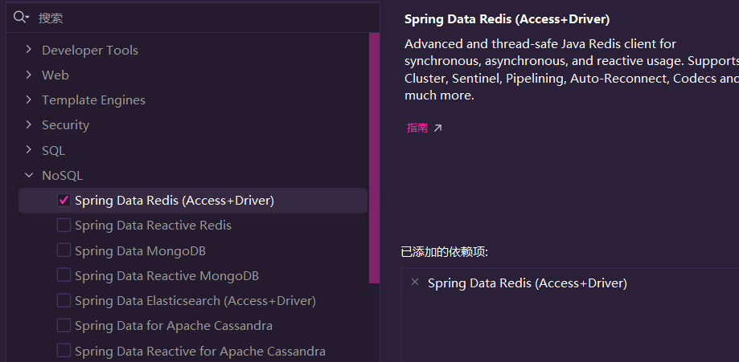
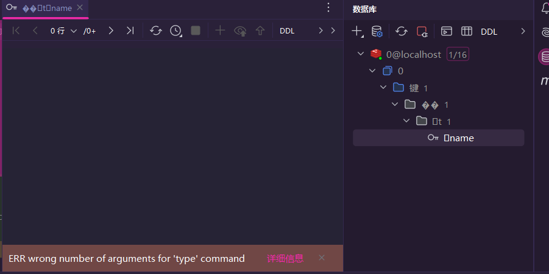
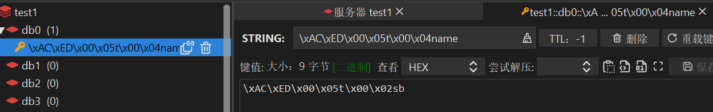

# Redis的Java客户端

## 学习帮助

[通义AI](https://tongyi.aliyun.com/)

[Maven坐标库](https://mvnrepository.com/)

## 推荐的客户端

### Jedis

1. 以**Redis命令**作为**方法名称**
2. Jedis实例**线程不安全**
3. 多线程环境**需要**搭配**连接池**使用

### Lettuce

1. 基于Netty实现，支持**同步**、**异步**、**响应式**
2. 线程安全
3. 支持**哨兵**、**集群**、**管道模式**

### Redisson

1. **基于Redis**实现分布式、可伸缩的**java数据结构集合**
2. 拥有Map、Queue、Lock、Semaphore、Atomiclong等功能
3. 支持**分布式**

### 使用建议

- 三种**都需要学**。但是SpringDataRedis整合了Jedis和Lettuce。因此只需要学习**SpringDataRedis**和**Redisson**即可

## Jedis快速入门

[Jedis的Maven坐标库](https://mvnrepository.com/artifact/redis.clients/jedis)

### 环境安装

1. 首先，在**maven工程**中的pom文件导入**Jedis**的maven坐标。以及单元测试（方便测试）

   ```xml
       <dependencies>
           
           <!-- Jedis依赖 -->
           <dependency>
               <groupId>redis.clients</groupId>
               <artifactId>jedis</artifactId>
               <version>5.2.0</version>
           </dependency>
   
           <!-- 单元测试依赖 -->
           <dependency>
               <groupId>org.junit.jupiter</groupId>
               <artifactId>junit-jupiter</artifactId>
               <version>5.11.3</version>
               <scope>jedisTest</scope>
           </dependency>
   
       </dependencies>
   ```

2. 随后在测试文件夹中，**新建**一个**测试类**，然后运行以下代码

   ```java
   import org.junit.jupiter.api.AfterEach;
   import org.junit.jupiter.api.BeforeEach;
   import org.junit.jupiter.api.Test;
   import redis.clients.jedis.Jedis;
   
   public class jedisTest {
       private Jedis jedis;
   
       //在运行之前，进行redis环境装配
       @BeforeEach
       public void setUp() {
           //建立链接
           jedis=new Jedis("127.0.0.1",6379);
           
           //输入密码，如果安装没有设置密码，就把该代码注释
           jedis.auth("123456");
           
           //选择库
           jedis.select(0);
       }
   
       @Test
       public void test1() {
           //获取运行代码后的返回值
           String obj1=jedis.set("name","sb");
           //如果没有问题，则会返回OK
           System.out.println(obj1);
           //获取之前在name存入的sb
           String obj2= jedis.get("name");
           //打印查看结果
           System.out.println(obj2);
       }
   
       //运行结束后，关闭掉接口
       @AfterEach
       public void tearDown() {
           if(jedis!=null){
               jedis.close();
           }
       }
   }
   ```

3. 如果最终**打印结果**是**OK**和**sb**。那么Jedis环境部署就**成功**

### Jedis连接池

Jedis由于**线程不安全**，并且**频繁创建**和**销毁**会有**性能损耗**，因此**需要搭配线程连接池技术**

1. 首先先**创建**一个**工具类**

   ```java
   import redis.clients.jedis.Jedis;
   import redis.clients.jedis.JedisPool;
   import redis.clients.jedis.JedisPoolConfig;
   
   import java.time.Duration;
   
   /**
    * 实现了Jedis的连接池功能
    * 通过调用getJedis()方法获取连接
    */
   public class jedisFactory {
       //连接池对象
       private static final JedisPool jedisPool;
   
       //java程序启动时就会运行
       static {
           //配置连接池
           JedisPoolConfig config = new JedisPoolConfig();
   
           //最大连接数
           config.setMaxTotal(20);
           //最大预备连接数
           config.setMaxIdle(10);
           //长时间无连接请求，缩减至多少连接
           config.setMinIdle(2);
           //设置没有连接的时候，需要等待多久时间
           config.setMaxWait(Duration.ofDays(10));
   
           //设置配置类、连接地址、端口号、超时时间、密码
           jedisPool = new JedisPool(config, "127.0.0.1", 6379,1000*10,"123456");
       }
   
       //外部获取连接的方法
       public static Jedis getJedis() {
           return jedisPool.getResource();
       }
   }
   ```

2. 然后将**之前入门程序**的单元测试类中的**setUp()**方法**修改**一下

   ```java
       @BeforeEach
       public void setUp() {
           //没有连接池技术的建立链接方式
           //jedis=new Jedis("127.0.0.1",6379);
           
           //有了连接池技术后的建立链接方式
           jedis=com.cjx.util.jedisFactory.getJedis();
   
           //输入密码，由于安装没有设置密码，故而将该代码注释
           //jedis.auth("123456");
   
           //选择库
           jedis.select(0);
       }
   ```

3. **修改**成功后，**运行**一下**没有抛异常**则连接池**配置成功**

## SpringDataRedis

### 简介

- **SpringData**是Spring中**数据**操作的**模块**，**包含**对**各种数据库**的集成。其中**Redis**的**集成**叫做**SpringDataRedis**

### 特点

1. 提供**不同Redis客户端的整合**（**Lettuce**和**Jedis**）
2. 提供了**统一的API操作Redis**
3. 支持Redis的发布订阅模型
4. 支持Redis的哨兵和Redis集成
5. 支持基于Lettuce的响应式编程
6. 支持基于JDK、**JSON**、字符串、Spring对象的**数据序列化和反序列化**
7. 支持基于Redis的JDKCollention实现

### 环境安装

本次环境安装基于**SpringBoot3.3.4**实现

1. 首先在**idea**中，新建一个**springboot**项目，然后勾选图中的依赖

2. 然后在pom文件中导入**一个**maven坐标

   ```xml
           <!-- 连接池依赖 -->
           <dependency>
               <groupId>org.apache.commons</groupId>
               <artifactId>commons-pool2</artifactId>
               <version>2.12.0</version>
           </dependency>
   ```

3. 然后在springboot的**配置文件**中写上**yml**格式的配置信息

   ```yaml
   spring:
     data:
       redis:
         host: 127.0.0.1     		#redis地址
         port: 6379          		#端口号
         password: 123456   		#如果redis库没有密码，则注释掉
         lettuce:
           pool:
             max-active: 20      	#最大连接数
             max-idle: 10        	#最大空闲连接
             min-idle: 2         	#最小空闲连接       
             max-wait: 10000     	#没有连接时的等待时长
   ```

4. 然后在测试类中写上代码

   ```java
   import org.junit.jupiter.api.Test;
   import org.springframework.beans.factory.annotation.Autowired;
   import org.springframework.boot.test.context.SpringBootTest;
   import org.springframework.data.redis.core.RedisTemplate;
   
   @SpringBootTest
   class testRedis1 {
       //由spring注入对象
       @Autowired
       private RedisTemplate redisTemplate;
   
       @Test
       void contextLoads() {
           //写入一个String键值对
           redisTemplate.opsForValue().set("name", "sb");
           //从redis库获取数据
           Object obj=redisTemplate.opsForValue().get("name");
           //这里会打印sb
           System.out.println(obj);
       }
   
   }
   ```

   如果打印结果是**sb**，那么环境安装**成功**

### * 正确的序列化

如果你按照**上面**的**代码运行一遍**后，你去到redis里，你就会发现原本存储键值对**{name:sb}**变成了图下的样子。

1. idea的数据库下（注意，**idea**端下**无法删除**这个数据）
2. RESP下

之所以数据会这样存储，是因为**存入**的是一个**String类型对象**，Spring将其**序列化**，因此为了做到**所见即所得**的效果，需要**修改Spring的默认序列化**

- 将**环境安装**中的**测试类代码**修改一下。

  ```java
      //旧代码
      //@Autowired
      //private RedisTemplate redisTemplate;
  
      //新代码
      @Autowired
      private StringRedisTemplate redisTemplate;
  ```

修改后**什么都不用动**，直接运行，查看idea或者RESP你都会发现，**所见即所得已经做到了**。

但是数据不仅只有基础类型，还有对象，要做到**存入对象为json**，**取出json字符串**自动转化为**java对象**，按照以下来做

1. 首先准备好一个**java对象类**，并且准备好**get**和**set**方法，有参无参**构造函数**和**toString**方法

   ```java
   public class user {
       private Integer id;
       private String name;
   }
   ```

   由于方法都可以由**idea**生成，因此这里只展现**对象结构**

2. 然后导入Json的**maven坐标**，如果你一开始创建项目勾选了**SpringWeb**依赖，那么可以直接**跳过**这一步，**否则**你需要导入这个坐标

   ```xml
   		 <!-- JSON依赖 -->
           <dependency>
               <groupId>com.fasterxml.jackson.core</groupId>
               <artifactId>jackson-databind</artifactId>
               <version>2.18.0</version>
           </dependency>
   ```

3. 然后新建一个**工具类**，在工具类中**封装**好**json序列化**和**反序列化**的代码

   ```java
   /**
    * 实现redis和java之间交互的json转化
    */
   public class redisJson {
       private static final ObjectMapper mapper = new ObjectMapper();
   
       /**
        * 该方法接受一个对象，返回json字符串
        */
       public static String setJson(Object obj){
           try {
               return mapper.writeValueAsString(obj);
           }catch (Exception e){
               e.printStackTrace();
           }
           return null;
       }
   
       /**
        * 该方法接受json字符串和对象class，然后反序列化返回java对象
        */
       public static <T>T getJson(String json,Class<T> clazz){
           try {
               return mapper.readValue(json,clazz);
           }catch (Exception e){
               e.printStackTrace();
           }
           return null;
       }
   }
   ```

4. 然后回到刚才的**测试类**中，**新增**一个测试对象**方法**

   ```java
       @Test
       void testObj() {
           //序列化对象
           String str1=redisJson.setJson(new user(1,"小苹果"));
   
           //写入一个String键值对
           //由于str1可能为null，因此最好写一个判断
           if (str1 != null) {
               redisTemplate.opsForValue().set("user",str1);
           }
   
           //从redis库获取数据
           String str2=redisTemplate.opsForValue().get("user");
   
           //调用反序列化方法
           user a=redisJson.getJson(str2,user.class);
   
           //这里会打印出user对象的toString方法
           System.out.println(a);
       }
   ```

   运行后，如果打印结果为：**user{id=1, name='小苹果'}**，并且Redis存储的也是正确的**json对象结构**，那么已经成功完成**java和redis的json交互**。

### * 哈希语法

如果是想往Redis存入**hash类型**，则代码这样编写

- ```java
      @Autowired
      private StringRedisTemplate redisTemplate;
  
      @Test
      void testHash() {
          //存入一个哈希表，key值为user，field为name，value为大苹果
          redisTemplate.opsForHash().put("user","name","大苹果");
  
          //获取key为user的所有field值和value值
          Map<Object,Object> map=redisTemplate.opsForHash().entries("user");
          //打印获取的值
          System.out.println(map);
      }
  ```

  打印最后的结果为：**{name=大苹果}**

**注意：这里填写信息即使是数字，也得是字符串类型。**

### * Key名污染

由于Redis**没有表结构**，并且**添加和修改的命令一体**，因此很容易被一些**常见的单词**例如user等**被覆盖**

- 例如现在有两个对象，分别为**老师user**和**学生user**。目前常见的方案是这样

  ```
  teacher:user
  student:user
  ```

  通过**:**符合来**分割**开key，这样就能避免Key污染。

