# Redis进阶部分


## 学习帮助

[通义AI](https://tongyi.aliyun.com/)

## * Redis配置文件

配置文件在安装的目录下的**Redis.conf**

如果你用的**Windows版本**，那么会有两个：**redis.windows-service.conf**和redis.windows.conf两个文件，修改前者即可

1. 该配置文件对**大小不敏感**
2. 可以导入**外部配置文件**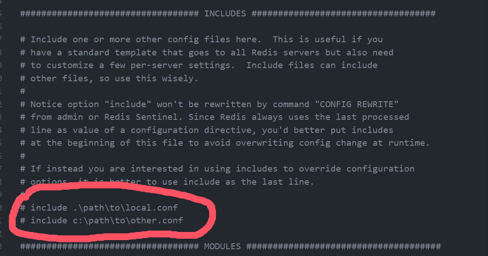
3. 从上到下分别为：**网络IP**、**保护模式**（关掉后谁都能访问Redis）、**端口号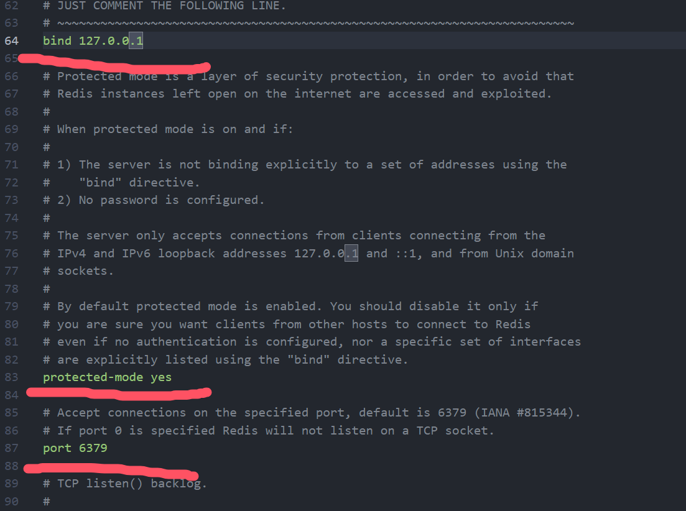**
4. **daemonize**（只在Linux）**守护进程模式**，yes和no开关。简单来说就是关掉后，后台依然保留Redis进程。如果需要开启，则需要到**pidfile**处指定后台进程文件
5. 这里的**logfile**为日志文件名，**databases**为默认数据库数量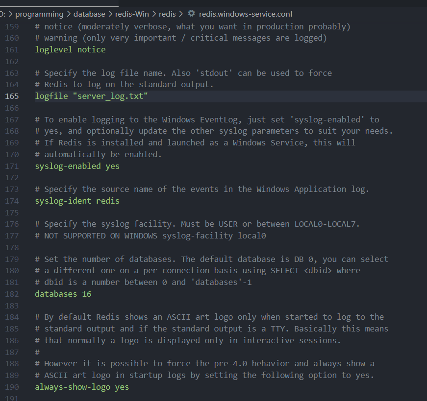
6. **第一行**的意思是，如果**九百秒内**，有**一个key**进行**增删改**，就进行**持久化操作**。**第二行**的意思是，如果**三百秒内**，有**十个key**进行**增删改**，就进行**持久化操作**。**第三行的**意思是**六十秒内**，有**一万个key**进行**增删改**，就进行**持久化操作**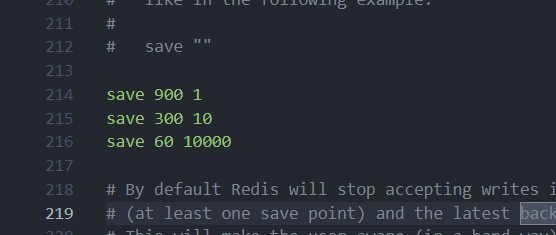
7. 从上到下，1.快照保存**异常**，**是否继续工作**。2.是否**压缩rdb**文件，会**消耗**部分**cpu**性能。3.**保存rdb**文件，进行**错误检查**。最后一个是rdb文件保存目录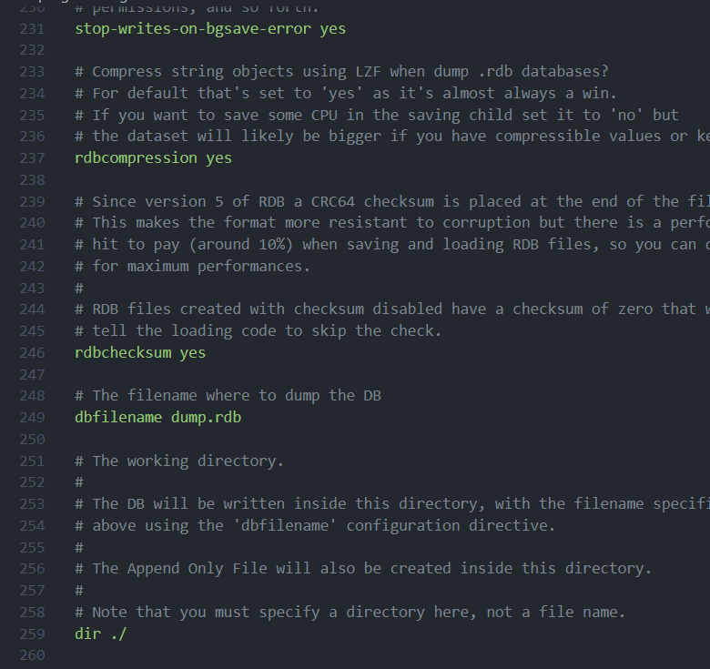
8. 这里是存放密码的地方，**默认**redis**是没有密码**的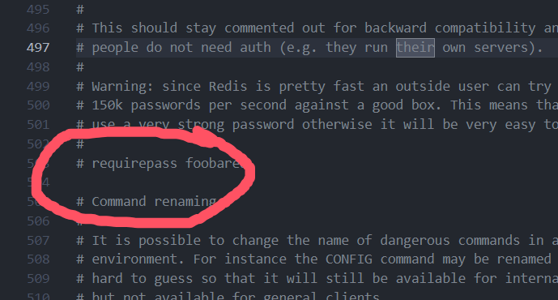
9. 默认最大的**客户端连接数量**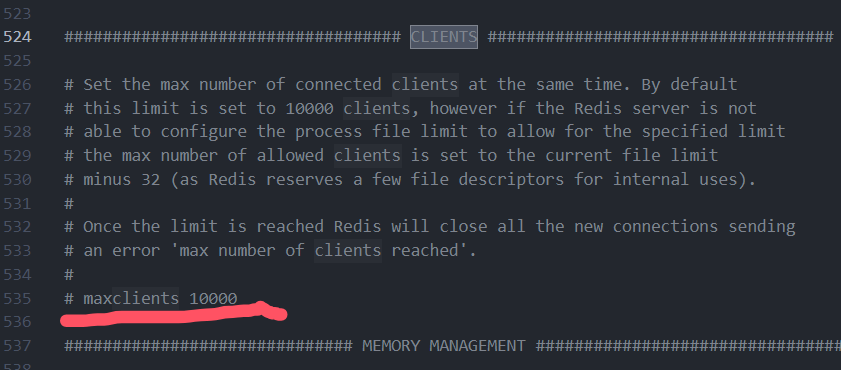
10. 配置**最大内存**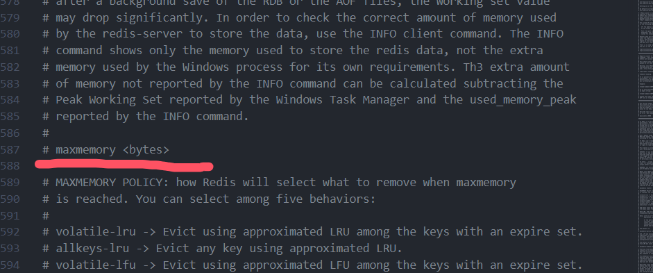
11. 内存满了处理策略。
    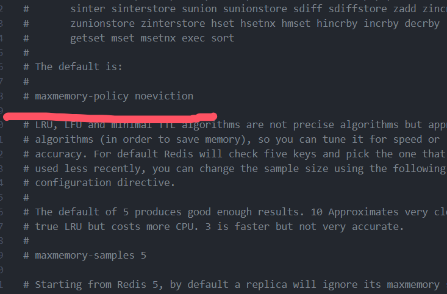
    1. volatile-lru：只对设置了过期时间的key进行lr（默认值）
    2. allkeys--lru：删除lru算法的key
    3. volatile-random：随机删除即将过期key
    4. allkeys-random：随机删除
    5. volatile-ttl：删除即将过期的
    6. noeviction：永不过期，返回错误
12. 从上到下，1.**AOF**（持久化）模式。2.持久化的**文件名**。3.同步时间，每秒一次，但是**可能会丢失这一秒的数据**（可修改为**always**，就是**每次修改**都会**保存一次**。修改为**no**，则同步**由系统决定**）。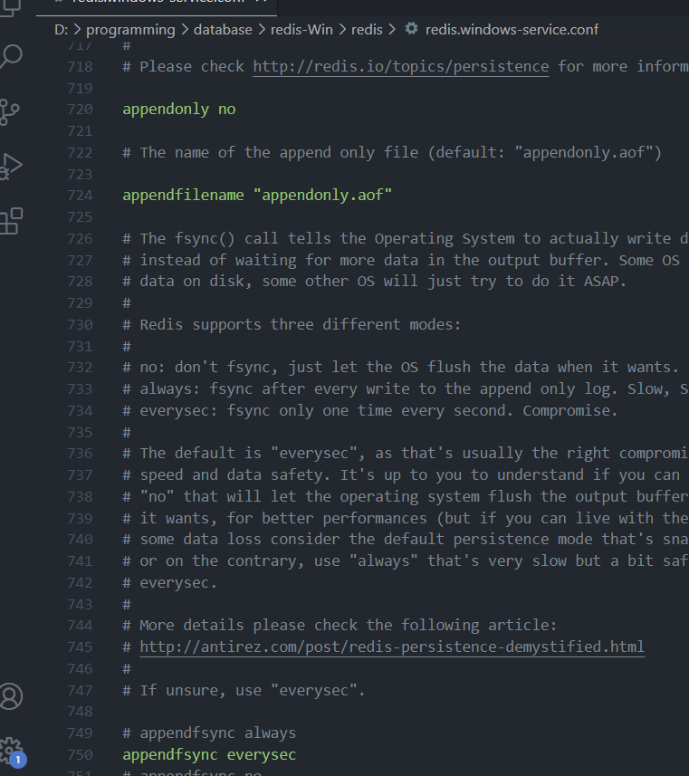
13. aof模式下，当aof文件大于64MB，就会开一个新的文件来写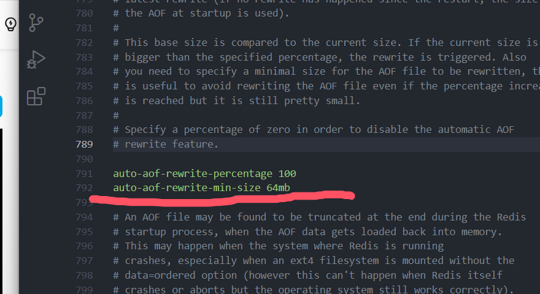

## 数据持久化

由于Redis的**数据**全部**存储**在**内存**中，当**设备断电**后，**数据**都将**不存在**，因此就需要将**内存数据写入硬盘**中，进行**数据持久化操作**

### RDB

在指定时间间隔内，将内存数据写进Redis（关闭redis本身也会触发），也就是**Snapshot快照**，恢复时将快照文件读取到内存中。Redis默认都采取RDB。

- 在Redis中，会单独开一个**子线程**去专门处理这个持久化工作，存储的时候会在**临时文件存储**，存储完毕后，在**将临时文件覆盖掉之前的保存文件**。

恢复rdb文件的方法，就是把**rdb文件放在redis的启动目录**下，redis在启动的时候会检测，**检测到后自动恢复数据**

**缺点**是在进行**持久化操作**的**时候**，**服务器宕机**，那么**数据可能会丢失**

### AOF

**所有命令都记录下来**。和RDB一样，会单独开一个子线程去保存。把所有命令记录下来，在恢复的时候就是把文件中的命令再执行一遍。当然不包括读操作。

该模式**默认是关闭**，如果要启动，就要**去配置文件手动开启**。

开启方法参考前面的**《Redis配置文件》**笔记。

如果aof文件有错误，redis无法启动，可以使用redis自带的一个修复工具，**redis-check-aof**。（修复的原理，就是**遍历每一行**，**哪一行异常**，**就删除哪一行**。因此会带来部分的操作丢失，**导致数据的不正确**）

缺点。占用容量大、修复速度慢、运行效率低下。因此默认采用RDB模式

## Redis发布订阅模式

简单来说是一个**信息通信模式**，发送者发送信息，订阅者接受信息。 具体来说，就是一群redis服务器，开启一条通道，当一台redis向通道发送信息，那么其他监听这个通道的redis服务器都会获取到。

1. 可以大致参考一下图片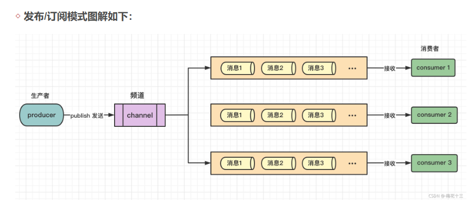
2. 代码端就是这样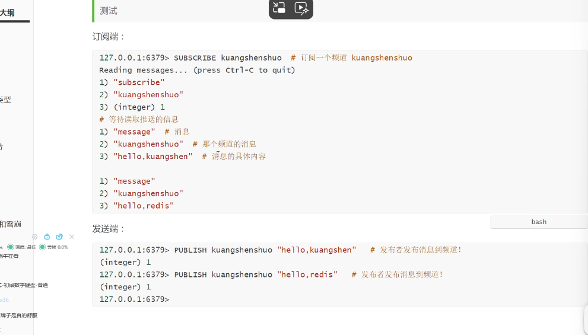

### 使用场景

1. 可以用来做**实时聊天频道**

如果场景复杂就使用**消息中间件**，不要硬上。简单了解原理知道是个什么即可。

具体**命令、实现**等前往[视频](https://www.bilibili.com/video/BV1S54y1R7SB?spm_id_from=333.788.player.switch&vd_source=95c95b2b45956217a529f886ca23dd35&p=31)观看，这里不做记录

## * Redis主从复制

**将一台Redis服务器的数据，复制到其他Redis服务器，前者为主节点，后者为从节点。数据复制是单向，只能从主节点到从节点，主以写为主，从为读为主**

**主来复制**，**从来读写**。是一个减少服务器压力的**架构**

配置该架构，至少需要三台Redis服务器

只要**在公司中**，**主从复制就是必须的**

### 主从复制主要作用

1. **数据冗余**：主从复制实现数据热备份，也算是持久化之外的一种方式
2. **故障恢复**：主节点出现问题，可以由从节点提供服务，快速恢复故障
3. **负载均衡**：读写分离，分担服务器压力，提高高并发性能
4. **高可用**：主从复制是实现哨兵模式和集群的基础

### * 环境配置

只需配置从，不需要配置主，因为**redis默认为主**。

如果**主机断开**，**从机可以继续读**，**但是不能写**。如果**主机又重新连接回来**，那么**就可以正常读写**

**注意！**本次配置**以Windows版本环境下使用命令行方法配置**，如果是linux系统，直接参考这个[视频](https://www.bilibili.com/video/BV1S54y1R7SB?spm_id_from=333.788.videopod.episodes&vd_source=95c95b2b45956217a529f886ca23dd35&p=31)

1. 首先，在**redis目录下**，新建两个文件夹,建议**文件夹名为端口号**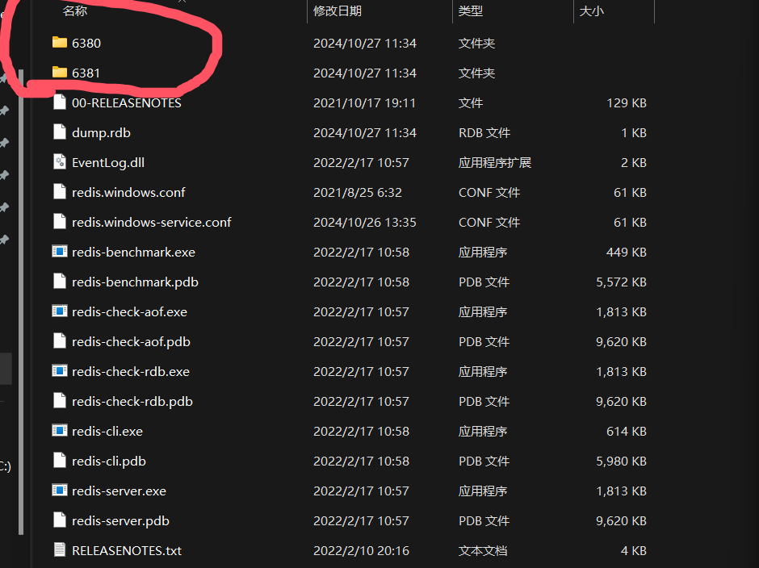

2. 然后将下面的配置代码复制，在新建文件夹里新建一个.conf后缀的文件，粘贴上

   ```python
   # 绑定IP，0.0.0.0代表本机的所有IP地址
   bind 127.0.0.1
   # 端口号
   port 6380
   # 是否是守护进程，开了也没用
   daemonize yes
   # 是否开启集群
   cluster-enabled no
   # 本地数据库存放路径，默认值为 ./
   dir "./6380/"
   # (启动自动生成)节点信息，只能是文件，不能是路径，否则启动时会报错,会创建在  dir 属性下
   cluster-config-file nodes-6380.conf
   cluster-node-timeout 5000
   # 启用aof持久化方式
   appendonly yes
   # 如以后台进程运行，则需指定一个pid，默认为/var/run/redis.pid
   pidfile redis_6380.pid
   # 指定日志输出的文件名，可设为/dev/null屏蔽日志 ,window下很恶心，必须得绝对路径，你要是写相对路径报错
   logfile "D:/programming/database/redis-Win/redis/6380/6380.log"
   ```

   要注意的地方是**端口号需要和文件名的端口号一致**，还有保存的文件路径等都得注意，需要改名。必须全部过一遍眼。还有最重要的，**集群模式一定要关掉**，因为集群模式不能设置为主从复制。

3. 然后返回到redis目录中，新建两个.cmd的后缀程序，然后在里面写上代码

   ```cmd
   redis-server.exe  ./6381/redis.windows-service.conf
   ```

   **注意！**./你刚才新建的文件夹名字/刚才你新建文件夹里的配置文件名字。**这个格式不能有错**，并且最好使用**英文命名**。**你建了几个文件夹，这个cmd程序就建立多少个**

4. 这里截个图大概对照一下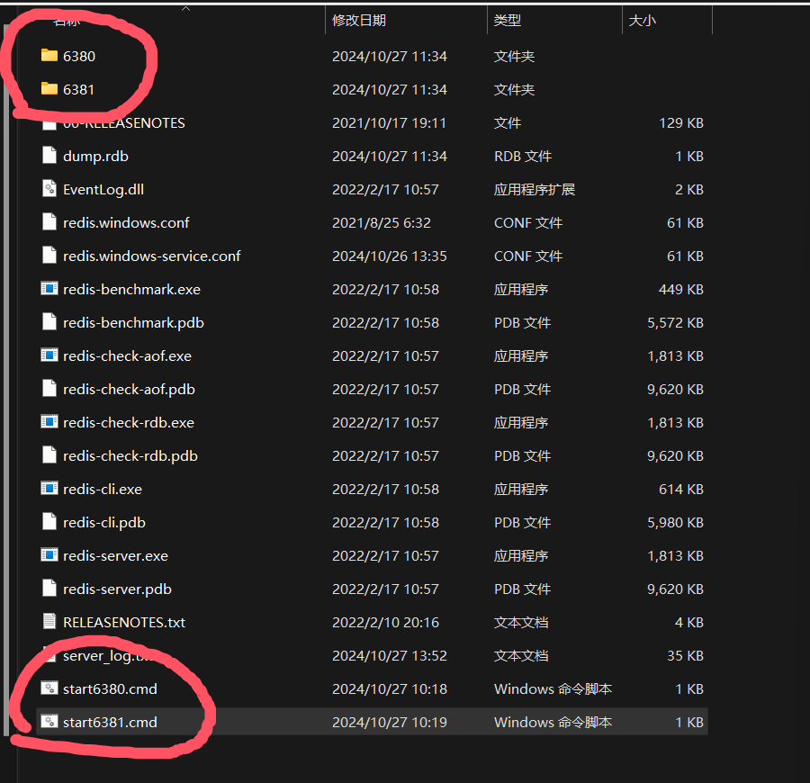

5. 然后打开这个cmd程序**，如果cmd打开后会自动闪退**，那么说明你**前面的步骤有问题**。如果**不会闪退能一直挂住电脑**，那说明你的从库已经**搭建完成**。不过**注意**，如果**cmd程序关掉后**，**从库就会消失**，因此cmd程序得一直挂着才行。

6. **还没完**。从库搭建好，**还得设立关系**才行，按win+r运行**cmd**，运行这段代码

   ```cmd
   redis-cli -p 6380
   ```

   这里的**6380**是切换到**你设置从库的端口号**

7. 然后观察如果运行后像图中这样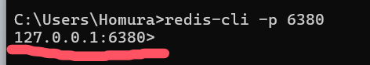这里的**127.0.0.1是你前面配置文件设置得来的**。

8. 那么就运行这段代码

   ```cmd
   slaveof 127.0.0.1 6379
   ```

   这里的**网址和端口**都是填写你**主库的网址和端口**，如果看到返回一个**OK**，那么说明你的**关系已经建立好了**

9. 然后你建立**多少个从库**，**就循环第六到第八多少次操作**，注意！一定是循环！**不要偷懒**

10. 关系全部建立好后，打开**redis目录下**的**redis-cli.exe文件**，打开后运行这段代码

    ```cmd
    info replication
    ```

11. 运行后你将看见图中的效果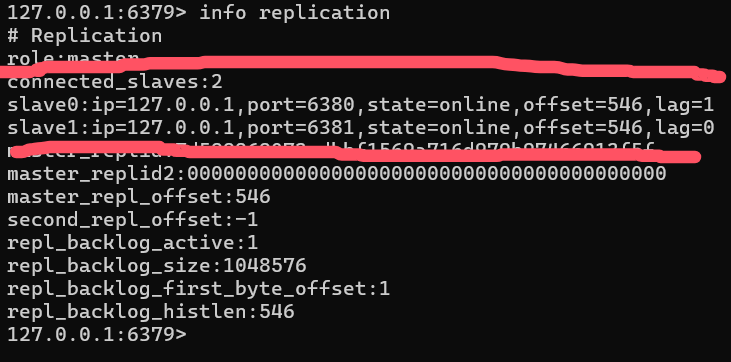

    其中注意红色**两边里面**的数据，**第一行**为**连接的从库数量**，**第二第三行**就是**从库的信息**。在编写文档的时候，我**配置了两个从库**，这里**能看见两个从库**，说明我**关系全部建立成功！**

12. 那么如果**取消关系**或者**删除从库**呢？很简单把**打开从库的cmd程序关掉**即可，如果要删除从库，那么把从库的**整个文件夹删除**就行了

### 效果演示与机制

当配置好主从环境后，写一些代码进行一下效果演示。

1. 在主机写入代码

   ```sql
   set k1 v1
   ```

2. 然后再去从机写

   ```sql
   get k1
   ```

   然后就会发现，从机获取到了主机存的key

3. 但是如果你在从机进行写操作，例如把第一次的操作在从机复刻一遍，就会像这样报异常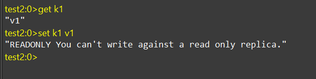这是因为从机只能读不能写的机制导致的。

**注意**，**命令行方法**当**从机断开**主机后，**会自动变化主机**

**只要变成从机**，那么主机的**数据全部会写入从机**（全量复制），即使是过去的数据（不是过期）。连接过程中产生的数据是**增量复制**。

### 第二种形态

主从复制其实有**两种形态**

- 如图所示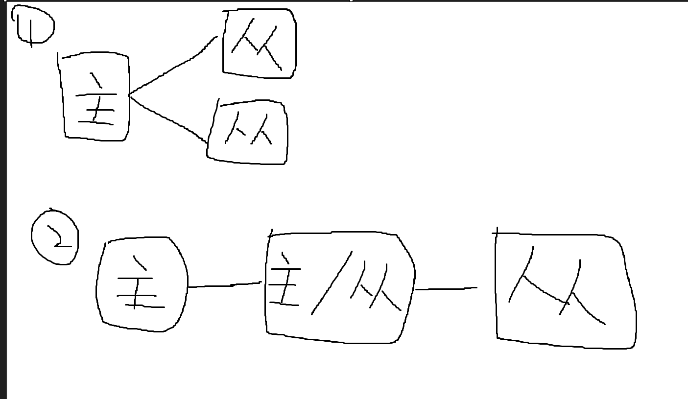当然笔记的**前面部分**说的主从结构是图中**第一种**

它们具体的**差别**在于，**第一种如果主机宕机后，那么整个集群就失去写操作的能力**。而**第二种当主机宕机后，那么中间那台从机将变成主机**（注意，如果第一台主机没宕机，那么中间的就是从机，只有第一台宕机，第二台才能变成主机）。

#### 环境配置

其实你学会了第一种配置，那么第二种配置是很简单的，但这里还是做一个代码演示。

**注意！这个配置过程是基于你已经学会了第一种配置方法**

1. 首先先**启动两个从库**

2. 然后打开cmd运行这个代码

   ```cmd
   redis-cli -p 6380
   ```

3. 然后再绑定主机

   ```cmd
   slaveof 127.0.0.1 6379
   ```

4. 然后关掉cmd再打开一个新的cmd，运行这个代码

   ```cmd
   redis-cli -p 6381
   ```

5. 然后注意，**绑定的主机是刚才设置的从机**，而不是6379主机

   ```cmd
   slaveof 127.0.0.1 6380
   ```

#### 效果演示与机制

绑定后可以代码测试一下，和第一种是一样的，**只有6379可以进行写操作**。

接下来演示一下，**当主机断开后**，**中间的从机会立刻变成主机的效果**。

1. 打开cmd，输入这段代码

   ```cmd
   redis-cli -p 6380
   ```

2. 然后输入这段命令

   ```cmd
   slaveof no one
   ```

   输入后，会返回个OK说明**6380这个从机已经脱离6379成为了6381的主机**（这个命令的意思就是**脱离当前连接的主机**的意思）

这个时候可以输入代码测试一下，由于这个过程过于简单，这里就不再手把手的写下过程。

总之就是6379的数据，6380不再接受。并且6380已经可以进行写操作，而6381则能接受到6380的数据。因为6381是绑定6380。**这是因为redis默认就是主机的关系，因此当6380脱离主机后，自动从从机变为主机**

### * 哨兵模式

根据上面的笔记内容，在**服务器宕机后**，需要**手动**输入命令去**更改主机**。那么哨兵模式就很明确了，就是当**发现主机宕机**后，**从机会自动变成主机**

**注意！笔记上的手动更改主机在公司中不被允许的！因此上面的内容仅用参考和理解**

1. 哨兵是一个**独立的线程**，它的作用是**不断向所有服务器发送请求**，来确认服务器是否存活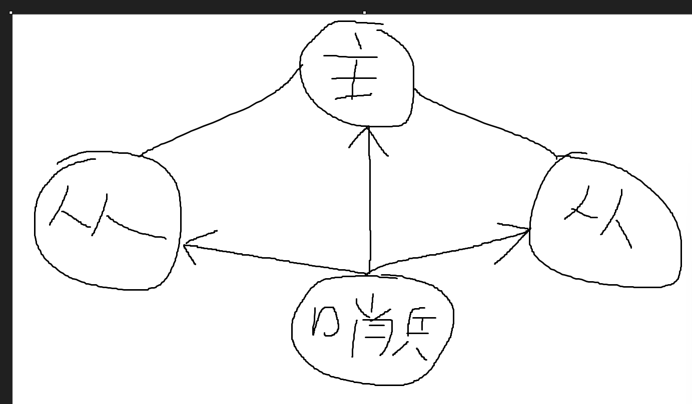当然这个图只是**单哨兵监控**，实际上哨兵会有多个，**因为哨兵可能也会出问题**
2. 例如图中的**多哨兵监控**，就是**哨兵会监控其他哨兵和服务器**，这样互相监控，最大程度保证出现问题立刻发现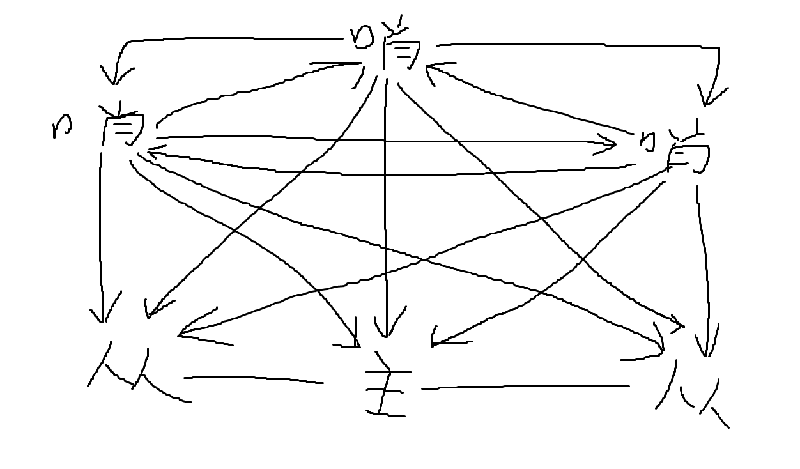

因此如果需要配备**哨兵模式**，那**最少就得配置三个哨兵**

假设主服务器宕机，那么哨兵1发现后，会认为该服务器不可用，这个行为叫做**主观下线**，然后当其他哨兵也发现这个服务器宕机，**当发现的哨兵达到一定数量时候**，哨兵之间会进行**投票决定选举出新主机**，选举结果由随机一个哨兵给出，**进行failover（故障转移）的操作**，切换成功后，就会通过**发布订阅模式，让所有哨兵监控的从服务器更改为主机，这个被称为客观下线**

#### 环境配置

这里使用**主从复制的第一种形态**，并且基于Windows来演示，如果是linux则可以观看这个[视频](https://www.bilibili.com/video/BV1S54y1R7SB?spm_id_from=333.788.videopod.episodes&vd_source=95c95b2b45956217a529f886ca23dd35&p=34)

1. 先完成**主从复制的第一种形态**

2. 然后在redis目录下新建一个文件，文件名为：**sentinel.conf**，文件里输入这段内容

   ```python
   # 哨兵模式配置。
   
   # 当前 Sentinel 服务运行的端口
   port 26379
   
   # 监控的服务器位置
   sentinel monitor mymaster 127.0.0.1 6379 2
   
   # 设置 Sentinel 认为主节点下线的时间，单位是毫秒
   sentinel down-after-milliseconds mymaster 5000
   
   # Generated by CONFIG REWRITE
   dir "D:\\programming\\database\\redis-Win\\redis"
   ```

3. 然后再去到**6780**和**6781**（两个从库）的目录下重复第二步的内容

4. 当然要注意**修改**配置文件中的**端口号**和**dir**的保存地点

5. 然后去redis目录写一个**cmd**程序启动服务

   ```cmd
   @echo off
   redis-server.exe D:\programming\database\redis-Win\redis\sentinel.conf --sentinel 
   @pause
   ```

   这个是**启动主目录**的，两个从库也需要编写，注意**修改目录位置**

6. 写好后我的目录大概就是这样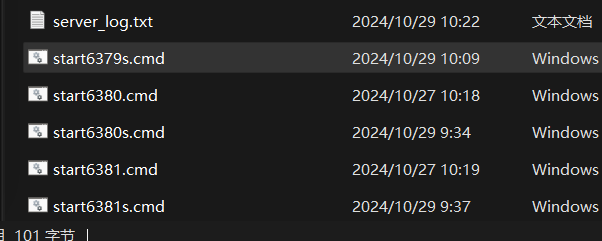带s的就是哨兵，不带s就是从库启动

7. 然后启动**刚才写好**的**cmd程序**（注意，**一定要先完成主从复制的架构搭建**）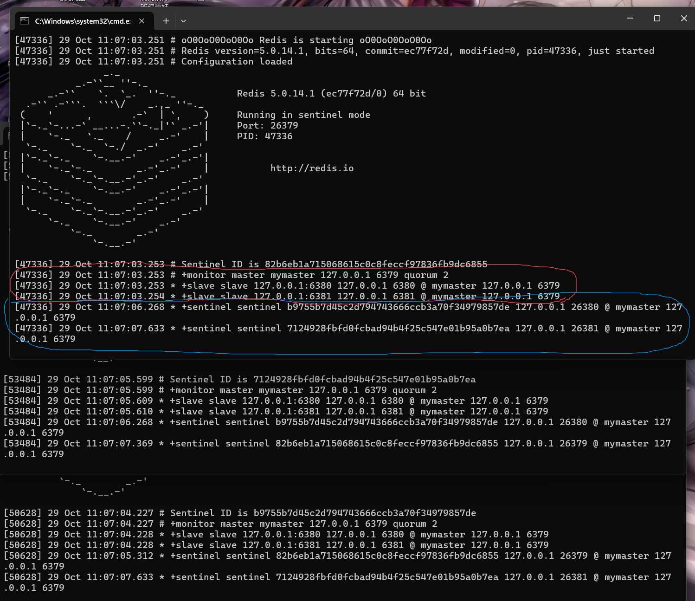

   **红色**的**圈圈**，圈住的就是**监控的数据库**。**蓝色**的圈圈，**圈住的是其他监控这个主库的哨兵**。也就是说现在的**主从复制+哨兵模式**已经**搭建完成**

## * 击穿、雪崩、穿透

**Redis在业务开发中，被用来作为缓存处理**，为数据库处理一些有效期短，但是频繁使用的数据

而缓存击穿、雪崩、穿透，正是基于这一思想理念而出现的问题。

假设有这种业务：

1. 用户查询订单号
2. 先从Redis获取信息
3. 获取信息后做一个非null判断
4. 如果缓存有的话，那么就直接返回数据
5. 如果没有就去数据库查询
6. 查询到后把数据存入缓存，然后设置一个过期时间，这样下一次查询就能从缓存查询到
7. 如果数据库也没有，则返回null或者异常

### 缓存击穿

高并发时，**当一个key经常使用**（热门key），如果**正巧在key失效瞬间**（有效期超时），会有**大量的并发请求进入到数据库中**（击穿），对数据库造成极高的压力，造成性能下降。

1. 永不过期：设置热门key和可能的热门key永远不会过期（通过算法实现），而冷门key定时删除
2. 加锁排队：在java的业务代码中加上同步锁，当检测到缓存中没有，就进入锁中，让查询数据库只有一个线程，等数据库的数据存回缓存中，那么其他线程就会转而去访问缓存（双重锁）

### 缓存雪崩

当**缓存集中过期**的时候，那么**大量请求进入到数据库**中，造成**数据库瞬间压力飙高**。有**可能导致数据库宕机**，数据库宕机后，系统会导致很多业务请求都无法处理（雪崩）

1. 随机失效：字面意思，就是**缓存有效期不固定**（建立在缓存击穿中的**加锁排队的基础上**）
2. Redis高可用：做好集群和数据备份以及哨兵模式等

### 缓存穿透

查询一个**数据库和缓存都不存在的数据**，而这样的**无效查询一旦多起来后**（恶意攻击），就会变成一种数据库攻击手段（穿透），给数据库造成极大的压力

1. 参数过滤：比如请求ID字段，一些负数或者很大的ID就直接拒绝
2. 返回空数据：如果数据库没有，则在Redis建立一个空数据，这样就能正常走进缓存中，避免数据库攻击（建立在缓存击穿中的**加锁排队的基础上**，并且一定要设置过期时间）
3. 布隆过滤器：**一种比Redis更加高效的缓存**，当请求过了一遍数据库没有后，则设置一个空数据放进布隆过滤器，当下一次同样的请求进来，会先到布隆过滤器查找，而布隆过滤器则会返回设置的空数据（黑名单机制。当然也可以反过来，数据库有的放布隆过滤器里面，这种就是白名单机制）

总结：击穿就是部分请求穿过缓存打在数据库上。雪崩就是数据库崩溃导致系统业务无法执行，穿透就是跳过缓存直接攻击到了数据库
