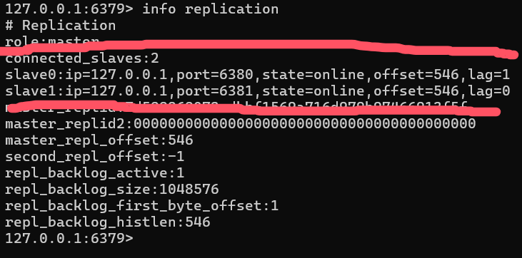
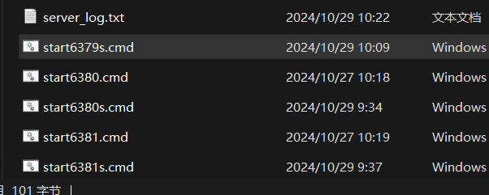
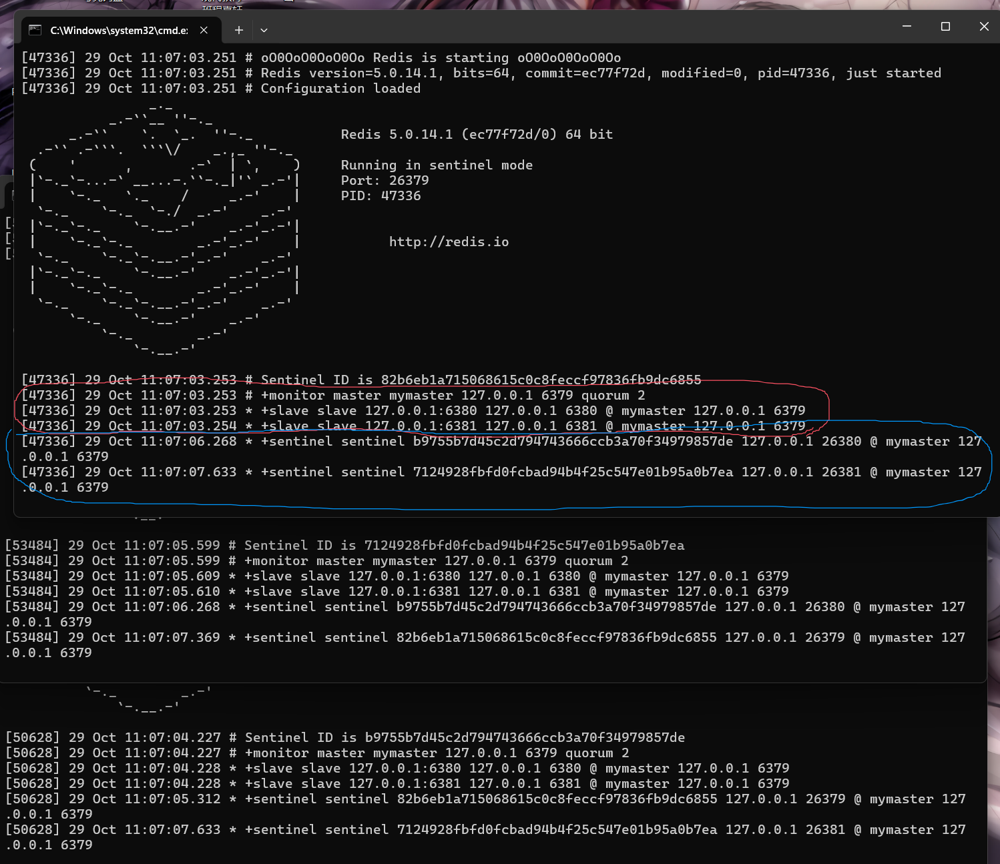
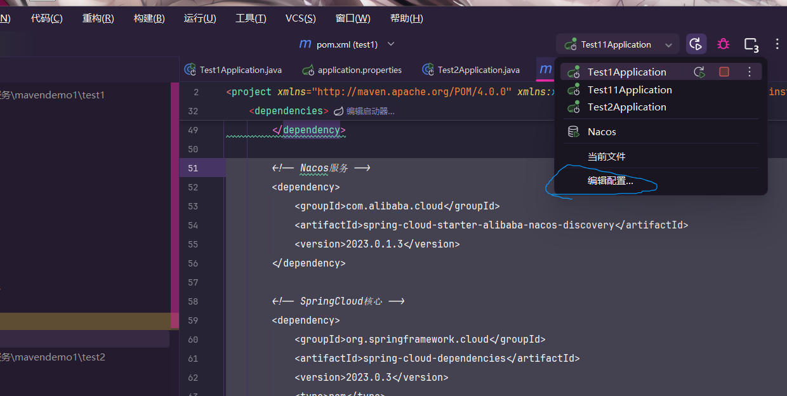
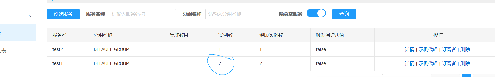
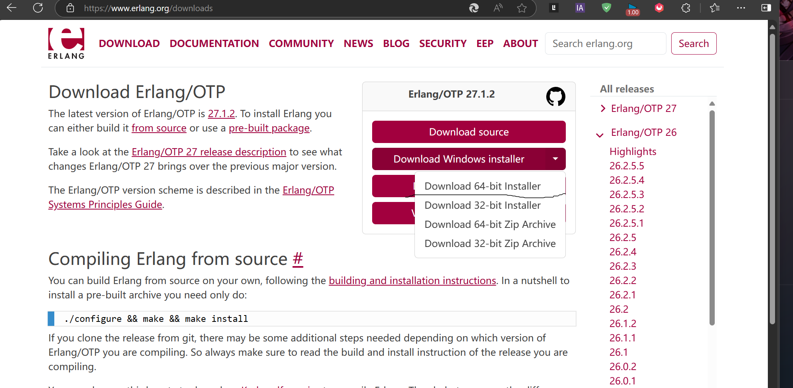

## 环境配置

如果你按照技术栈学习，一路过来配置都能搭建好

但问题来了，如果你是一台全新电脑呢？或者重新安装了系统呢？

一个个翻就太麻烦了，**这个笔记就把技术栈中的所需要的所有环境配置全部打包在这个文件**

**包括微服务**，包括编程软件

## jdk

Jdk全名就是java开发者工具包，**必须安装Jdk才能进行Java程序开发**

- 如图所示，这是Jdk的发布历史，其中**Jdk8**（或者叫Jdk1.8）和**Jdk17**是目前**使用最多**的两个版本

那么下面，将进行Jdk的安装

1. 首先进入[官网](https://www.oracle.com/cn/java/technologies/downloads/)

2. 然后往下滑找到这个页面注意我勾选的红框要对的上

3. 这里我们**安装java17**，因为后面的框架部分内容，**新版本都是起步java17**，因此这里我们选择安装java17，安装要选择红圈圈住的**Msi下载或者是上面的exe下载**，因为这个是按照程序，下载回来一直点下一步就可以装好

4. 下载好后，双击打开，**根据安装程序一直点一下步**，安装即可

5. 安装好后，按下**win键**搜索环境变量

6. 打开后，**根据图片点出环境变量设置**

7. 在变量名和变量值分别输入这段内容

   ```
   变量名：JAVA_HOME
   变量值：C:\Program Files\Java\jdk-17
   ```

   当然变量值生效的前提是，**你在前面安装的时候没有动过人家的默认设置**，如果修改了安装目录，则根据你修改的安装的地方做修改

8. 然后win+r键输入cmd打开命令窗口，输入这段内容

   ```cmd
   java -version
   ```

9. 如果**显示的内容和你下载的版本号对上了**，那么说明你**安装成功**

到这，Jdk就安装完成。

## Idea

**idea**是**Java开发最常用的工具**，用这个软件官网的说法，**idea拥有领先式的Java编程体验**

1. 前往[官网](https://www.jetbrains.com.cn/idea/download/other.html)下载
2. 要下载这个版本的
3. 下载压缩包后，解压后进入目录=>bin找到**idea64.exe**双击点开就能使用
4. 进去选择好这些设置，然后点击下一个
5. 进入这个界面后，点击免费试用
6. 在这里点击新建项目
7. 如图点击
8. 进来之后，需要稍微配置一下
9. 打开设置
10. 首先下载的第一个插件就是ui插件，能让idea更漂亮美观(Material Theme UI Lite)
11. 然后就是这个插件，可以让括号变成彩色，在以后编程更加方便(Rainbow Brackets Lite)
12. 插件装好后，就开始破解，破解插件可以参考这个[网站](read://https_blog.csdn.net/?url=https%3A%2F%2Fblog.csdn.net%2Fweixin_48050899%2Farticle%2Fdetails%2F141721188)
13. 下载好后，关闭idea，然后点击文件夹中的idea破解
14. 看到这个后，就说明稳了
15. 进到这个页面，点击后就能看到有效期
16. 看破解成功

### 破解失败

如果出现破解失败场景

- 比如说

那么这个问题，是因为你之前选择地区选择了中国大陆的原因

因为中国大陆，intellij公司会做网络数据校验

1. 点击开始使用
2. 关闭项目
3. 这里选择未指定区域，这样就可以避开公司的检验
4. 然后使用破解插件重新来一遍，基本就能解决问题

## Maven

java开发项目工具，中后期学习和开发必不可少

既然maven那么强大，那就赶紧下载来使用吧

其实并不需要下载，因为idea集成了maven。但是，idea集成的maven不方便使用，并且不好配置。因此我们这里**更推荐**去网上下载maven，自己配置自己使用，而不是使用idea集成的maven

1. 前往[官网](https://maven.apache.org/download.cgi)下载圈住的版本

2. 下载好后解压，然后去任意一个位置（不能是maven目录里面）**新建一个文件夹**，取名为mavenGit（**注意！这个文件夹十分重要，因为这就是maven的本地仓库了，以后项目开发所需要的所有maven插件和jar包等都将放在这里**）

3. 新建好文件夹后，**回到解压好的maven目录下**，进入conf文件夹中，找到**settings.xml**文件

4. 打开文件后，找到这个形状的代码标签块

   ```xml
   <mirror>
   	***      
   </mirror>
   ```

5. 这个代码块里面的信息，就是maven官方仓库的信息，**因为网络问题**，加上政治等原因，**maven官方速度极慢**，有时候甚至无法连接上去，因此我们这里就需要把它**改成国内阿里公司的镜像maven仓库**，这样速度就很快。

   ```xml
       <mirror>
         <id>aliyunmaven</id>
         <mirrorOf>*</mirrorOf>
         <name>阿里云公共仓库</name>
         <url>https://maven.aliyun.com/repository/public</url>
         <blocked>false</blocked>
       </mirror>
   ```

6. 还没完，还需要**配置maven变量**，和配java时候一样

7. 找到你**maven的安装目录下的bin目录**

   ```
   安装地址\apache-maven-3.9.8\bin
   ```

8. 然后复制后去到**环境变量**设置中，在**系统变量中找到path**，点进去后**新建变量**，然后**输入你刚才复制的安装目录**中

9. 然后打开cmd，输入代码后，如果显示版本信息则说明maven配置成功

   ```cmd
   mvn -v
   ```

10. 然后接下来就是打开idea，点击自定义，点击配置

11. 点击左边构建、执行、部署=>构建工具=>maven-->其中主路径就是maven目录，用户设置文件就是刚才修改了阿里云仓库的配置文件，本地仓库就是新建的文件夹，设置好保存

12. 设置好保存，然后建立一个maven项目-->

13. 然后等待maven插件下载完成-->

14. 下载完成后，然后在**pom**文件中输入这段代码

    ```java
        <dependencies>
            <dependency>
                <groupId>junit</groupId>
                <artifactId>junit</artifactId>
                <version>4.13.2</version>
                <scope>test</scope>
            </dependency>
        </dependencies>
    ```

15. 然后在test/java下新建一个类-->

16. 然后在方法名上，**打@Test，只要有联想**，就说明已经成功

### 导入成功，但无效果

- 如果你导入成功jar包，如图-->

但是却没有联想，那就是**因为你的maven目录带有中文**

maven目录带中文，可能就会出现这个问题，因此需要改成英文

当然改文件夹目录，**idea和环境变量需要重新配置**

## MySql

mysql是一个关系型数据库，一个轻量级数据库，在java中开发十分常见

知名网站Youtube、Facebook、Twitter等一众网站都在采用

而mysql有两个版本，分别为社区版和商业版

其中社区版免费，商业版付费(提供技术支持)

1. 首先打开这个[网站](https://downloads.mysql.com/archives/community/)，选择好系统和下载文件-->

1. 运行后**一直下一步**，直到这个页面-->

   这里选择中间，然后一直下一步

1. 到了这个页面，就开始配置mysql，这里**没有展示的页面，就是默认直接下一步**-->

1. 这个页面设置一下数据库名字，建议是mysql+版本号，例如8.4，就叫mysql84-->

1. mysql内置一个root管理员账户，这里是设置其密码-->

1. 这里点击下面的**Execute**下载配置-->

1. 到了这个页面后，**开始设置系统变量**，和maven方法相同-->

1. 复制mysql的安装目录下的bin目录，然后粘贴到path里-->

1. 然后打开cmd，运行这段代码，之后**输入你之前设置好的root密码**，就能看数据库版本信息

   ```cmd
   mysql -uroot -p
   ```

1. 结果如图-->

1. 然后是连接数据库，这里**客户端使用idea**,随便进一个项目

1. 然后依次点击打开页面-->

1. 点击+号找到mysql-->

1. 然后点击这个下载驱动-->

1. 下载完成后，输入账号和密码-->

   其中账号为：root

   密码是你自己设置的

1. 然后点击**测试连接**，成功就代表idea已经连进数据库中-->

1. 点击这里的**架构**，下面的就是数据库-->

1. 点击下面的确定后，在**查询窗口**就可以编写代码，这里写一句查询语句

   ```sql
   select * from mysql.db
   ```

1. 然后就能查询出来-->

### 配置失败

1. 如图，如果你的配置卡在这个地方-->

2. 那么可能是因为你的**电脑名为中文**导致的

3. 打开电脑设置，查看系统信息，看这台**电脑名为中文**-->

4. 把名字改成英文，然后**重启电脑**

5. 重启好后，去设置=>应用中删除mysql-->

6. 删好后去c盘目录删除mysql的数据，如果你**前面没有修改**的话，那么默认目录如图

   不过这个**ProgramData**，**默认是隐藏文件夹**，找不到可以自行百度

7. 删除好后，**按照前面步骤重新配置mysql**


## WebStorm

前端开发软件，可以避免安装各种工具就能进行现代web开发

1. 首先前往https://www.jetbrains.com/webstorm/download/other.html下载
2. 下载后解压，选择**非商业使用**-->
3. 进到这个页面，选择一个账号登录-->
4. 登录后，就能获得**一年的免费使用**。然后在这里随便创建一个项目进去-->
5. 进去后，点击右下角**切换语言**-->
6. 切换好中文后，可以安装两个插件，这里可以**参考前面的idea安装**
7. 到这，webstorm就安装完成

## WebStorm创建Vue项目

vue的项目有三种，三种创建项目方式几乎差不多，而这里演示的是cli脚手架

1. 创建一个vue项目，让webstorm下载node和npm-->

2. 进入后进入终端，输入代码更换npm下载源（下载速度更快）-->

   代码如下

   ```
   npm config set registry https://registry.npmmirror.com		//淘宝镜像源
   ```

   下面是可能用的上命令

   ```
   npm config set registry https://registry.npmjs.org		//官方源
   npm config get registry			//查看使用下载源
   ```

3. 输入后直接关闭webstorm，然后重新建一个新项目

4. 打印这个信息时候，用方向键选择vue版本-->

5. 选择好后,等待一段时间，直到上面出现npm-->

6. 运行后，点击下面的网址，看到vue标志后，创建完成-->

## Redis

由于Redis并没有windows版本，因此需要去虚拟机安装

但是但是但是，虚拟机安装很麻烦（才不是我弄不好），加上在linux上部署网上教程一抓一大把，因此这里**我在windows上部署**（包括后面的微服务）

1. 前往[下载](https://github.com/tporadowski/redis/releases)Redis的Win转译版本。下载选择**.msi**的文件，这个文件为安装程序，下载后设置好目录傻瓜式安装

2. 下载成功后，**WIN+R**输入**cmd**运行这段代码（6379为端口号，Redis安装程序默认为6379）

   ```cmd
   netstat -ano | findstr :6379
   ```

   如果**什么都没打印**，则继续安装**不用理会**。反之，如果**打印出东西**，那么就需要**更改Redis的端口号**，更改的端口号任意四位数，只要保证不被占用即可。

3. 安装成功后，使用idea软件，数据库连接redis，看到架构里有从0到15个库就说明安装部署成功

## Redis客户端

redis的java客户端，如果不修改默认序列化，写进redis的数据，idea是识别不出来的（甚至删除不掉）

因此我们需要去安装一个专门用于redis的图形化客户端

1. 首先前往[redis客户端](https://github.com/lework/RedisDesktopManager-Windows/releases/tag/2022.5)下载-->

2. 下载后，**无脑下一步**，记得调整安装目录

3. 这里填写url地址-->

4. url地址为

   ```
   redis://localhost:6379
   ```

5. 填写好,用端口号取名，redis图形客户端安装完成-->

## Redis主从复制

**网上主从复制教程很多，但是window版本很少，这绝对是你能在网上找到，最详细的教程**

只需配置从，不需要配置主，因为**redis默认为主**。

如果**主机断开**，**从机可以继续读**，**但是不能写**。如果**主机又重新连接回来**，那么**就可以正常读写**

**注意！**本次配置**以Windows版本环境下使用命令行方法配置**，如果是linux系统，直接参考这个[视频](https://www.bilibili.com/video/BV1S54y1R7SB?spm_id_from=333.788.videopod.episodes&vd_source=95c95b2b45956217a529f886ca23dd35&p=31)

1. 首先，在**redis目录下**，新建两个文件夹,建议**文件夹名为端口号**

2. 然后将下面的配置代码复制，在新建文件夹里新建一个redis.windows-service.conf后缀的文件，粘贴上

   ```python
   # 绑定IP，0.0.0.0代表本机的所有IP地址
   bind 127.0.0.1
   # 端口号
   port 6380
   # 是否是守护进程，开了也没用
   daemonize yes
   # 是否开启集群
   cluster-enabled no
   # 本地数据库存放路径，默认值为 ./
   dir "./6380/"
   # (启动自动生成)节点信息，只能是文件，不能是路径，否则启动时会报错,会创建在  dir 属性下
   cluster-config-file nodes-6380.conf
   cluster-node-timeout 5000
   # 启用aof持久化方式
   appendonly yes
   # 如以后台进程运行，则需指定一个pid，默认为/var/run/redis.pid
   pidfile redis_6380.pid
   # 指定日志输出的文件名，可设为/dev/null屏蔽日志 ,window下很恶心，必须得绝对路径，你要是写相对路径报错
   logfile "D:/programming/database/redis-Win/redis/6380/6380.log"
   ```

   要注意的地方是**端口号需要和文件名的端口号一致**，还有保存的文件路径等都得注意，需要改名。必须全部过一遍眼。还有最重要的，**集群模式一定要关掉**，因为**集群模式不能设置为主从复制**。

3. 然后返回到redis目录中，新建两个start**.cmd**的后缀程序，然后在里面写上代码

   ```cmd
   redis-server.exe  ./6381/redis.windows-service.conf
   ```

   **注意！**./你刚才新建的文件夹名字/刚才你新建文件夹里的配置文件名字。**这个格式不能有错**，并且最好使用**英文命名**。**你建了几个文件夹，这个cmd程序就建立多少个**

4. 这里截个图大概对照一下

5. 然后打开这个cmd程序**，如果cmd打开后会自动闪退**，那么说明你**前面的步骤有问题**。如果**不会闪退能一直挂住电脑**，那说明你的从库已经**搭建完成**。不过**注意**，如果**cmd程序关掉后**，**从库就会消失**，因此cmd程序得一直挂着才行。

6. **还没完**。从库搭建好，**还得设立关系**才行，按win+r运行**cmd**，运行这段代码

   ```cmd
   redis-cli -p 6380
   ```

   这里的**6380**是切换到**你设置从库的端口号**

7. 然后观察如果运行后像图中这样这里的**127.0.0.1是你前面配置文件设置得来的**。

8. 那么就运行这段代码

   ```cmd
   slaveof 127.0.0.1 6379
   ```

   这里的**网址和端口**都是填写你**主库的网址和端口**，如果看到返回一个**OK**，那么说明你的**关系已经建立好了**

9. 然后你建立**多少个从库**，**就循环第六到第八多少次操作**，注意！一定是循环！**不要偷懒**

10. 关系全部建立好后，打开**redis目录下**的**redis-cli.exe文件**，打开后运行这段代码

    ```cmd
    info replication
    ```

11. 运行后你将看见图中的效果

    其中注意红色**两边里面**的数据，**第一行**为**连接的从库数量**，**第二第三行**就是**从库的信息**。在编写文档的时候，我**配置了两个从库**，这里**能看见两个从库**，说明我**关系全部建立成功！**

12. 那么如果**取消关系**或者**删除从库**呢？很简单把**打开从库的cmd程序关掉**即可，如果要删除从库，那么把从库的**整个文件夹删除**就行了

## Redis哨兵

通过哨兵观察，避免redis宕机无法发现

完成哨兵模式的基础，是你已经实现主从复制的结构搭建

1. 先完成**主从复制的第一种形态**

2. 然后在redis目录下新建一个文件，文件名为：**sentinel.conf**，文件里输入这段内容

   ```python
   # 哨兵模式配置。
   
   # 当前 Sentinel 服务运行的端口
   port 26379
   
   # 监控的服务器位置
   sentinel monitor mymaster 127.0.0.1 6379 2
   
   # 设置 Sentinel 认为主节点下线的时间，单位是毫秒
   sentinel down-after-milliseconds mymaster 5000
   
   # 注意必须用 \\ 来做分割
   dir "D:\\programming\\database\\redis-Win\\redis"
   ```

3. 然后再去到**6780**和**6781**（两个从库）的目录下重复第二步的内容

4. 当然要注意**修改**配置文件中的**端口号**和**dir**的保存地点

5. 然后去redis目录写一个**cmd**程序启动服务

   ```cmd
   @echo off
   redis-server.exe D:\programming\database\redis-Win\redis\sentinel.conf --sentinel 
   @pause
   ```

   这个是**启动主目录**的，两个从库也需要编写，注意**修改目录位置**

6. 写好后我的目录大概就是这样带s的就是哨兵，不带s就是从库启动

7. 然后启动**刚才写好**的**cmd程序**（注意，**一定要先完成主从复制的架构搭建**）

   **红色**的**圈圈**，圈住的就是**监控的数据库**。**蓝色**的圈圈，**圈住的是其他监控这个主库的哨兵**。也就是说现在的**主从复制+哨兵模式**已经**搭建完成**

## Nacos

[官方文档](https://nacos.io/docs/latest/quickstart/quick-start/)

注意！就在**Windows环境安装**

1. 首先第一步，当然是去[官网](https://nacos.io/download/nacos-server/)下载Nacos压缩包，这个笔记中，采用的是**2.4.3**版本

2. 然后将它解压，进入文件目录=>conf找到mysql-schema.sql这个文件

3. 找到后**打开Navicat数据库软件**（使用idea也行，但是你得在每个表名上加上一个数据库名称，不然无法执行代码），然后**新建一个库叫Nacos**，然后在库中新建一个查询，然后把刚才的**.sql文件打开**，把里面**所有东西复制粘贴到查询窗口上**，然后**运行代码**，运行结束后吗的库表应该和我一致

4. 然后在**文件目录下的bin文件下**，**新键一个cmd程序**，代码如下

   ```cmd
   startup.cmd -m standalone
   ```

5. 然后运行这个写好的cmd，那么Nacos就会启动，当你cmd窗口停在

   ```
   Nacos started successfully in stand alone mode. use embedded storage
   ```

   这段话后不动，就说你**Nacos启动成功**

6. 然后在输入这段地址，就能进入控制台（如果有密码，那账号和密码默认是nacos）

   ```
   http://127.0.0.1:8848/nacos
   ```

   当然这是**默认地址**，你没动过配置文件的情况下

7. 然后在bin的界面下，找到**shutdown.cmd**这个文件，**点击运行后就能关闭Nacos服务**

## Nacos服务注册

现在**注册中心搭建好**了，那现在就该让自己**项目的端口注册到注册中心**被引用

1. 先启动好Nacos服务，然后打开控制台停在**服务管理=>服务列表**这一页面

2. 然后创建一个springboot带**mvc**依赖的项目

3. 然后向两个创建的项目的**pom文件**添加maven坐标

   ```xml
           <!-- Nacos服务 -->
           <dependency>
               <groupId>com.alibaba.cloud</groupId>
               <artifactId>spring-cloud-starter-alibaba-nacos-discovery</artifactId>
               <version>2023.0.1.2</version>
           </dependency>
   
           <!-- SpringCloud核心 -->
           <dependency>
               <groupId>org.springframework.cloud</groupId>
               <artifactId>spring-cloud-dependencies</artifactId>
               <version>2023.0.2</version>
               <type>pom</type>
               <scope>import</scope>
           </dependency>
   ```

4. 之后修改配置文件为

   ```yaml
   spring:
     application:
       name: test1
     cloud:
       nacos:
         discovery:
           server-addr: 127.0.0.1:8848
   server:
     port: 8081
   ```

5. 添加后启动两个项目回到页面刷新，你就会发现列表已经出现**两个服务**，**说明服务注册成功**

6. **还没完**，因为实际项目中，**一个模块服务会有多个实例**，因此我们也需要进行相对于的配置

7. 首先打开这个设置

8. 然后框选要复制的项目，然后点击一下

9. 然后**修改**一下**名称**，然后再点击一下这个界面的**修改选项**（有高亮显示），点击添加**虚拟机选项**

10. 然后在里面添加上这段代码，**等于号后面就是端口号**

   ```
   -Dserver.port=8083
   ```

11. 然后在外面启动这个项目

12. 然后去到**Nacos页面**，刷新一下，就会发现实例从1变成2

    说明**多例项目设置完成**

## -Nacos共享配置

**未验证**

nacos除了实现负载均衡以外，还有一大功能就是共享配置文件

1. 首先先启动Nacos，然后创建一个springBoot的mvc项目

2. 然后在pom文件添加依赖

   ```xml
           <!-- nacos拉取配置文件 -->
           <dependency>
               <groupId>com.alibaba.cloud</groupId>
               <artifactId>spring-cloud-starter-alibaba-nacos-config</artifactId>
               <version>2023.0.1.2</version>
           </dependency>
   
           <!-- boostrap配置文件引导启动 -->
           <dependency>
               <groupId>org.springframework.cloud</groupId>
               <artifactId>spring-cloud-starter-bootstrap</artifactId>
               <version>4.0.4</version>
           </dependency>
   ```

3. 然后在配置nacos上发布配置文件-->

4. 第一个是配置id，第二个就是配置文件介绍，第三个就是文件格式，第四个就是配置信息

5. 这里我填写的信息，这里我上传的是jdbc配置，从nacos拉取配置做数据库操作

6. 然后重写springboot的application.yml配置文件

   ```yaml
   spring:
     application:
       name: abc
   server:
     port: 8081
   ```

7. 之后在这个配置文件的下面新建一个文件bootstrap.yml

   ```yaml
   spring:
     application:
       name: jdbc                      #服务名称
     profiles:
       active: dev                     #版本
     cloud:
       nacos:
         server-addr: 127.0.0.1:8848   #nacos地址
         config:
           file-extension: yaml        #文件格式
           shared-configs:
             - data-id: abc            #nacos上的配置文件id
               refresh: true
   ```

8. 之后把需要进行测试代码完成，然后启动程序测试我们能看见一些信息-->

9. 看见这个后，基本就稳了，**因为如果你也是采用拉取jdbc的配置的话，如果没拉到，项目是无法启动的**

## Sentinel

**Sentinel**是一个**微服务流量控制组件**，并且提供一个web端的控制台 

1. 首先呢，我们先去[github](https://github.com/alibaba/Sentinel)上下载一个jar包下来，放在一个**非中文的目录**

2. 然后呢**在存放的目录下新建一个txt文件**，写上这段代码

   ```cmd
   java -jar sentinel-dashboard-1.8.8.jar --server.port=8090
   ```

   **注意**，其中的版本号要和吗下载的文件名对上，后面的端口号是因为默认8080，这个端口是给SpringBoot使用的，所以这里修改了端口号

3. 然后把txt改成cmd文件，运行cmd文件后，然后点击[控制台](http://localhost:8090/#/login)

4. 当你看见这个的时候，就说明稳了

5. 输入用户和密码

   ```
   sentinel
   ```

   **默认**账号和密码都是这个

6. 然后去到Idea中，在springboot项目下添加这个**Maven依赖**

   ```xml
           <!-- sentinel的依赖 -->
           <dependency>
               <groupId>com.alibaba.cloud</groupId>
               <artifactId>spring-cloud-starter-alibaba-sentinel</artifactId>
               <version>2023.0.1.3</version>
           </dependency>
   ```

7. 然后在**该项目**下的配置文件添加和控制台连接的信息

   ```yaml
   spring:
     application:
       name: sentinelTest1
     cloud:
       sentinel:
         transport:
           dashboard: localhost:8090   #控制台端口位置
           client-ip: 127.0.0.1        #控制台Ip地址
   server:
     port: 8081        
   ```

8. 随后开启这个项目，然后访问这个项目中任意一个接口（多访问几次），然后再回到Sentinel控制台中

9. 然后你就会看到这个页面如果没有，**耐心等待一小会**（五分钟)，再点刷新就能看见了，红圈圈中的，就是你的SpirngBoot项目名称

10. 到这就说明你Sentinel搭建成功

## Seata环境搭建

TC是一个负责事务回滚或者提交的角色，是**一个单独的服务**。

**注意！本次部署基于Windows**

1. 去[官网](https://seata.apache.org/unversioned/download/seata-server/)下载Seata，一定要下载圈住的**超链接**

2. 下载好后，解压进到目录中，seata-server=>script=>server=>db找到**mysql.sql**文件

3. 然后打开数据库软件，创建一个架构（库）叫做**seata**，然后在这个库里面把刚才的mysql.sql文件里的代码全部运行一遍

   ```sql
   create database Seata;
   
   CREATE TABLE IF NOT EXISTS Seata.global_table
   (
       `xid`                       VARCHAR(128) NOT NULL,
       `transaction_id`            BIGINT,
       `status`                    TINYINT      NOT NULL,
       `application_id`            VARCHAR(32),
       `transaction_service_group` VARCHAR(32),
       `transaction_name`          VARCHAR(128),
       `timeout`                   INT,
       `begin_time`                BIGINT,
       `application_data`          VARCHAR(2000),
       `gmt_create`                DATETIME,
       `gmt_modified`              DATETIME,
       PRIMARY KEY (`xid`),
       KEY `idx_status_gmt_modified` (`status` , `gmt_modified`),
       KEY `idx_transaction_id` (`transaction_id`)
   ) ENGINE = InnoDB
     DEFAULT CHARSET = utf8mb4;
   
   -- the table to store BranchSession data
   CREATE TABLE IF NOT EXISTS Seata.branch_table
   (
       `branch_id`         BIGINT       NOT NULL,
       `xid`               VARCHAR(128) NOT NULL,
       `transaction_id`    BIGINT,
       `resource_group_id` VARCHAR(32),
       `resource_id`       VARCHAR(256),
       `branch_type`       VARCHAR(8),
       `status`            TINYINT,
       `client_id`         VARCHAR(64),
       `application_data`  VARCHAR(2000),
       `gmt_create`        DATETIME(6),
       `gmt_modified`      DATETIME(6),
       PRIMARY KEY (`branch_id`),
       KEY `idx_xid` (`xid`)
   ) ENGINE = InnoDB
     DEFAULT CHARSET = utf8mb4;
   
   -- the table to store lock data
   CREATE TABLE IF NOT EXISTS Seata.lock_table
   (
       `row_key`        VARCHAR(128) NOT NULL,
       `xid`            VARCHAR(128),
       `transaction_id` BIGINT,
       `branch_id`      BIGINT       NOT NULL,
       `resource_id`    VARCHAR(256),
       `table_name`     VARCHAR(32),
       `pk`             VARCHAR(36),
       `status`         TINYINT      NOT NULL DEFAULT '0' COMMENT '0:locked ,1:rollbacking',
       `gmt_create`     DATETIME,
       `gmt_modified`   DATETIME,
       PRIMARY KEY (`row_key`),
       KEY `idx_status` (`status`),
       KEY `idx_branch_id` (`branch_id`),
       KEY `idx_xid` (`xid`)
   ) ENGINE = InnoDB
     DEFAULT CHARSET = utf8mb4;
   
   CREATE TABLE IF NOT EXISTS Seata.distributed_lock
   (
       `lock_key`       CHAR(20) NOT NULL,
       `lock_value`     VARCHAR(20) NOT NULL,
       `expire`         BIGINT,
       primary key (`lock_key`)
   ) ENGINE = InnoDB
     DEFAULT CHARSET = utf8mb4;
   
   INSERT INTO Seata.distributed_lock (lock_key, lock_value, expire) VALUES ('AsyncCommitting', ' ', 0);
   INSERT INTO Seata.distributed_lock (lock_key, lock_value, expire) VALUES ('RetryCommitting', ' ', 0);
   INSERT INTO Seata.distributed_lock (lock_key, lock_value, expire) VALUES ('RetryRollbacking', ' ', 0);
   INSERT INTO Seata.distributed_lock (lock_key, lock_value, expire) VALUES ('TxTimeoutCheck', ' ', 0);
   
   
   CREATE TABLE IF NOT EXISTS Seata.vgroup_table
   (
       `vGroup`    VARCHAR(255),
       `namespace` VARCHAR(255),
       `cluster`   VARCHAR(255),
       UNIQUE KEY `idx_vgroup_namespace_cluster` (`vGroup`,`namespace`,`cluster`)
   ) ENGINE = InnoDB
     DEFAULT CHARSET = utf8mb4;
   ```

   **如果你用的是idea**，可以直接复制这段代码去使用

4. 然后回到seata软件目录中，seata-server=>conf，找到**application.yml**文件

5. 点进去后把里面代码**全部删掉**（如果你不想删，你也可以对照着使用），然后复制这段数据

   ```yaml
   #
   # Licensed to the Apache Software Foundation (ASF) under one or more
   # contributor license agreements.  See the NOTICE file distributed with
   # this work for additional information regarding copyright ownership.
   # The ASF licenses this file to You under the Apache License, Version 2.0
   # (the "License"); you may not use this file except in compliance with
   # the License.  You may obtain a copy of the License at
   #
   #     http://www.apache.org/licenses/LICENSE-2.0
   #
   # Unless required by applicable law or agreed to in writing, software
   # distributed under the License is distributed on an "AS IS" BASIS,
   # WITHOUT WARRANTIES OR CONDITIONS OF ANY KIND, either express or implied.
   # See the License for the specific language governing permissions and
   # limitations under the License.
   #
   
   server:
     port: 7091
   
   spring:
     application:
       name: seata-server
   
   logging:
     config: classpath:logback-spring.xml
     file:
       path: ${log.home:${user.home}/logs/seata}
     extend:
       logstash-appender:
         destination: 127.0.0.1:4560
       kafka-appender:
         bootstrap-servers: 127.0.0.1:9092
         topic: logback_to_logstash
   
   console:
     user:
       username: seata
       password: seata
   seata:
     config:
       # support: nacos, consul, apollo, zk, etcd3
       type: file
     registry:
       # support: nacos, eureka, redis, zk, consul, etcd3, sofa
       type: nacos                   #选择你的注册中心
       nacos:
         application: seata-server   #服务名称，对应nacos中显示的ID
         server-addr: 127.0.0.1:8848     #url地址
         group: "DEFAULT_GROUP"      #对应的nacos分组
         namespace: ""               #nacos的命令空间，如果你不填就默认是public(但你不能直接public)
         username: "nacos"           #账号
         password: "nacos"           #密码
     store:
       # support: file 、 db 、 redis 、 raft
       mode: db                #选择数据库
       session:
         mode: db              #session存放
       lock:
         mode: db              #锁存放
       db:
         datasource: druid     #数据库连接池
         db-type: mysql
         driver-class-name: com.mysql.cj.jdbc.Driver
         url: jdbc:mysql://localhost:3306/seata?useUnicode=true&characterEncoding=utf-8&serverTimezone=Asia/Shanghai
         user: root
         password: root
         vgroup_table: vgroup_table          #对应数据库里的表
         global_table: global_table          #对应数据库里的表
         branch_table: branch_table          #对应数据库里的表
         lock_table: lock_table              #对应数据库里的表
         distributed_lock: distributed_lock  #对应数据库里的表
         query-limit: 1000
         max-wait: 5000
     #  server:
     #    service-port: 8091 #If not configured, the default is '${server.port} + 1000'
     security:
       secretKey: SeataSecretKey0c382ef121d778043159209298fd40bf3850a017
       tokenValidityInMilliseconds: 1800000
       csrf-ignore-urls: /metadata/v1/**
       ignore:
         urls: /,/**/*.css,/**/*.js,/**/*.html,/**/*.map,/**/*.svg,/**/*.png,/**/*.jpeg,/**/*.ico,/api/v1/auth/login,/version.json,/health,/error,/vgroup/v1/**
   ```

6. 然后启动**Nacos服务**

7. 然后保存配置文件，去到软件目录，seata-server=>lib在这里，把**mysql驱动**(jar包)放在这里

8. 然后去到软件目录，seata-server=>bin目录下，新建一个**txt文件**，把下面代码复制进去

   ```bat
   @REM
   @REM Licensed to the Apache Software Foundation (ASF) under one or more
   @REM contributor license agreements.  See the NOTICE file distributed with
   @REM this work for additional information regarding copyright ownership.
   @REM The ASF licenses this file to You under the Apache License, Version 2.0
   @REM (the "License"); you may not use this file except in compliance with
   @REM the License.  You may obtain a copy of the License at
   @REM
   @REM     http://www.apache.org/licenses/LICENSE-2.0
   @REM
   @REM Unless required by applicable law or agreed to in writing, software
   @REM distributed under the License is distributed on an "AS IS" BASIS,
   @REM WITHOUT WARRANTIES OR CONDITIONS OF ANY KIND, either express or implied.
   @REM See the License for the specific language governing permissions and
   @REM limitations under the License.
   @REM
   
   @echo off
   
   chcp 65001
   
   set ERROR_CODE=0
   
   :init
   @REM Decide how to startup depending on the version of windows
   
   @REM -- Win98ME
   if NOT "%OS%"=="Windows_NT" goto Win9xArg
   
   @REM set local scope for the variables with windows NT shell
   if "%OS%"=="Windows_NT" @setlocal
   
   @REM -- 4NT shell
   if "%eval[2+2]" == "4" goto 4NTArgs
   
   @REM -- Regular WinNT shell
   set CMD_LINE_ARGS=%*
   goto WinNTGetScriptDir
   
   @REM The 4NT Shell from jp software
   :4NTArgs
   set CMD_LINE_ARGS=%$
   goto WinNTGetScriptDir
   
   :Win9xArg
   @REM Slurp the command line arguments.  This loop allows for an unlimited number
   @REM of arguments (up to the command line limit, anyway).
   set CMD_LINE_ARGS=
   :Win9xApp
   if %1a==a goto Win9xGetScriptDir
   set CMD_LINE_ARGS=%CMD_LINE_ARGS% %1
   shift
   goto Win9xApp
   
   :Win9xGetScriptDir
   set SAVEDIR=%CD%
   %0\
   cd %0\..\.. 
   set BASEDIR=%CD%
   cd %SAVEDIR%
   set SAVE_DIR=
   goto repoSetup
   
   :WinNTGetScriptDir
   set BASEDIR=%~dp0
   set BASEDIR=%BASEDIR:~0,-5%
   
   :repoSetup
   set REPO=
   
   
   if "%JAVACMD%"=="" set JAVACMD=java
   
   if "%REPO%"=="" set REPO=%BASEDIR%\lib
   
   set CLASSPATH="%BASEDIR%"\conf;"%REPO%"\*
   
   set ENDORSED_DIR=
   if NOT "%ENDORSED_DIR%" == "" set CLASSPATH="%BASEDIR%"\%ENDORSED_DIR%\*;%CLASSPATH%
   
   if NOT "%CLASSPATH_PREFIX%" == "" set CLASSPATH=%CLASSPATH_PREFIX%;%CLASSPATH%
   
   @REM Reaching here means variables are defined and arguments have been captured
   :endInit
   
   if exist %BASEDIR%/logs (
     echo "%BASEDIR%/logs"
   ) else (
     md "%BASEDIR%/logs"
   )
   
   if "%SKYWALKING_ENABLE%"=="true" (
     set SKYWALKING_OPTS=-javaagent:"%BASEDIR%"/ext/apm-skywalking/skywalking-agent.jar -Dskywalking_config="%BASEDIR%"/ext/apm-skywalking/config/agent.config -Dskywalking.logging.dir="%BASEDIR%"/logs
     echo "apm-skywalking enabled opts: %SKYWALKING_OPTS%"
   ) else (
     echo "apm-skywalking not enabled"
   )
   if "%JMX_ENABLE%"=="true" (
     set JMX_PORT=%JMX_PORT%
     set JMX_OPTS=%JMX_OPTS%
     if "%JMX_OPTS%"=="" (
       set "JMX_OPTS=-Dcom.sun.management.jmxremote -Dcom.sun.management.jmxremote.authenticate=false -Dcom.sun.management.jmxremote.ssl=false"
     )
     if "%JMX_PORT%"=="" (
       set "JMX_OPTS=%JMX_OPTS% -Dcom.sun.management.jmxremote.port=10055 -Dcom.sun.management.jmxremote.rmi.port=10055"
     )
     echo "JMX enabled"
   ) else (
     echo "JMX disabled"
   )
   
   %JAVACMD% %JAVA_OPTS% %SKYWALKING_OPTS% %JMX_OPTS% -server -Dloader.path="%BASEDIR%"/lib -Xmx1024m -Xms1024m -Xss512k -XX:SurvivorRatio=10 -XX:MetaspaceSize=128m -XX:MaxMetaspaceSize=256m -XX:MaxDirectMemorySize=1024m -XX:-OmitStackTraceInFastThrow -XX:-UseAdaptiveSizePolicy -XX:+HeapDumpOnOutOfMemoryError -XX:HeapDumpPath="%BASEDIR%"/logs/java_heapdump.hprof -XX:+DisableExplicitGC -Xloggc:"%BASEDIR%"/logs/seata_gc.log -verbose:gc -Dio.netty.leakDetectionLevel=advanced -classpath %CLASSPATH% -Dapp.name="seata-server" -Dapp.repo="%REPO%" -Dapp.home="%BASEDIR%" -Dbasedir="%BASEDIR%" -Dspring.config.location="%BASEDIR%"/conf/application.yml -Dspring.config.additional-location="%BASEDIR%"/conf/ -Dlogging.config="%BASEDIR%"/conf/logback-spring.xml -jar "%BASEDIR%"/target/seata-server.jar %CMD_LINE_ARGS%
   if %ERRORLEVEL% NEQ 0 goto error
   goto end
   
   :error
   if "%OS%"=="Windows_NT" @endlocal
   set ERROR_CODE=%ERRORLEVEL%
   echo An error occurred. Error Code: %ERROR_CODE%
   pause
   goto end
   
   :end
   @REM set local scope for the variables with windows NT shell
   if "%OS%"=="Windows_NT" goto endNT
   
   @REM For old DOS remove the set variables from ENV - we assume they were not set
   @REM before we started - at least we don't leave any baggage around
   set CMD_LINE_ARGS=
   goto postExec
   
   :endNT
   @REM If error code is set to 1 then the endlocal was done already in :error.
   if %ERROR_CODE% EQU 0 @endlocal
   
   
   :postExec
   
   if "%FORCE_EXIT_ON_ERROR%" == "on" (
     if %ERRORLEVEL% NEQ 0 exit %ERROR_CODE%
   )
   
   exit /B %ERROR_CODE%
   ```

   这段代码，其实就是目录下的**启动程序的改版**，原版的启动程序异常就会直接闪退，根本看不到报错日志，这个文件**可以避免报错后直接闪退**

9. 接下来把txt文件改成bat，改一个能记住的名字，可以如图所示

10. 然后**启动seata-server.bat程序**，如果闪退，就尝试启动你刚才写好的bat程序

11. 当启动好后，去Nacos服务查看

    当你看见这个后，稳了

12. 然后打开这个网址[Seata控制台](http://127.0.0.1:7091/#/transaction/list)，打开后账号密码都是

    ```
    seata
    ```

13. 然后点击这里切换中文

14. OK，TC服务搭建完成

## Seata整合微服务

按理来说，这里应该用nacos拉取配置，但是这里配置环境图省事，就采取本地配置文件来设置

1. 首先创建一个springboot的mvc项目

2. 然后在pom文件导入依赖

   ```xml
           <!-- springboot的mybatis依赖 -->
           <dependency>
               <groupId>org.mybatis.spring.boot</groupId>
               <artifactId>mybatis-spring-boot-starter</artifactId>
               <version>3.0.3</version>
           </dependency>
   
           <!-- mysql驱动 -->
           <dependency>
               <groupId>com.mysql</groupId>
               <artifactId>mysql-connector-j</artifactId>
               <version>8.4.0</version>
           </dependency>
   
           <!-- springboot的seata依赖 -->
           <dependency>
               <groupId>com.alibaba.cloud</groupId>
               <artifactId>spring-cloud-starter-alibaba-seata</artifactId>
               <version>2023.0.1.2</version>
           </dependency>
   ```

3. 然后在配置文件写入信息

   ```yaml
   spring:
     datasource:
       url: jdbc:mysql://localhost:3306/test1?useUnicode=true&characterEncoding=utf-8&useSSL=false&serverTimezone=UTC
       username: root
       password: root
       driver-class-name: com.mysql.cj.jdbc.Driver
     application:
       name: abc
   server:
     port: 8081
   
   seata:
     enabled: true                 # 是否开启事务
     tx-service-group: dcsp1       # 组名，主要是用来区分不同的微服务集群
     service:
       vgroup-mapping:
         dcsp1: default            # 定义TC的服务地址，单机模式下就是默认配置
       grouplist:
         default: 127.0.0.1:8091   #seata业务端口
     client:
       tm:
         commit-retry-count: 5     #当事务提交失败后，重试次数
     data-source-proxy-mode: XA    #设置事务模式
   ```

4. 然后随便写一个接口类和jdbc相关的类，这里留下的是接口类

   ```java
   import io.seata.spring.annotation.GlobalTransactional;
   import org.springframework.beans.factory.annotation.Autowired;
   import org.springframework.web.bind.annotation.GetMapping;
   import org.springframework.web.bind.annotation.RequestMapping;
   import org.springframework.web.bind.annotation.RestController;
   
   @RestController
   @RequestMapping("/abc")
   public class mvc1 {
       @Autowired
       a1Dao a1Dao;
   
       @GetMapping("/abc")
       //下面的注释就是开启seata的事务
       @GlobalTransactional
       public String w(){
           a1Dao.deleteByid(1);
           if(true){int i=5/0;}
           return "abc";
       }
   }
   ```

5. 然后就可以启动测试,测试完成后切换事务模式为AT，然后在测试的库里导入一张表（注意，**这个表必须是在url中的库中**，否则访问不到）

   ```sql
   CREATE TABLE test1.undo_log (
       `id` bigint(20) NOT NULL AUTO_INCREMENT,
       `branch_id` bigint(20) NOT NULL,
       `xid` varchar(100) NOT NULL,
       `context` varchar(128) NOT NULL,
       `rollback_info` longblob NOT NULL,
       `log_status` int(11) NOT NULL,
       `log_created` datetime NOT NULL,
       `log_modified` datetime NOT NULL,
       PRIMARY KEY (`id`),
       UNIQUE KEY `ux_undo_log` (`xid`,`branch_id`)
   ) ENGINE=InnoDB AUTO_INCREMENT=1 DEFAULT CHARSET=utf8;
   ```

6. 然后继续测试一遍，没有问题说明整合完成。（如果有问题，查看一下**测试的表是否有主键**，必须有主键才行）

## Nacos和Seata联动

**注意Springboot项目版本为3.3.5**

Seata的配置很多份，因此往往会在Nacos获取

虽然说是从Nacos获取，**但实际上确并不需要在上面填写Seata的配置**（听起来很诡异，但经过实测也确实如此）

1. 创建一个springboot项目带有mvc依赖

   ```xml
           <!-- springboot的mybatis依赖 -->
           <dependency>
               <groupId>org.mybatis.spring.boot</groupId>
               <artifactId>mybatis-spring-boot-starter</artifactId>
               <version>3.0.3</version>
           </dependency>
   
           <!-- mysql驱动 -->
           <dependency>
               <groupId>com.mysql</groupId>
               <artifactId>mysql-connector-j</artifactId>
               <version>8.4.0</version>
           </dependency>
   
           <!-- springboot的seata依赖 -->
           <dependency>
               <groupId>com.alibaba.cloud</groupId>
               <artifactId>spring-cloud-starter-alibaba-seata</artifactId>
               <version>2023.0.1.2</version>
           </dependency>
   
           <!-- nacos拉取配置文件 -->
           <dependency>
               <groupId>com.alibaba.cloud</groupId>
               <artifactId>spring-cloud-starter-alibaba-nacos-config</artifactId>
               <version>2023.0.1.2</version>
           </dependency>
   
           <!-- boostrap配置文件引导启动 -->
           <dependency>
               <groupId>org.springframework.cloud</groupId>
               <artifactId>spring-cloud-starter-bootstrap</artifactId>
               <version>4.0.4</version>
           </dependency>
   ```

2. 这里我们依然以jdbc操作，去测试seata的事务性，把dao层和接口写完

3. **去nacos新建一个配置文件，id为jdbc**

   ```yaml
   spring:
     datasource:
       url: jdbc:mysql://localhost:3306/test1?useUnicode=true&characterEncoding=utf-8&useSSL=false&serverTimezone=UTC
       username: root
       password: root
       driver-class-name: com.mysql.cj.jdbc.Driver
   ```

4. 然后新建一个**bootstrap.yml**文件,拉取jdbc配置文件

   ```yaml
   spring:
     application:
       name: jdbc                      #服务名称，同时也是拉取配置文件的id名，会拉取同名的配置文件，所以这个服务名称不能乱取
     profiles:
       active: dev                     #版本
     cloud:
       nacos:
         server-addr: 127.0.0.1:8848   #nacos地址
         config:
           file-extension: yaml        #文件格式
   ```

5. 然后在微服务的**application.yml**文件添加上

   ```yaml
   server:
     port: 8081
   seata:
     registry:
       type: nacos                         #选择你的注册中心
       nacos:
         server-addr: 127.0.0.1:8848       # url地址
         namespace: ""                     #nacos的命令空间，如果你不填就默认是public(但你不能直接public)
         group: "DEFAULT_GROUP"            #对应的nacos分组
         application: seata-server         #服务名称，对应nacos中显示的ID
         username: nacos                   #账号(如果没有账号，这里可以删掉)
         password: nacos                   #密码
     tx-service-group: hmall               #集群组
     service:
       vgroup-mapping:
         hmall: "default"                  #组名
     data-source-proxy-mode: XA            #开启事务XA模式
   ```

6. 最后启动项目进行测试

## RabbitMQ

RabbitMQ安装基于windows

1. 首先RabbitMQ是Erlang语言开发，因此**需要安装Erlang环境**

2. 不过你先别急，我们得先确定RabbitMQ**需要的Erlang版本是什么**？

3. 进到[官网](https://www.rabbitmq.com/docs/which-erlang)就能查看到，rabbitMQ支持的版本

4. 确定好版本之后，前往[Erlang](https://www.erlang.org/downloads)下载对应的版本

5. 下载注意要下载**64位的安装程序**

6. 下载好运行，无脑下一步安装完成即可

7. 然后打开系统环境变量，**新建一个变量**

8. 变量的地址就是你**环境的安装目录下的bin文件**

   ```
   安装地址\Erlang OTP\bin
   ```

9. 安装好环境变量后，去cmd输入erl，如果看见版本号，说明**安装成功**

10. 安装好环境后，就开始安装RabbitMQ

11. 从[官网](https://www.rabbitmq.com/docs/download)在这个位置下载**windows版本程序**

12. 下载好后，安装一直点下一步即可

13. 然后打开cmd，切换到你**安装RabbitMQ的盘**

14. 然后输入你RabbitMQ的**安装地址**

    ```
    安装地址\rabbitmq_server-4.0.3\sbin
    ```

15. cmd切换到输入的目录后，输入这段代码

    ```
    rabbitmq-plugins enable rabbitmq_management
    ```

16. 输入后等待安装完成，完成之后，再输入这段代码，检验是否安装成功

    ```
    rabbitmqctl status
    ```

17. 如果没看到错误警告等字眼，八九不离十是安装成功了

18. 然后打开服务，找到RabbitMQ将其**停止运行**

19. 停在运行后去到RabbitMQ的安装目录下的**sbin目录**

20. （注意！电脑重启后，可以直接打开网页，因为是开机自启的）

21. 找到**rabbitmq-server.bat**文件，运行后等待一会，打开[RabbitMQ控制台](http://localhost:15672/)

22. 当你看见这个页面的时候，恭喜，你RabbitMQ**已经成功部署**

23. 账号和密码都是

    ```
    guest
    ```

24. 当登录将会看见这个页面

25. 我知道，这个是英文界面看不懂。**但是没办法**

## WebStorm创建Nuxt项目

Nuxt在webstorm中没有**现成的模板可以创建，因此我们需要手动去创建**

1. 首先在webstorm中创建Node项目

2. 然后根据代码手动调整下package.json文件

   ```json
   {
     "name": "test3",
     "version": "1.0.0",
     "main": "index.js",
     "scripts": {
       "test": "echo \"Error: no test specified\" && exit 1",
       "dev": "nuxi dev",
       "build": "nuxi build"
     },
     "devDependencies": {
       "nuxt": "^3.13.2"
     },
     "keywords": [],
     "author": "",
     "license": "ISC",
     "description": ""
   }
   ```

3. 然后设置npm作为启动程序

4. 然后打开终端输入这段代码，下载配置

   ```
   npm install
   ```

5. 然后启动npm，yes和no的选择可以自行去翻译选择。并不是重点

6. 创建好后，src目录下的内容可以直接创建使用（参考vue脚手架和vite的情况），但有一点不同，**就是app.vue要在项目的根目录，不能在src下**
