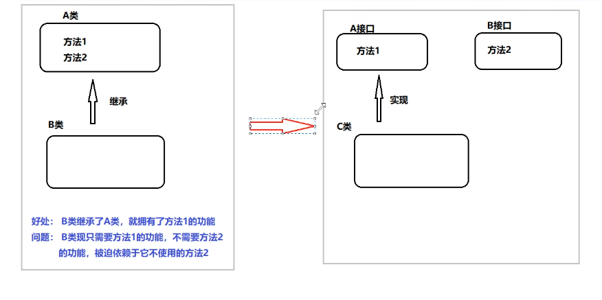
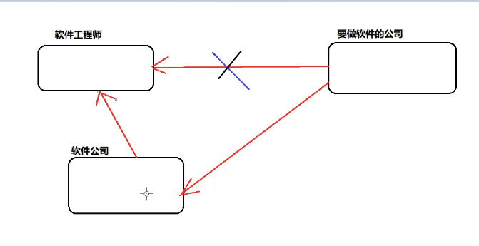

# 设计模式

## 学前要求

在学习设计模式前，先将**技术栈拓展到SpringBoot阶段**，**并且写过几个网页项目**再来学习设计模式，**否则你提前学了也不太用的上**，**而且学起来也很吃力费劲疑惑**

## 何为设计模式

简单来说，就是前人写代码在不同场景总结出的一套方法论。

**设计模式的作用基本就是低耦合、易拓展**

很多框架都会采用设计模式，因此学习设计模式，对代码的理解和业务的进阶有很大帮助

**注意！设计模式不要为了使用而使用。遵从剃须刀原则，如无必要，勿增实体**

## 来源

来自于1990年四个编程人员合作写的一本书《设计模式：可复用面向对象软件的基础》书中，书中收录了23种设计模式，而这23种，就是现在最常见的设计模式。

## * 设计原则

在软件开发中，为了提高软件的可维护性和可复用性，程序员尽量根据**六条原则**来进行**开发程序**

1. **开闭原则**：支持扩展，不动源代码
2. **里氏替换原则**：父类使用的地方，换位子类也没有影响（简单来说就是子类不能去重写父类的方法）
3. **依赖倒转原则**：A类依赖B类，那么A类需要依赖的是B类的抽象方法而不是具体实现，如图
4. **接口隔离原则**：不能被迫依赖于不需要的方法，依赖的方法必须是建立最小接口上，如图图中左边就是不遵守该原则，右边则是遵守该原则的改进
5. **迪米特法则**：又称最少**知识原则**，如果两个实体无直接通信，那么应该通过第三方去去转发调用，如图
6. 合成复用原则：优先使用组合和聚合等方式实现，其次在考虑继续关系
   1. **组合**：一个类拥有另一个类的实例
   2. 聚合：一个类使用另一个类的实例，但这个实例也能被其他类使用