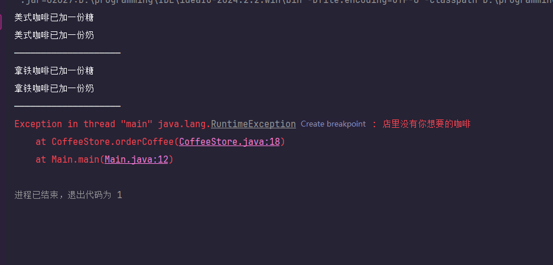
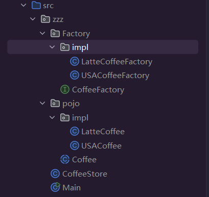
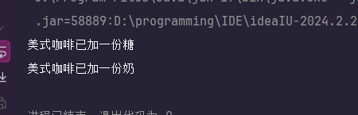
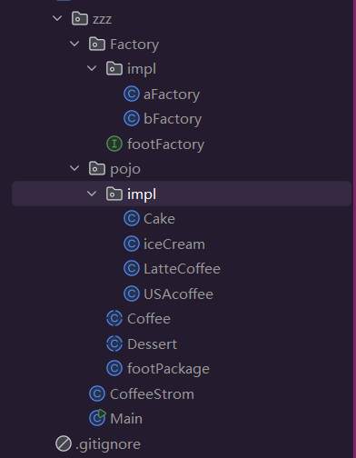

# 创建者模式

## 何为创建者模式

就是如何创建对象，将**对象的创建与使用分离**

## * 单例模式

单例模式就是创建出来的对象，**始终都是同一个**

具体来说就是对象类，自己负责创建自己对象，提供一个方法给外部获取对象，这样外部可以直接访问对象，而不需要创建出来

### 饿汉式

系统刚运行的时候，单例对象就被创建出来

1. 饿汉单例模式代码如下

   ```java
   /**
    * 饿汉式单例模式，基于静态成员变量实现
    */
   public class Singleton {
       //类对象
       private static final Singleton instance = new Singleton();
   
       //私有构造方法,不让外界new出对象
       private Singleton() {
       }
   
       //提供一个公共方法，让外界获取里面的对象
       public static Singleton getInstance() {
           return instance;
       }
   }
   ```

2. **如果有必要的话**，可以修改一下向下面代码一样，**防止反射获取**

   ```java
   /**
    * 饿汉式单例模式，基于静态成员变量实现
    */
   public class Singleton {
       //类对象
       private static final Singleton instance = new Singleton();
       
   
       //私有构造方法,不让外界new出对象
       private Singleton() {
           //加上锁，避免多个线程跑进来
           synchronized (Singleton.class) {
               //反射强行获取的构造函数
               //如果对象已经创建好，给它个异常就老实了
               if(instance != null){
                   throw new RuntimeException("单例模式，禁止反射获取构造函数");
               }
           }
       }
   
       //提供一个公共方法，让外界获取里面的对象
       public static Singleton getInstance() {
           return instance;
       }
   }
   ```
   
3. 如果**真有必要**的话，可以再次修改下代码，防止**序列化**破坏单例模式

   ```java
   import java.io.Serial;
   import java.io.Serializable;
   
   /**
    * 饿汉式单例模式，基于静态成员变量实现
    * 实现了Serializable接口，这样该对象就能进行序列化操作
    */
   public class Singleton implements Serializable {
       //类对象
       private static final Singleton instance = new Singleton();
   
   
       //私有构造方法,不让外界new出对象
       private Singleton() {
           //加上锁，避免多个线程跑进来
           synchronized (Singleton.class) {
               //反射强行获取的构造函数
               //如果对象已经创建好，给它个异常就老实了
               if(instance != null){
                   throw new RuntimeException("单例模式，禁止反射获取构造函数");
               }
           }
       }
   
       //重写了序列化中的这个方法后
       //就可以避免序列化被强行new出来
       //破坏原本的单例模式
       @Serial
       public Object readResolve() {
           return getInstance();
       }
   
       //提供一个公共方法，让外界获取里面的对象
       public static Singleton getInstance() {
           return instance;
       }
   }
   ```

   虽然这个也不是**最完美**，但是基本上能用在**99%的业务场景**了

### 懒汉式

首次使用单例对象才会被创建

1. 懒汉式内部类单例模式

   ```java
   /**
    * 懒汉式，通过java的内部类特性单例模式
    */
   public class Singleton {
       //私有构造方法,不让外界new出对象
       private Singleton() {
       }
   
       //内步类在JVM虚拟机启动的时候，不会加载
       //只有调用的时候启动
       private static class SingletonHolder {
           private static final Singleton instance = new Singleton();
       }
   
       //提供一个公共方法，让外界获取里面的对象
       public static Singleton getInstance() {
           return SingletonHolder.instance;
       }
   }
   ```

2. **如果有必要的话**，可以修改一下向下面代码一样，**防止反射获取**

   ```java
   /**
    * 懒汉式，通过java的内部类特性单例模式
    */
   public class Singleton {
       //设置一个状态
       private static boolean flag = false;
   
       //私有构造方法,不让外界new出对象
       private Singleton() {
           //加个同步锁，避免下面修改flag值出问题
           synchronized (Singleton.class) {
               //检查你是第几次创建对象，如果部不是第一次就给你异常
               if(flag){
                   throw new RuntimeException("单例模式，禁止反射获取构造函数");
               }
               flag = true;
           }
       }
   
       //内步类在JVM虚拟机启动的时候，不会加载
       //只有调用的时候启动
       private static class SingletonHolder {
           private static final Singleton instance = new Singleton();
       }
   
       //提供一个公共方法，让外界获取里面的对象
       public static Singleton getInstance() {
           return SingletonHolder.instance;
       }
   }
   ```
   
3. 如果**真有必要**的话，可以再次修改下代码，防止**序列化**破坏单例模式

   ```java
   import java.io.Serial;
   import java.io.Serializable;
   
   /**
    * 懒汉式，通过java的内部类特性单例模式
    * 实现了Serializable接口，这样该对象就能进行序列化操作
    */
   public class Singleton implements Serializable {
       //设置一个状态
       private static boolean flag = false;
   
       //私有构造方法,不让外界new出对象
       private Singleton() {
           //加个同步锁，避免下面修改flag值出问题
           synchronized (Singleton.class) {
               //检查你是第几次创建对象，如果部不是第一次就给你异常
               if(flag){
                   throw new RuntimeException("单例模式，禁止反射获取构造函数");
               }
               flag = true;
           }
       }
   
       //内步类在JVM虚拟机启动的时候，不会加载
       //只有调用的时候启动
       private static class SingletonHolder {
           private static final Singleton instance = new Singleton();
       }
   
       //重写了序列化中的这个方法后
       //就可以避免序列化被强行new出来
       //破坏原本的单例模式
       @Serial
       public Object readResolve() {
           return getInstance();
       }
   
       //提供一个公共方法，让外界获取里面的对象
       public static Singleton getInstance() {
           return SingletonHolder.instance;
       }
   }
   ```

   虽然这个也不是**最完美**，但是基本上能用在**99%的业务场景**了

### 枚举式

枚举式又称恶汉式，之所以叫恶汉式，就是因为它相比前两种方法，太过可恶

通过**枚举类型**来实现单例模式，java中的枚举不需要考虑**线程安全**、**反射**、**序列化安全**等，并且十分简单。

**恶汉式是被请求调用时候才创建**

- ```java
  /**
   * 恶汉式，通过java的枚举来实现
   */
  public enum Singleton {
      instance;
  }
  ```

  你没看错，就是这么**简单**

### Web场景

在**网站开发**的场景中，每有一个用户进入服务器，Tomcat就会创建一个线程给用户

那么问题来了，不同的用户在它们对应的线程访问同一个单例模式对象，那对象里的数据是互相通用还是各自是各自的？

答案是**所有用户访问的都是同一个对象**

那么如果我想每**个用户使用的对象，都是不同的**，但是在**单个用户里这个对象是单例模式下**，那么这个该如何解决呢？

答案是**不需要解决**，因为这个需求显然是**违背了单例模式的原则**，因此在**这种需求下应该选择其他的技术**，比如说**Session和Cookie**，**Redis缓存**，**ThreadLocal线程变量**等来**满足**这个**需求**，而不是对这个单例模式去**钻牛角尖**

## * 工厂模式

工厂模式就是一个**专门负责创建对象的类**，在很多框架中都十分常见

假设现在有一个这样的场景：**咖啡类**下有**两个子类**，**美式咖啡和拿铁咖啡**，还有一个**咖啡店类**，咖啡店可以点咖啡的功能，也就是**共四个类**

### 传统写法

如果按照我们传统的写法，会这样实现这个模块

1. 首先写一个咖啡类，然后在里面编写两个共有方法

   ```java
   public abstract class Coffee {
   
       public abstract String getName();
   
       //下面属于咖啡共有的方法功能
       //加糖
       public void addSugar(){
           System.out.println(getName()+"已加一份糖");
       }
   
       //加奶
       public void addMilk(){
           System.out.println(getName()+"已加一份奶");
       }
   
   }
   ```

2. 然后编写它们的两个子类，这里就把两个类的代码合在一起

   ```java
   /**
    * 美式咖啡
    * @author Akemi0Homura
    */
   public class USACoffee extends Coffee{
   
       @Override
       public String getName() {
           return "美式咖啡";
       }
   }
   
   
   /**
    * 拿铁咖啡
    * @author Akemi0Homura
    */
   public class LatteCoffee extends Coffee {
   
       @Override
       public String getName() {
           return "拿铁咖啡";
       }
   }
   ```

3. 然后再写一个咖啡商店类

   ```java
   /**
    * 咖啡商店
    * @author Akemi0Homura
    */
   public class CoffeeStore {
   
       public Coffee orderCoffee(String type){
           Coffee coffee = null;
   
           //判断咖啡种类，实现点餐效果
           if("美式".equals(type)){
               coffee=new USACoffee();
           }
           if("拿铁".equals(type)){
               coffee=new LatteCoffee();
           }
           if(coffee == null){
               throw new RuntimeException("店里没有你想要的咖啡");
           }
   
           //加料理包
           coffee.addSugar();
           coffee.addMilk();
   
           return coffee;
   
       }
   
   }
   ```

4. 最后写一个Main函数测试一下

   ```java
   /**
    * 测试
    * @author Akemi0Homura
    */
   public class Main {
       public static void main(String[] args) {
           CoffeeStore store = new CoffeeStore();
           store.orderCoffee("美式");
           System.out.println("——————————分隔符——————————");
           store.orderCoffee("拿铁");
           System.out.println("——————————分隔符——————————");
           store.orderCoffee("卡布奇诺");
       }
   }
   ```

5. 运行后没有任何问题

### 简单工厂

那么根据前面传统方法的做法，**虽然功能是实现了**，但是**违反设计原则**

假如现在要把卡布奇诺咖啡增加上去，那么就要修改源代码，**违反开闭原则：支持拓展，不动源码**

在Java中，处处是对象，一旦**new对象的代码过多**，那么**耦合性会指数性提高**，等你要做修改的时候，改动地方过多，**导致难以维护**

而工厂模式，**就是把new对象的这一部分给解耦，去用一个专门的工厂类是做创建对象，这样耦合就会从业务代码转移到工厂类里面，修改和维护大大提升**。


**注意！简单工厂不属于COF的23种经典设计模式！**

简单工厂包含以下角色

1. **抽象产品**：**定义产品规范**，描述产品主要特征和功能
2. **具体产品**：实现或者继承抽象产品的子类
3. **具体工厂**：**提供了创建产品的方法**，使用者通过调用方法创建产品

那么带着这种思想回顾我们前面的咖啡点案例

其中**抽象产品=咖啡**，**具体产品=美式和拿铁**。**而具体工厂并没有**，因此想要做解耦，**就得写一个简单工厂类，来创建产品**

1. 我们只需要做以下变动，首先是新建一个简单工厂类

   ```java
   /**
    * 简单咖啡工厂
    * @author Akemi0Homura
    */
   public class simpleCoffeeFactory {
       public Coffee newCoffee(String type){
           Coffee coffee = null;
   
           //判断咖啡种类,生产咖啡
           if("美式".equals(type)){
               return new USACoffee();
           }
           if("拿铁".equals(type)){
               return new LatteCoffee();
           }
   
           //如果工厂里面没有需要的咖啡，就抛异常
           throw new RuntimeException("店里没有你想要的咖啡");
   
       }
   }
   ```

2. 然后修改一下之前的咖啡店类

   ```java
   /**
    * 咖啡商店
    * @author Akemi0Homura
    */
   public class CoffeeStore {
   
       public Coffee orderCoffee(String type){
           //创建出工厂对象，让工厂对象去生产咖啡
           //这样咖啡店只需要专注业务部分代码（加料理包）
           //而生产咖啡这种工作交给工厂去完成
           simpleCoffeeFactory a=new simpleCoffeeFactory();
           Coffee coffee=a.newCoffee(type);
   
           //加料理包
           coffee.addSugar();
           coffee.addMilk();
   
           return coffee;
   
       }
   
   }
   ```

这样修改完成，假如现在想增加一个卡布奇诺咖啡，就不需要动我们的业务代码，去工厂类里添加一个即可。

当然你说这样做**还是没有实现开闭原则：支持拓展，不动源码**，确实，所以说**这并不是一种设计模式**

但是它的实现起来很简单，并且也能很大程度和业务代码解耦

#### 静态工厂

**静态工厂也不属于23种常见设计模式**中，**静态工厂就是在简单工厂的基础上，将工厂类中的方法改为静态的即可**，其他代码都不需要改动。**这样做的好处是不需要new出工厂类，只需要工厂类.方法就能获取到对象。**

由于过于简单这里不做记录

### 工厂模式

如果你觉得简单工厂太傻，解了商店的耦合又增加一个工厂耦合，那么你就可以使用这个**工厂方法模式，**工厂模式完美解决所有问题**，**并且遵守开闭原则：支持拓展，不动源码**。

工厂模式包括以下角色：

1. **抽象工厂**：**提供创建产品接口**，调用者通过访问具体工厂方法来创建产品
2. **具体工厂**：实现了抽象工厂方法，完成具体产品的创建
3. **抽象产品**：定义产品的规范
4. **具体产品**：**实现了抽象产品的功能，具体产品由具体工厂来创建**

说了那么多，那具体该怎么写呢？

1. 首先根据目录先**新建出对应的类和接口**先

2. 在CoffeeFactory接口下写这段代码

   ```java
   import zzz.pojo.Coffee;
   
   /**
    * 抽象工厂
    * @author Akemi0Homura
    */
   public interface CoffeeFactory {
       //创建咖啡方法
       Coffee createCoffee();
   }
   
   ```

3. 然后在包下的impl的**两个子类工厂去实现方法**，具体的实现就是这样

   ```java
   import zzz.Factory.CoffeeFactory;
   import zzz.pojo.Coffee;
   import zzz.pojo.impl.USACoffee;
   
   /**
    * 实现了抽象工厂的具体工厂
    * 专门生产美式咖啡
    * @author Akemi0Homura
    */
   public class USACoffeeFactory implements CoffeeFactory {
       //实现了接口的创建方法
       //美式咖啡工厂，就只生成美式咖啡
       @Override
       public Coffee createCoffee() {
           return new USACoffee();
       }
   }
   ```

4. 另一个拿铁咖啡工厂也是这样写，只是创建的对象不同，这里就不记录了。

5. 然后pojo包下的类里面代码可以参考前面**简单工厂**里的代码

6. 随后**咖啡店类**的代码修改一下

   ```java
   import zzz.Factory.CoffeeFactory;
   import zzz.pojo.Coffee;
   
   /**
    * 咖啡商店
    * @author Akemi0Homura
    */
   public class CoffeeStore {
       //声明出复杂工厂
       private CoffeeFactory factory;
   
       //给复杂工厂生成一个set方法
       public void setFactory(CoffeeFactory factory) {
           this.factory = factory;
       }
   
       //点咖啡功能
       public Coffee orderCoffee(){
           Coffee coffee = factory.createCoffee();
   
           //加料理包
           coffee.addSugar();
           coffee.addMilk();
   
           return coffee;
   
       }
   
   }
   ```

7. 最后Main方法这样写

   ```java
   import zzz.Factory.CoffeeFactory;
   import zzz.Factory.impl.USACoffeeFactory;
   
   /**
    * 测试
    * @author Akemi0Homura
    */
   public class Main {
       public static void main(String[] args) {
           //创建出咖啡店对象
           CoffeeStore store = new CoffeeStore();
           //创建出美式咖啡工厂
           CoffeeFactory usa=new USACoffeeFactory();
           //让咖啡店去使用美式咖啡工厂对象
           store.setFactory(usa);
           //点咖啡，打印得出美式咖啡
           store.orderCoffee();
       }
   }
   ```

8. 最后的**打印结果**应该是这样

**工厂方法的代码和要写的类比简单工厂多很多**，并且复杂抽象，如果你没有写多个项目的经验可能会难以理解，这也是为什么会有明明不是设计模式，但前面还是要写**简单工厂**的案例

那么这样做，如果你想添加卡布奇诺咖啡，那么直接写一个生成卡布奇诺的咖啡工厂，实现复杂工厂接口后，就可以点卡布奇诺咖啡，**真正做到了开闭原则：支持拓展，不动源码**

当然也有缺点，就是每新增一个咖啡，就得写一个类，积累多了会增加系统复杂度和类爆炸等问题

### 抽象工厂

工厂方法，是一个工厂只生成一个产品。但是现实中一个工厂往往能生产十几个甚至几十个的产品。

而**抽象工厂呢，就是根据某一个分类，生产多个产品**

比如说电子厂会生成电线、芯片、主板等多种产品，而不是单纯只生产一个电线或者一个芯片

**注意！如果你需要这种套餐或者组合家族类型的话，就使用抽象工厂，否则建议使用工厂模式**

抽象工厂包括以下角色：

1. **抽象工厂**：**提供创建产品接口**，包含多个创建产品的方法
2. **具体工厂**：实现了抽象工厂方法，完成具体产品的创建
3. **抽象产品**：定义产品的规范，并且里面有多个产品
4. **具体产品**：**实现了抽象产品的功能，具体产品由具体工厂来创建**

角色和工厂模式差不多，但是有一点小区别。

假如现在**咖啡店推出两个套餐，买雪糕送美式咖啡，买蛋糕送拿铁咖啡，两种AB套餐**，那这个功能如何用抽象工厂实现呢？

1. 首先先按照图中建立这些类和目录结构

2. 然后其中pojo目录代码如下

   ```java
   /**
    * 这是咖啡
    * @author Akemi0Homura
    */
   public abstract class Coffee {
       //这是咖啡名字
       public abstract String getName();
   
       //加巧克力
       public void addSugar(){
           System.out.println(getName()+"已加一份糖");
       }
   
       //加草莓
       public void addMiku(){
           System.out.println(getName()+"已加一份牛奶");
       }
   }
   
   
   
   /**
    * 这是甜品
    * @author Akemi0Homura
    */
   public abstract class Dessert {
       //这是甜品名字
       public abstract String getName();
   
       //加巧克力
       public void addChocolate(){
           System.out.println(getName()+"已加一份巧克力");
       }
   
       //加草莓
       public void addStrawberry(){
           System.out.println(getName()+"已加一份草莓");
       }
   
   }
   
   
   /**
    * 这是套餐对象,这里需要get和set方法无参有参构造函数
    * @author Akemi0Homura
    */
   public class footPackage {
       private Coffee coffee;
       private Dessert dessert;
   }
   
   ```

3. 然后pojo中impl的代码如下

   ```java
   import zzz.pojo.Dessert;
   
   /**
    * @author Akemi0Homura
    */
   public class Cake extends Dessert {
       @Override
       public String getName() {
           return "雪糕";
       }
   }
   
   
   
   /**
    * 
    * @author Akemi0Homura
    */
   public class iceCream extends Dessert {
       @Override
       public String getName() {
           return "雪糕";
       }
   }
   
   
   
   /**
    * 
    * @author Akemi0Homura
    */
   public class LatteCoffee extends Coffee {
       @Override
       public String getName() {
           return "拿铁咖啡";
       }
   }
   
   
   
   import zzz.pojo.Coffee;
   
   /**
    * @author Akemi0Homura
    */
   public class USAcoffee extends Coffee {
       @Override
       public String getName() {
           return "美式咖啡";
       }
   }
   
   ```

4. 然后是Factory包下的代码

   ```java
   import zzz.pojo.Coffee;
   import zzz.pojo.Dessert;
   
   /**
    * 抽象工厂
    * @author Akemi0Homura
    */
   public interface footFactory {
       //创建咖啡方法
       Coffee createCoffee();
       //创建甜品方法
       Dessert createDessert();
   }
   ```

5. 然后是Factory中的impl代码

   ```java
   import zzz.Factory.footFactory;
   import zzz.pojo.Coffee;
   import zzz.pojo.Dessert;
   import zzz.pojo.impl.USAcoffee;
   import zzz.pojo.impl.iceCream;
   
   /**
    * @author Akemi0Homura
    */
   public class aFactory implements footFactory {
   
       @Override
       public Coffee createCoffee() {
           return new USAcoffee();
       }
   
       @Override
       public Dessert createDessert() {
           return new iceCream();
       }
   }
   
   
   
   import zzz.Factory.footFactory;
   import zzz.pojo.Coffee;
   import zzz.pojo.Dessert;
   import zzz.pojo.impl.Cake;
   import zzz.pojo.impl.LatteCoffee;
   
   /**
    * @author Akemi0Homura
    */
   public class bFactory implements footFactory {
       @Override
       public Coffee createCoffee() {
           return new LatteCoffee();
       }
   
       @Override
       public Dessert createDessert() {
           return new Cake();
       }
   }
   ```

6. 写完后再编写咖啡店的代码

   ```java
   import zzz.Factory.footFactory;
   import zzz.pojo.footPackage;
   
   /**
    * @author Akemi0Homura
    */
   public class CoffeeStrom {
       //声明出工厂
       private footFactory factory;
   
       //给复杂工厂生成一个set方法
       public void setFactory(footFactory factory) {
           this.factory = factory;
       }
   
       //店套餐功能
       public footPackage orderPackage(){
           //创建出套餐对象
           footPackage footPackage =new footPackage(factory.createCoffee(),factory.createDessert());
   
           //业务操作
           footPackage.getCoffee().addMiku();
           footPackage.getCoffee().addMiku();
   
           footPackage.getDessert().addChocolate();
           footPackage.getDessert().addStrawberry();
   
           return footPackage;
       }
   }
   ```

7. 最后写一个Main方法测试一下

   ```java
   import zzz.Factory.footFactory;
   import zzz.Factory.impl.aFactory;
   
   /**
    * @author Akemi0Homura
    */
   public class Main {
       public static void main(String[] args) {
           //创建咖啡店
           CoffeeStrom strom=new CoffeeStrom();
           //创建a套餐工厂
           footFactory factory=new aFactory();
           //给咖啡店a套餐工厂
           strom.setFactory(factory);
           //点a套餐
           strom.orderPackage();
       }
   }
   ```

8. 然后打印结果是和前面的需要相同，那么就说明抽象工厂成功做好

因为是在普通工厂的基础上修改而来，自然开闭原则也是没有违反，**支持拓展并且可以不修改源码**

